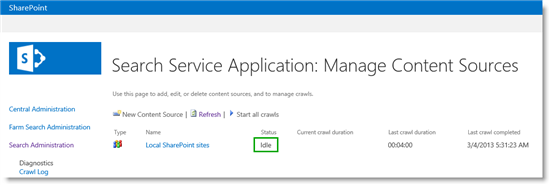
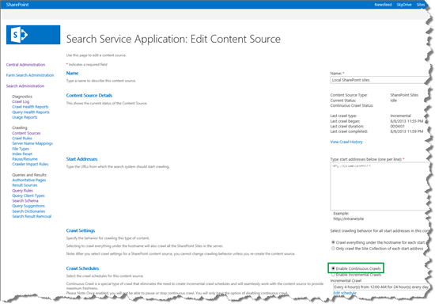
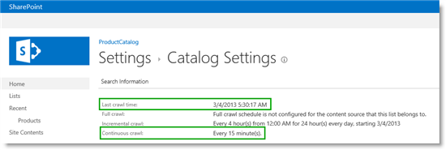

# Stage 4: Set up search and enable the crawling of your catalog content in SharePoint Server

[!INCLUDE[appliesto-2013-2016-2019-xxx-md](../includes/appliesto-2013-2016-2019-xxx-md.md)]
  
> [!NOTE]
> Most of the features described in this series are available only for private sites collections in SharePoint in Microsoft 365. 
  
## Quick overview

As described in [Stage 3: How to enable a list as a catalog in SharePoint Server](stage-3-how-to-enable-a-list-as-a-catalog.md), the **Products** list has now been enabled as a catalog. As we'll be using search technology to retrieve and display content on our publishing site (the Contoso website), we have to crawl the catalog so that its content is added to the search index. 
  
In this article, you'll learn:
  
- [About crawling](stage-4-set-up-search-and-enable-the-crawling-of-your-catalog-content.md#BKMK_AboutCrawling)
    
- [How to start a full crawl in Central Administration](stage-4-set-up-search-and-enable-the-crawling-of-your-catalog-content.md#BKMK_HowtoStartaFullCrawlinCentralAdministration)
    
- [How to enable continuous crawls in Central Administration](stage-4-set-up-search-and-enable-the-crawling-of-your-catalog-content.md#BKMK_HowtoEnableContinuousCrawlsinCentralAdministration)
    
- [How to set continuous crawl interval](stage-4-set-up-search-and-enable-the-crawling-of-your-catalog-content.md#BKMK_HowtoSetContinuousCrawlInterval)
    
- [How to initiate a reindexing of the catalog](stage-4-set-up-search-and-enable-the-crawling-of-your-catalog-content.md#BKMK_HowtoInitiateaReindexingoftheCatalog)
    
- [How to view crawl status and schedule for a catalog](stage-4-set-up-search-and-enable-the-crawling-of-your-catalog-content.md#BKMK_HowtoViewCrawlStatusandScheduleforaCatalog)
    
## Start stage 4

### About crawling
<a name="BKMK_AboutCrawling"> </a>

Depending on your permission level, you can start a crawl from two places:
  
|**Where to start crawl**|**Required permission level**|
|:-----|:-----|
|Central Administration  <br/> |Search service application administrator  <br/> |
|On the catalog  <br/> |Site collection administrator  <br/> |
   
The reason that you can start a crawl from two places is that people who are working with catalog content (let's call them content managers) are unlikely to have  *Search service application administrator*  rights. In other words, they don't have access to Central Administration. 
  
When changes are made to catalog content, it makes sense to crawl this content fairly quickly so that it can be displayed on the publishing site.
  
Luckily, content managers can make new content available without having to pester Search service application administrators to run new crawls. We'll come back to how to do this later in this article, but first let's look at how to start a full crawl in Central Administration.
  
### How to start a full crawl in Central Administration
<a name="BKMK_HowtoStartaFullCrawlinCentralAdministration"> </a>

Before you can start a full crawl in Central Administration, you must specify which content source should be crawled. When you run a full crawl, all content in the content source is crawled even if that content has already been added to the search index.
  
For this scenario, we'll crawl the **Local SharePoint** sites content source. 
  
1. Go to **Central Administration** > **Manage service applications** > **Search Service Application** > **Content Sources**. 
    
2. On the **Manage Content Sources** page, pause on the **Local SharePoint sites** content source, and from the menu, select **Start Full Crawl**. 
    
     
  
The status of the crawl is shown in the **Status** column. 
    
3. Refresh this page until you see that the value in the **Status** column is **Idle**. This means that the crawl has finished. 
    
     
  
4. Optionally, you can verify that your items are added to the search index by selecting **Crawl Log**. In our scenario, we now have 870 items in the search index, which is approximately the same number of products we have in the **Products** list. 
    
     
  
### How to enable continuous crawls in Central Administration
<a name="BKMK_HowtoEnableContinuousCrawlsinCentralAdministration"> </a>

You can only start a full crawl manually. Nobody wants the trouble of having to manually start a crawl every time that a change is made to their catalog content, as this is neither an efficient nor practical way to work. So, to avoid this overhead, you can enable a **continuous crawl** of your content source that contains the catalog. 
  
Continuous crawls start automatically at set intervals. Any changes that were made to the catalog after the previous crawl, are picked up by the crawler and added to the search index.
  
To enable continuous crawls:
  
1. Go to **Central Administration** > **Manage service applications** > **Search Service Application** > **Content Sources**. 
    
2. On the **Manage Content Sources** page, select the content source for which you want to enable continuous crawl, in our scenario case, this is **Local SharePoint** sites. 
    
3. Select the option **Enable Continuous Crawls**. 
    
     
  
### How to set continuous crawl interval
<a name="BKMK_HowtoSetContinuousCrawlInterval"> </a>

The default interval for continuous crawls is 15 minutes. You can set shorter intervals by using PowerShell. The code example below sets the continuous crawl interval to 1 minute.
  
```
$ssa = Get-SPEnterpriseSearchServiceApplication
```

```
$ssa.SetProperty("ContinuousCrawlInterval", 1)
```

So, by enabling continuous crawls, you can avoid much frustration from content managers as they no longer have to wait for Search service application administrators to start a crawl for them. But, for some catalog changes, for example, enabling managed properties as refiners, continuous crawls are insufficient, and you have to do a full reindexing of the catalog content. But don't worry, content managers have no reason for concern because there is a way for them to initiate a full reindexing of the catalog.
  
### How to initiate a reindexing of the catalog
<a name="BKMK_HowtoInitiateaReindexingoftheCatalog"> </a>

To mark a catalog for reindexing, here's what you should do:
  
1. On the catalog (in our scenario the **Products** list in the Product Catalog Site Collection), select the **LIST** tab > **List Settings** > **Advanced Settings**. 
    
2. On the **Advanced Settings** page, select **Reindex List**. 
    
     
  
### How to view crawl status and schedule for a catalog
<a name="BKMK_HowtoViewCrawlStatusandScheduleforaCatalog"> </a>

You can view the crawl status and schedule for a specific catalog. To do this:
  
1. On the catalog (in our scenario the **Products** list in the Product Catalog Site Collection), select the **LIST** tab > **List Settings** > **Catalog Settings**. 
    
2. On the **Catalog Settings** page, you can see when the catalog was last crawled, and what crawls are scheduled to run when. In our scenario, we can see the catalog was last crawled on 3/4/2013 at 5:30:17 AM, and that continuous crawls are scheduled to run every 15 minutes. 
    
     
  
So, content managers can be happy because their content is added to the search index at short intervals, and Search service application administrators can be happy because they are no longer bothered by content managers constantly asking them to start a crawl.
  
#### Next article in this series

[From site column to managed property - What's up with that?](from-site-column-to-managed-propertywhat-s-up-with-that.md)
  
## See also

#### Other Resources

[Configure search for cross-site publishing](configure-cross-site-publishing.md#BKMK_Configure_search)

