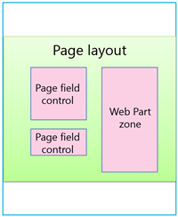
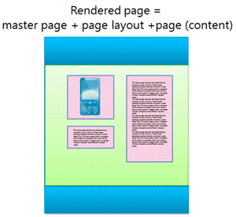
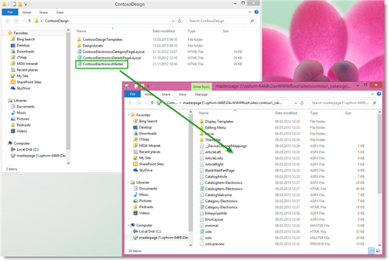
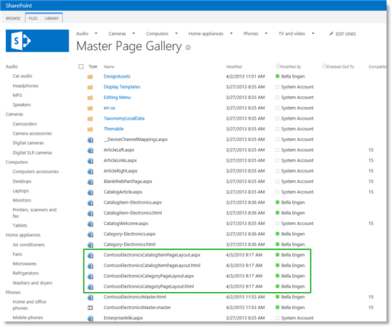
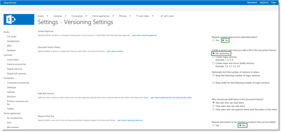
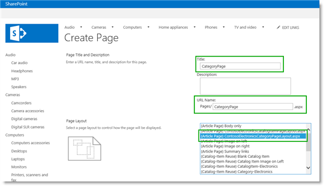
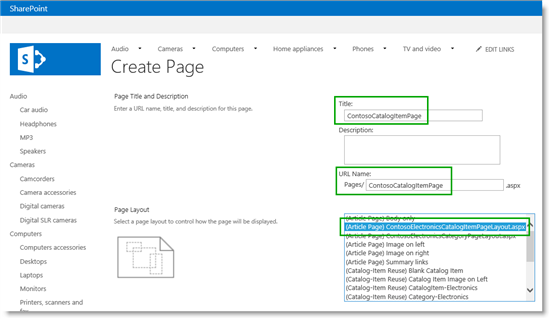

# Stage 7: Upload page layouts and create new pages in a publishing site in SharePoint Server

 **Summary:** Learn how to upload page layouts and create new pages in a publishing site in SharePoint Server 2016. 
  
> [!NOTE]
> Most of the features described in this series are available only for private sites collections in SharePoint Online. 
  
## Quick overview

[Stage 6: Upload and apply a new master page to a publishing site in SharePoint Server](stage-6-upload-and-apply-a-new-master-page-to-a-publishing-site.md) explained how to upload and apply a new master page. The next step in giving our site a "Contoso look" is to create new pages. 
  
In this stage, you'll learn:
  
- [About page layouts](stage-7-upload-page-layouts-and-create-new-pages-in-a-publishing-site.md#BKMK_AboutPageLayouts)
    
- [About pages and rendered pages](stage-7-upload-page-layouts-and-create-new-pages-in-a-publishing-site.md#BKMK_AboutPagesAndRenderedPages)
    
- [How to upload a new page layout](stage-7-upload-page-layouts-and-create-new-pages-in-a-publishing-site.md#BKMK_HowToUploadANewPageLayout)
    
- [How to turn off versioning for the Pages Library](stage-7-upload-page-layouts-and-create-new-pages-in-a-publishing-site.md#BKMK_HowToTurnOffVersioningForThePagesLibrary)
    
- [How to create a page based on a page layout](stage-7-upload-page-layouts-and-create-new-pages-in-a-publishing-site.md#BKMK_HowToCreateAPageBasedOnAPageLayout)
    
> [!NOTE]
> This article doesn' *t*  cover how to create a page layout. It explains how to upload already completed page layouts. These files won't be made available for download. 
  
## Start stage 7

### About page layouts

A **page layout** is a template for a page in your site. This is where you define the layout and structure for the body of a page. 
  
Page layouts contain page field controls and Web Part zones. Page field controls and Web Part zones are placeholders that define where content can be added by authors. They are added to a page layout at a specific position, for example on the left side of a column, and with specific style elements, such as bold.
  

  
[Stage 6: Upload and apply a new master page to a publishing site in SharePoint Server](stage-6-upload-and-apply-a-new-master-page-to-a-publishing-site.md) explained how SharePoint Server 2016 automatically converts an HTML master page into an ASP.NET page. The same rule applies to page layouts. You can create a page layout in HTML format and SharePoint Server 2016 will automatically convert it to an ASP.NET page for you. This means that you can design your page layout using your favorite HTML editor, and focus on HTML, CSS, and JavaScript. You don't have to worry about ASP.NET or SharePoint specific markup. 
  
For more information, see:
  
- [Overview of the SharePoint 2013 page model](https://go.microsoft.com/fwlink/p/?LinkId=400535)
    
- [How to: Create a page layout in SharePoint 2013](https://go.microsoft.com/fwlink/p/?LinkId=400538)
    
### About pages and rendered pages

It is important to understand that authors do not add content to a page layout. Content is added to a **page**. 
  
A page is created based on a specific page layout. Once you've created a page, authors can add content that they want to display on their website to the page. Because the page is based on a page layout with page field controls and Web Part zones, authors can't add content outside these areas.
  
When visitors browse a site, they will see a rendered page. In a rendered page, the master page is merged with the page layout, and the content for the page is displayed in the page fields and Web Part zones.
  

  
For more information, see [Overview of the SharePoint 2013 page model](https://go.microsoft.com/fwlink/p/?LinkId=400535).
  
### How to upload a new page layout

In our Contoso scenario, we have two page layouts: one for the category page, and one for the catalog item page.
  
[Stage 6: Upload and apply a new master page to a publishing site in SharePoint Server](stage-6-upload-and-apply-a-new-master-page-to-a-publishing-site.md) explained how to map a network drive. Because we have mapped our network drive, uploading these page layouts becomes very easy. Simply drag-and-drop the files into your **Master Page Gallery**. 
  

  
In SharePoint, refresh the **Master Page Gallery** page to see that the two page layouts are added. Also notice that an associated ASP.NET file was created for the page layouts. 
  

  
### How to turn off versioning for the Pages Library

In our scenario, we are not using SharePoint workflows for approval. The files have already been approved. Therefore, before we create a new page, we want to turn off versioning for the **Pages** library. 
  
To turn off versioning for the **Pages** library: 
  
1. From the **Site Settings** menu, select **Site contents**. 
    
     
  
2. On the **Site Contents** page, click **Pages**. 
    
3. In the **Pages** library, on the **LIBRARY** tab, click **Library Settings**. 
    
4. On the **Settings** page, click **Versioning settings**. 
    
5. In the **Require Check Out section**, for **Require documents to be checked out before they can be edited**, select **No**. 
    
     
  
We are now ready to create our two new pages.
    
### How to create a page based on a page layout

To create a new page:
  
1. On the **Site Contents** page, click **Pages**. 
    
2. In the **Pages** library, click the **FILES** tab, and then click **New Document**. 
    
     
  
3. On the **Create Page** page, enter a **Title** and a **URL name**. From the **Page Layout** list, select the page layout that you want to apply to the new page. In our scenario, the page layout is the newly uploaded page layout called  *ContosoElectronicsCategoryPageLayout*  . 
    
     
  
After you click **OK**, the newly created page is shown in the **Pages** library. 
    
     
  
4. In our Contoso scenario, we'll also need a catalog item page. To create this page, repeat steps 3 and 4 from the previous procedure. However for **Page Layout**, select  *ContosoElectroniceCatalogItemPageLayout*  . 
    
     
  
Our **Pages** library now contains two new pages:  *ContosoCategoryPage*  and  *ContosoCatalogItemPage*  . 
    
     
  
Now that we have created these pages, the next step is to assign them to the terms that drive our site navigation.
  
#### Next article in this series

[Stage 8: Assign a category page and a catalog item page to a term in SharePoint Server](stage-8-assign-a-category-page-and-a-catalog-item-page-to-a-term.md)
  
## See also

#### Other Resources

[How to: Create a page layout in SharePoint Server 2013](https://msdn.microsoft.com/library/jj822368.aspx)
  
[Add snippets to a master page or a page layout in SharePoint Server 2013](https://msdn.microsoft.com/library/office/jj822367.aspx)

