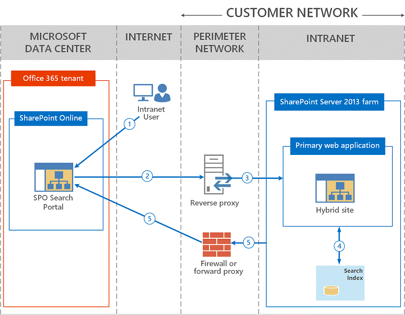

# Configure a reverse proxy device for SharePoint Server hybrid

 **Summary:** Learn about supported reverse proxy devices for SharePoint Server hybrid deployments. 
  
 **This article is part of a roadmap of procedures for configuring SharePoint hybrid solutions. Be sure you're [following a roadmap](configuration-roadmaps.md) when you do the procedures in this article. **
  
This topic provides an overview of the role of reverse proxy devices in a SharePoint Server hybrid deployment and links to device-specific configuration guidance.
  
In this article:
  
- [The role of a reverse proxy in a SharePoint Server hybrid deployment](configure-a-reverse-proxy-device-for-sharepoint-server-hybrid.md#role)
    
- [General reverse proxy requirements](configure-a-reverse-proxy-device-for-sharepoint-server-hybrid.md#requirements)
    
- [Supported reverse proxy devices](configure-a-reverse-proxy-device-for-sharepoint-server-hybrid.md#devices)
    
## The role of a reverse proxy in a SharePoint Server hybrid deployment

SharePoint Server and SharePoint Online can be configured in a hybrid configuration to securely combine search results and external data from Microsoft Business Connectivity Services. Reverse proxy devices play a role in the secure configuration of a hybrid SharePoint Server deployment when inbound traffic from SharePoint Online needs to be relayed to your on-premises SharePoint Server farm. For example, if a federated user uses a SharePoint Online search portal that is configured to return hybrid search results, a reverse proxy device intercepts and pre-authenticates the request for on-premises SharePoint Server content and then relays it to SharePoint Server. The reverse proxy device in a hybrid topology provides a secure endpoint for inbound traffic using SSL encryption and client certificate authentication.
  
### How inbound connectivity works

The following diagrams show how a reverse proxy device is used for inbound connectivity.
  
With an inbound search solution, only the SharePoint Online site has search results from both locations.
  
**Inbound connectivity**

  
In the example below, a federated user on the Internet uses the SharePoint Online search portal to search for content in both SharePoint Online and her company's on-premises SharePoint Server server.
  
**A federated user on the Internet searches for content that's located on her company's on-premises server.**

  
The following list describes the steps shown in the preceding picture.
  
1. From the Internet, a federated user browses to her SharePoint Online site.
    
2. SharePoint Online queries the search index in SharePoint Online and also sends the search query to the external URL of the on-premises SharePoint farm which resolves to the external endpoint of the reverse proxy device.
    
3. The reverse proxy device pre-authenticates the request using the Secure Channel SSL certificate and relays the request to the URL of the primary web application.
    
4. The SharePoint farm service account queries the on-premises search index and security trims the search results in the context of the user who sent the search request.
    
5. Security trimmed search results are returned to SharePoint Online and displayed on the search results page. This result set includes search results from the SharePoint Online search index and search results from the search index of the SharePoint Server farm.
    
> [!NOTE]
> Inbound connectivity enables access to content and resources in your on-premises SharePoint Server farm **from the internet** only if the user has an active, secure connection to the intranet network over VPN or DirectAccess or if the SharePoint Server farm is configured in an extranet topology. 
  
For a more detailed description of this process, that shows how certificates are used and authentication and authorization work in this topology, see [Poster: SharePoint 2013 Hybrid Topology: Certificate, Authentication, and Authorization flow](https://go.microsoft.com/fwlink/?LinkId=392320).
  
## General reverse proxy requirements

In a hybrid SharePoint Server scenario, the reverse proxy must be able to:
  
- Support client certificate authentication with a wildcard or SAN SSL certificate.
    
- Support pass-through authentication for OAuth 2.0, including unlimited OAuth bearer token transactions.
    
- Accept unsolicited inbound traffic on **TCP port 443** (HTTPS). 
    
    > [!TIP]
    > No ports other than TCP 443 need to be opened on the external reverse proxy endpoint to support hybrid connectivity. 
  
- Bind a wildcard or SAN SSL certificate to a published endpoint.
    
- Relay traffic to an on-premises SharePoint Server farm or load balancer without rewriting any packet headers.
    
## Supported reverse proxy devices

The table below lists the currently supported reverse proxy devices for SharePoint Server hybrid deployments. This list will be updated as new devices are tested for supportability. Follow the steps in the configuration article for the reverse proxy device that you want to use. When you've completed configuring the reverse proxy device, return to your [roadmap](configuration-roadmaps.md).
  
|**Supported reverse proxy devices**|**Configuration article**|**Additional information**|
|:-----|:-----|:-----|
|Windows Server 2012 R2 with Web Application Proxy (WA-P)    |[Configure Web Application Proxy for a hybrid environment](configure-web-application-proxy-for-a-hybrid-environment.md)   |Web Application Proxy (WA-P) is a Remote Access service in Windows Server 2012 R2 that publishes web applications that users can interact with from many devices.    > [!IMPORTANT]> To use Web Application Proxy as a reverse proxy device in a hybrid SharePoint Server environment, you must also deploy AD FS in Windows Server 2012 R2.           |
|Forefront Threat Management Gateway (TMG) 2010    |[Configure Forefront TMG for a hybrid environment](configure-forefront-tmg-for-a-hybrid-environment.md)   |Forefront TMG 2010 is a comprehensive, secure, web gateway solution that provides secure reverse proxy functionality.    > [!NOTE]> Forefront TMG 2010 is no longer sold by Microsoft but will be supported through 4/14/2020. For more information, see [Microsoft Support Lifecycle information for TMG 2010](http://support.microsoft.com/lifecycle/default.aspx?LN=en-us&amp;p1=14873&amp;x=13&amp;y=9).           |
|F5 BIG-IP    |[Enabling SharePoint 2013 Hybrid Search with the BIG-IP](https://devcentral.f5.com/articles/enabling-sharepoint-2013-hybrid-search-with-the-big-ip)   |External content managed by F5 Networks.    |
|Citrix NetScaler    |[Citrix NetScaler and Microsoft SharePoint 2013 Hybrid Deployment Guide](https://www.citrix.com/content/dam/citrix/en_us/documents/products-solutions/deployment-guide-netscaler-office-365-en.pdf)   |External content managed by Citrix.    |
   
## See also

#### Concepts

[Hybrid for SharePoint Server](hybrid.md)

