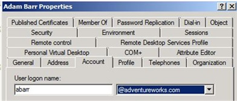

# Configure Office 365 for SharePoint hybrid

 **Summary:** Get Office 365 for enterprises set up for hybrid integration with SharePoint Server. 
  
 **This article is part of a roadmap of procedures for configuring SharePoint hybrid solutions. Be sure you're [following a roadmap](configuration-roadmaps.md) when you do the procedures in this article. **
  
## Configure Office 365 for SharePoint hybrid

You have to set up some basic integration between Office 365 for enterprises and SharePoint Server before you can configure a hybrid environment. Do the following steps as described in this article:
  
1. Sign up for Office 365.
    
2. Register your domain with Office 365.
    
3. Assign UPN domain suffixes.
    
4. Synchronize accounts with Office 365.
    
5. Assign licenses to your users.
    
You might have already done some of these steps. If so, there's no need to repeat them. But be sure you do each of the steps in the order shown above before you configure a hybrid environment.
  
## 1. Sign up for Office 365

You need an [Office 365 subscription](https://go.microsoft.com/fwlink/p/?LinkID=532795) in order to set up a hybrid environment with SharePoint Server 2016. If you're planning to configure hybrid OneDrive for Business, be sure to subscribe to a plan that includes OneDrive for Business. All other hybrid SharePoint hybrid scenarios require an Enterprise plan that includes SharePoint Online. 
  
## 2. Register your domain with Office 365

When you sign up for Office 365, you're given an initial domain name that looks like contoso.onmicrosoft.com. However, in order to configure a hybrid environment with SharePoint Server 2016, you must register a public domain that you own (such as contoso.com) in Office 365. For detailed information on how to do this, see [Work with domain names in Office 365](https://go.microsoft.com/fwlink/p/?LinkID=534807).
  
## 3. Assign a UPN domain suffix

You have to create a UPN domain suffix in your on-premises Active Directory domain that matches the public domain—for example, contoso.com. Then, you have to assign the UPN domain suffix to each user account that you want to synchronize or federate.
  
The following procedures show how to manually do these tasks. If you have many users whom you want to federate, we recommend that you put all federated user accounts into an organizational unit (OU), and then create a script that will change the UPN domain suffix for each user account in that OU. For supported guidance on DirSync filtering, see [Configure filtering for directory synchronization](https://go.microsoft.com/fwlink/?LinkID=392308). For information about how to create a script for this, see [How Can I Assign a New UPN to All My Users](https://go.microsoft.com/fwlink/?LinkId=392242).
  
 **To create the UPN suffix in your on-premises DNS**
  
1. On the Active Directory server, open **Active Directory Domains and Trusts**.
    
2. In the left pane, right-click the top-level node, and then click **Properties**.
    
3. In the **UPN suffixes** dialog box, enter the domain suffix in the **Alternative UPN suffixes** box that you want for hybrid, and then click **Add** > **OK**.
    
For more information, see [Add user principal name suffixes](https://go.microsoft.com/fwlink/?LinkId=392430) (https://go.microsoft.com/fwlink/?LinkId=392430). 
  
 **To manually assign a UPN domain suffix to users**
  
1. In **Active Directory Users and Computers**, in the left pane, click the **Users** node. 
    
2. In the **Name** column, right-click the user account that you want to federate, and then click **Properties**.
    
3. In the **Properties** dialog box, click the **Account** tab. 
    
4. Select the UPN domain suffix that you added in the previous procedure from the drop-down list, as shown in the following picture.
    
     
  
5. Repeat steps 2 through 4 for each additional user account that you want to federate.
    
## 4. Synchronize user accounts with Office 365

In order to configure a hybrid environment, you must synchronize your on-premises Active Directory Domain Services user accounts with Office 365 by configuring one of the following:
  
- Directory synchronization with password synchronization
    
- Directory synchronization with single sign-on (SSO)
    
If you choose the SSO option, you can also configure password synchronization if you want to as a backup for SSO, but you must configure at least one of the two (password synchronization or SSO). 
  
For detailed information on how to configure these options, see [Office 365 integration with on-premises environments](https://go.microsoft.com/fwlink/p/?LinkID=524187).
  
## 5. Assign licenses to your users

Your users must each have a license in Office 365 in order to be able to use hybrid features. Once your accounts are synchronized, [assign licenses to your users](https://go.microsoft.com/fwlink/p/?LinkID=529809).
  

