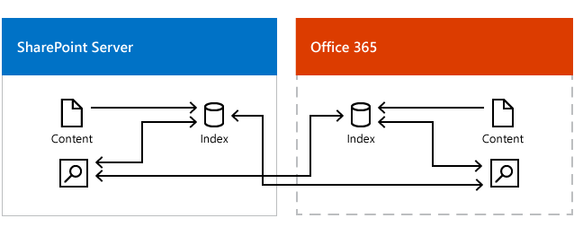
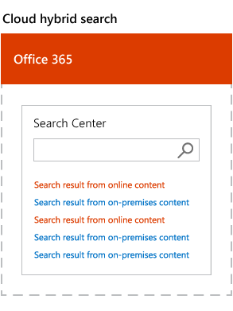
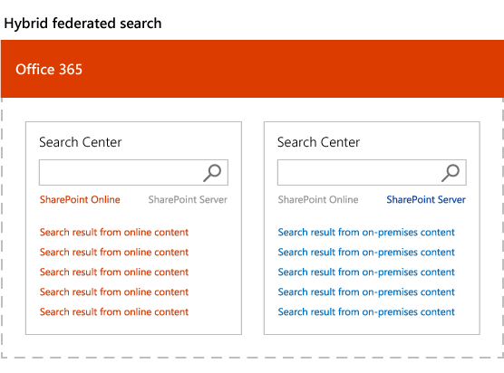

# Hybrid search in SharePoint

 Hybrid search lets your users search for files and documents across SharePoint Server and Office 365 at the same time. Depending on how you set up hybrid search, you can have only on-premises users search for content stored in Office 365, only online users search for content stored in SharePoint Server, or both user groups search for content stored in the other environment. 
  
There are two variants of hybrid search:
  
- Cloud hybrid search
    
- Hybrid federated search
    
## What is cloud hybrid search?

With the [cloud hybrid search solution](learn-about-cloud-hybrid-search-for-sharepoint.md) for SharePoint, you index all your crawled content, including on-premises content, in your search index in Office 365. When users enter a query in a search center, they get search results from the Office 365 search index, and thus get results both from on-premises and Office 365 content. 
  

  
## What is hybrid federated search?

With the [hybrid federated search solution](learn-about-hybrid-federated-search-for-sharepoint.md) for SharePoint, you federate results from your search index in SharePoint Server 2013 and your search index in Office 365. When users enter a query in a search center, they get search results from the Office 365 search index and from the SharePoint Server 2013 search index, and thus get results both from on-premises and Office 365 content. 
  

  
## Cloud hybrid search or hybrid federated search - what's the difference for your users?

With cloud hybrid search, search results come from one search index. A search center in for example SharePoint Online in Office 365 displays and ranks results in one single result block. SharePoint Online calculates search relevance ranking and refiners for all your results, regardless of whether the results come from on-premises or Office 365 content.
  

  
With hybrid federated search, search results come from two indexes. A search center in for example SharePoint Online in Office 365 displays and ranks results in two result blocks. SharePoint Online displays and ranks search results from Office 365 content, but uses the ranking from SharePoint Server 2013 for search results from on-premises content and displays these search results in the order that they arrive.
  

  
## Should you choose cloud hybrid search or hybrid federated search?

We recommend that you choose **cloud hybrid search** for these benefits: 
  
- Your users get unified search results, search relevance ranking, and refiners even if your organization has a hybrid deployment with content both on-premises and in Office 365. 
    
- Your users automatically get the newest SharePoint Online search experience without your organization having to update your existing SharePoint servers.
    
- Your users can use cloud capabilities such as Office Delve also for your on-premises content.
    
- You no longer have to worry about the size of your search index, because your search index is in Office 365. This means that the footprint of your SharePoint Server 2013 search farm is smaller, and your total cost of ownership for search is lower.
    
- You don't need to upgrade any of your existing installations of SharePoint to have enterprise search in the cloud because SharePoint Server 2013 supports crawling of existing SharePoint Server 2007, SharePoint Server 2010 and SharePoint Server 2013 content farms.
    
- You no longer have to migrate your search index to a newer version of SharePoint because this happens automatically for you in Office 365.
    
If you have some on-premises content that's highly sensitive and shouldn't be indexed outside your on-premises network, then we recommend using a combination of cloud hybrid search and hybrid federated search.
  
## See also

#### Concepts

[Plan hybrid federated search for SharePoint Server](plan-hybrid-federated-search.md)
#### Other Resources

[Learn about cloud hybrid search for SharePoint](learn-about-cloud-hybrid-search-for-sharepoint.md)
  
[Plan cloud hybrid search for SharePoint](plan-cloud-hybrid-search-for-sharepoint.md)
  
[Learn about hybrid federated search for SharePoint](learn-about-hybrid-federated-search-for-sharepoint.md)

