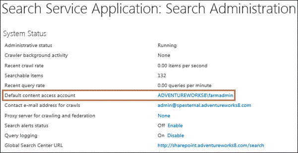

# Change the default account for crawling in SharePoint Server

 **Summary:** Change the user name or password of the account that the SharePoint Server 2016 or SharePoint Server 2013 Search service uses by default for crawling. 
  
The account that the SharePoint Server Search service uses by default for crawling is called the default content access account. It must be a domain account with a password that is current in Active Directory Domain Services (AD DS). If the password of this domain account expires, the Search service is not able to use the account to crawl content.
  
The password of the default content access account has two additional dependencies on the domain account password in AD DS:
  
- If you change the password of the account in AD DS, you must make the same change for the password of the default content access account in SharePoint Server.
    
- If you want to change the password of the default content access account in SharePoint Server, you must first change the password in AD DS. This is because the credentials that you enter for the default content access account in SharePoint Server are checked against those in AD DS. If you enter a new password for the default content access account before the account password is changed in AD DS, an error will result and the password of the default content access account will not be changed.
    
## 

The following procedure changes the user name and password for the default content access account. You can specify a different account for crawling particular URLs by using a crawl rule. If you specify a different account in a crawl rule and you want to change the password of that account, you must change the crawl rule. For more information, see [Manage crawl rules in SharePoint Server](manage-crawl-rules.md).
  
 **To change the default content access account**
  
1. Verify that the account that performs this procedure is a service application administrator for the Search service application that you want to configure.
    
2. In Central Administration, in the **Application Management** section, click **Manage service applications**.
    
3. On the Manage Service Applications page, click the Search service application for which you want to change the default content access account.
    
4. On the Search Administration page for the Search service application, in the **System Status** section, find the **Default content access account**, which is of the form  _Domain\UserName_.
    
     
  
5. Click the default content access account name. The **Default Content Access Account** dialog box appears. 
    
6. (Optional) In the **Account** text box, type a new user name. 
    
7. In the **Password** text box and in the **Confirm Password** text box, type the new password, and then click **OK**.
    
## See also

#### Concepts

[Create and configure a Search service application in SharePoint Server 2016](create-and-configure-a-search-service-application.md)
  
[Manage crawl rules in SharePoint Server](manage-crawl-rules.md)

