# How to add refiners to your search results page in SharePoint Server

[!INCLUDE[appliesto-2013-2016-2019-xxx-md](../includes/appliesto-2013-2016-2019-xxx-md.md)]
  
The previous article in this series, [Plan to use refiners on a search results page in SharePoint Server](plan-to-use-refiners-on-a-search-results-page.md), showed how to identify and plan to use refiners on your site. In this article, you'll learn:
  
- [How to map a crawled property to a refinable managed property](how-to-add-refiners-to-your-search-results-page.md#BKMK_HowtoMapaCrawledPropertytoaRefinableManagedProperty)
    
- [How to initiate a reindexing of a list or library](how-to-add-refiners-to-your-search-results-page.md#BKMK_HowtoInitiateaReindexingofaListorLibrary)
    
- [How to configure the Refinement Web Part to use custom refiners](how-to-add-refiners-to-your-search-results-page.md#BKMK_HowtoConfiguretheRefinementWebParttoUseCustomRefiners)
    
- [How to add counts to refiner values](how-to-add-refiners-to-your-search-results-page.md#BKMK_HowtoAddCountstoRefinerValues)
    
## How to map a crawled property to a refinable managed property

In our Search Center scenario, we knew we wanted to use the following refinable managed properties:
  
|**Refiner to use**|**Refinable managed property**|
|:-----|:-----|
|Manager    |RefinableString01    |
|Internal Writer    |RefinableString02    |
|Editor    |RefinableString03    |
|Content Type    |RefinableString04    |
|Requested Publish Date    |RefinableDate01    |
   
The procedure for mapping a crawled property to a refinable managed property is the same for all refiners. The following example procedure explains how we mapped the crawled property that represents  *Internal Writer*  to the  *RefinableString01*  refinable managed property. 
  
1. On your Search Center, on the **Site Settings** page, select **Search Schema**. 
    
     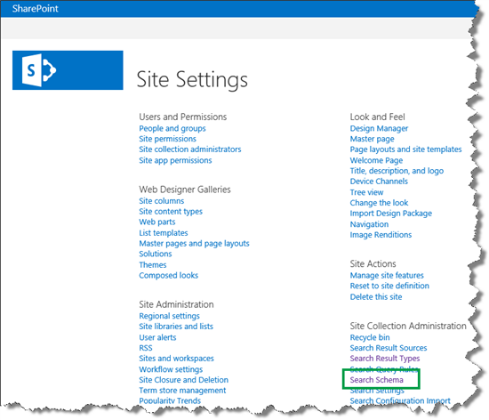
  
2. In the **Managed property** field, type the name of the refinable managed property to which you want to map a crawled property, and then click the arrow button. 
    
    In our scenario, we typed  *RefinableString01*  . 
    
     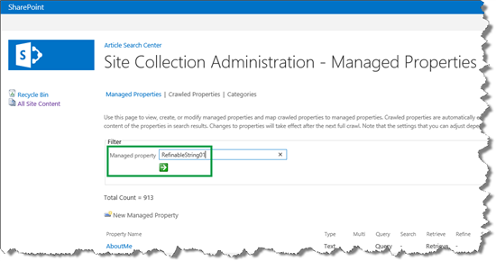
  
3. From the **Property Name** field, select **Edit/Map Property**. 
    
     
  
4. On the **Edit Managed Property** page, click **Add a Mapping**. 
    
     
  
5. In the **Crawled property selection** dialog, use the **Search for crawled property name** field to search for the crawled property that you want to map to this refinable managed property. 
    
    In our scenario, we knew we wanted to use the site column called  *Internal Writer*  . Crawled properties don't contain spaces. Therefore, we entered  *InternalWriter*  . 
    
     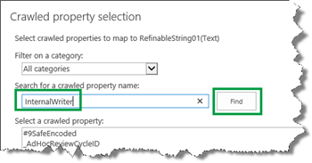
  
    Two crawled properties were found:  *ows_q_USER_Internal_Writer*  and  *ows_Internal_Writer*  . 
    
     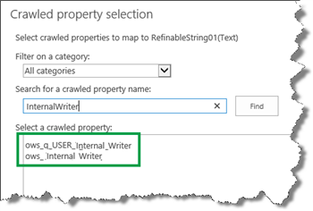
  
    If you have questions here, your confusion is understandable. This part is somewhat tricky. There are actually two crawled properties, which might seem strange, considering that we have only one Internal Writer site column. So which crawled property should we choose to map to the refinable managed property?
    
    Let's take a closer look at what's going on. The difference between the two crawled properties is the prefix. One has an  *ows_q_USER_*  prefix, and the other has  *ows_*  . 
    
    > [!IMPORTANT]
    > When mapping a crawled property to a refinable managed property, select the crawled property with the **ows_** prefix. 
  
    If you want more information about the naming convention for crawled and managed properties, see [From site column to managed property - What's up with that?](../administration/from-site-column-to-managed-propertywhat-s-up-with-that.md).
    
6. Select the crawled property with the  *ows_*  prefix, and then click **OK**. 
    
    In our scenario, we selected  *ows_Internal_Writer*  . 
    
     
  
    On the **Edit Managed Property** page, notice that the crawled property is added to the **Mappings to crawled property field**. 
    
     
  
7. In the **Alias** field, enter a name for the refiner. 
    
    In our scenario, we entered  *InternalWriter*  . 
    
     
  
    It's important to understand that the alias that you enter here is  *not*  the refiner name that will be shown on your search results page. This alias is meant to make your life a bit easier when you're configuring refiners in the **Refinement Web Part** (see procedure below). Remember, you can't change the name of the refinable managed property. Therefore, when you do the configuration, you'll have to deal with many refinable managed properties that have similar names,  *RefinableString01*  ,  *RefinableString02*  and so on So, the alias is a good reminder of which value that you mapped to the property. 
    
8. To finish the mapping, click **OK**. 
    
     
  
    The following screen shots show the final result after repeating the steps from the procedure above for the remaining four refiners.
    
     
  
     
  
## How to initiate a reindexing of a list or library

When you've mapped all the refinable managed properties that you want to use, you have to do a reindexing of your list or library. For information on how to do that, see [How to create a Search Center Site Collection and enable crawling of your content in SharePoint Server](how-to-create-a-search-center-site-collection-and-enable-crawling-of-your-conten.md).
  
## How to configure the Refinement Web Part to use custom refiners

By default, the **Refinement Web Part** is included on the search results page. In the previous blog post I showed you how to configure the **Search Results Web Part** to use a new result source. The two refiners  *Author*  and  *Modified date*  were also displayed. 
  
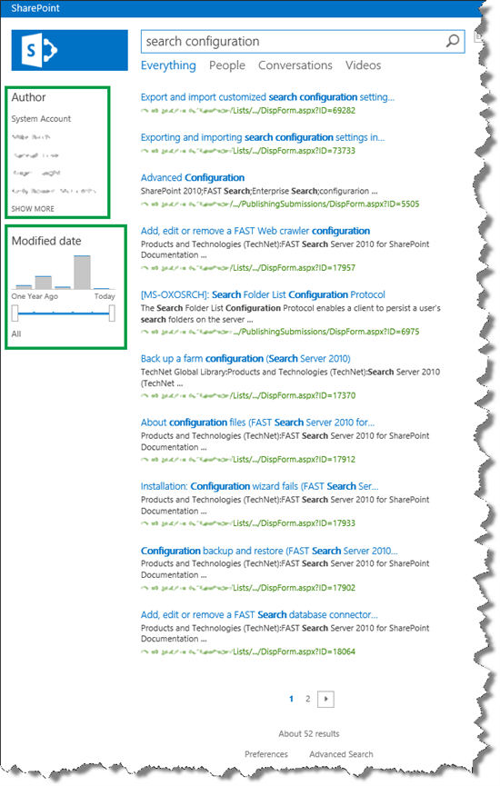
  
To display custom refiners, here's what you should do:
  
1. On the search results page, click the **Settings** menu, and then click **Edit Page**. 
    
2. In the **Refinement Web Part**, click the **Web Part Menu**, and then click **Edit Web Part**. 
    
     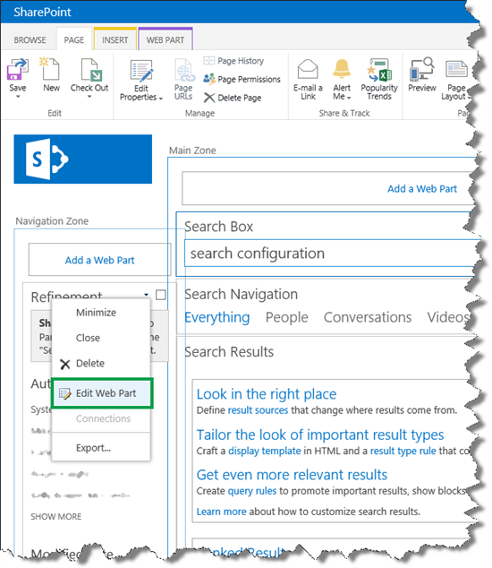
  
3. In the Web Part tool pane, click **Choose Refiners**. 
    
     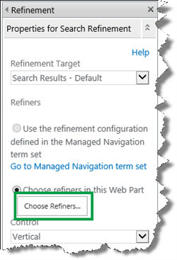
  
4. In the **Selected refiners** section, select the refiners that you don't want to display on your search results page, and then click **Remove**. 
    
    In our scenario, we removed all the default refiners.
    
     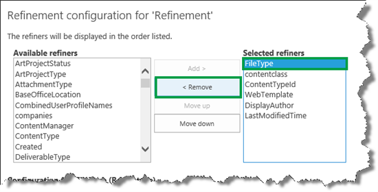
  
5. In the **Available refiners** section, scroll down and select a refinable managed property. 
    
    In our scenario, we selected  *RefinableString1.*  This is the refinable managed property that is mapped to the crawled property  *ows_Internal_Writer*  . Notice that sample values are shown (a good sign that we're on the right path), together with the alias  *InternalWriter*  . 
    
     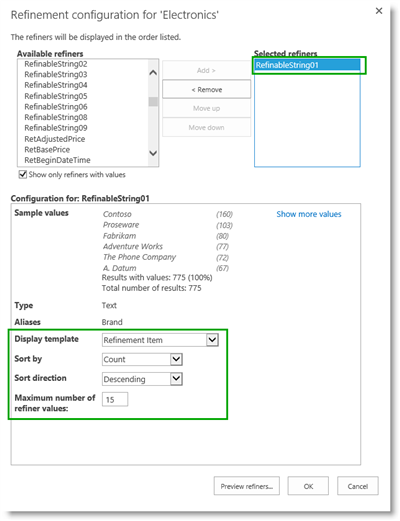
  
6. Click **Add**. 
    
     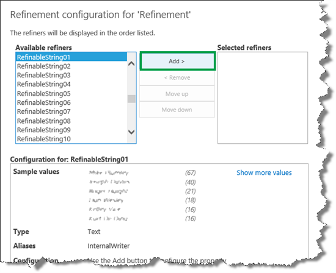
  
    This moves the  *RefinableString01*  property over to the **Selected refiners** section. When a refiner is moved over to the **Selected refiners** section, additional configuration options are shown. They will be explained in steps 10 and 11. 
    
     
  
7. Repeat steps 5 and 6 to add all the refiners you want to use on your search results page.
    
    In our scenario, we added the five refinable managed properties that we configured in the previous section.
    
     
  
8. To preview the refiners, click **Preview Refiners**. 
    
     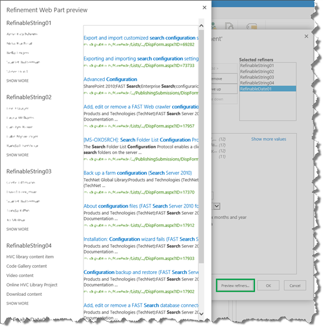
  
9. To change the display order of refiners, select the refiner you want to move, and then click the **Move up** or **Move down** button. 
    
    In our scenario, we selected  *RefinableString04*  (notice the Alias name), and selected **Move up** until it was the first property in the **Selected refiners** section. 
    
     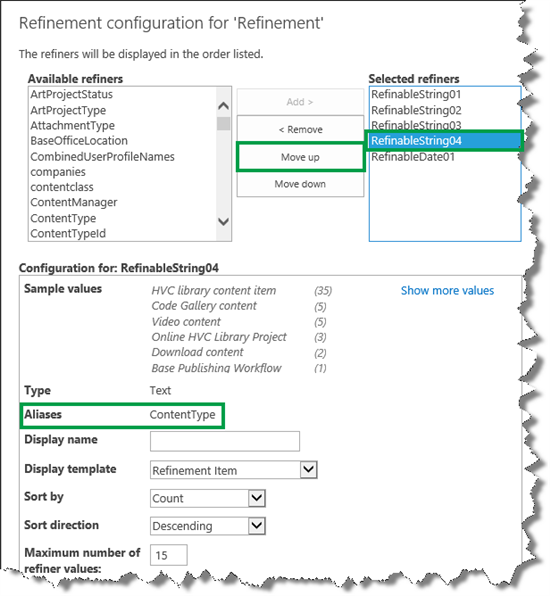
  
10. To enable users to select multiple refiner values, from the **Display template** menu, select **Multi-value Refinement Item**. 
    
     
  
    We clicked **Preview refiners** again, and verified that the  *ContentType*  refiner (RefinableString04) was displayed first, and that it had check boxes that would enable users to select multiple refiner values. 
    
     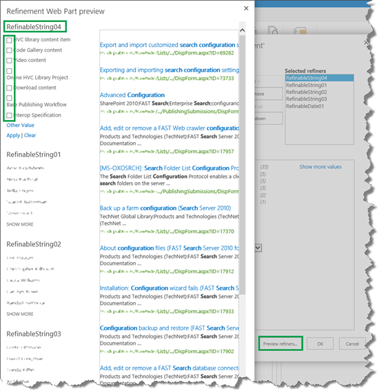
  
    We repeated this step for the refiners  *RefinableString01*  ,  *RefinableString02*  , and  *RefinableString03*  . 
    
    The  *RefinableDate01*  refiner represents  *Requested publish date*  . By default, the refiner values are shown in a list, which makes it difficult for users to see the date range. 
    
     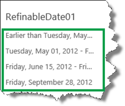
  
    To display the refiner values in a more user-friendly way, in the **Refinement configuration** dialog, from the **Display template** menu, we selected **Slider with bar graph**. In the **Dates** section, we selected **Last day, week, month, six months and year**. 
    
     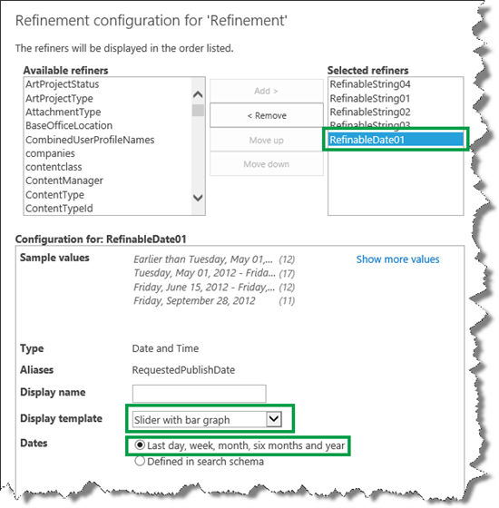
  
    When we now previewed our refiners, the values for the  *Requested Publish Date*  refiner (  *RefinableDate01*  ) were perfectly displayed as a graph. 
    
     
  
    But, there was more thing that we needed to improve: the refiner display names.  *RefinableString01*  ,  *RefinableString02*  , and so on do not make much sense to users. 
    
11. To change the refiner display name, in the **Display name** field, enter the name that you want to be displayed for each refiner. 
    
    In our scenario, for the  *RefinableString04*  refiner, we entered  *Content Type*  . 
    
     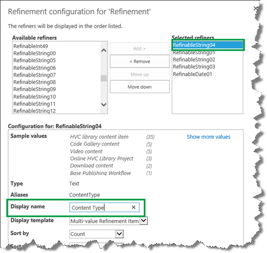
  
    Repeat this step for all your refinable managed properties.
    
12. To save the configurations, click **OK** in the **Refinement configuration** dialog, and then **OK** in the Web Part tool pane. 
    
13. Save the page.
    
In our scenario, the five refiners were now correctly displayed on the search results page.
  

  
But, there was one small detail that would make the refiners even better. Right now users couldn't see numeric details for the refiner values. For example, we could see names of writers that had written articles that had to do with  *search configuration*  . However, we couldn't see how many articles they had written. 
  
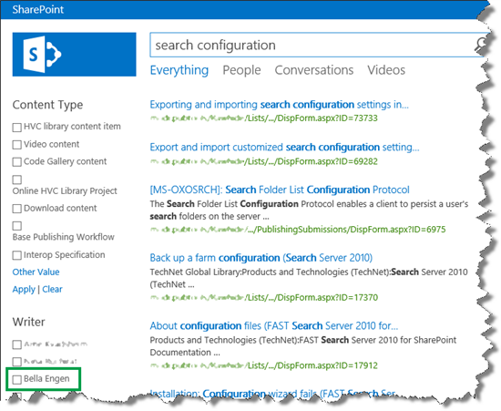
  
To see this information, we needed to add  *counts*  to the refiner values. 
  
## How to add counts to refiner values

To add counts to refiner values, you'll have to edit a display template. When you work with display templates, you'll make life a lot easier for yourself if you map your network drive. By doing this, you'll be able to work with display templates from Windows Explorer. [Stage 6: Upload and apply a new master page to a publishing site in SharePoint Server](../administration/stage-6-upload-and-apply-a-new-master-page-to-a-publishing-site.md) explains how to map your network drive. 
  
1. In your mapped network drive, go to **Display Templates** --> **Filters**. 
    
2. To add counts to refiners where it's only possible to select one refiner value at a time, open the HTML file **Filter_Default**. To add counts to refiners where it's possible to select multiple refiner values, open the HTML file **Filter_MultiValue**. 
    
3. Change the value for **ShowCounts** to **true**. 
    
     
  
4. Save the file.
    
    To verify that refiner counts are displayed, enter a query in your search center.
    
    In our scenario, we again entered  *search configuration*  . We could now see that the writer "Bella Engen" was the writer of five articles on the subject that had something to do with search configuration. Nice! 
    
     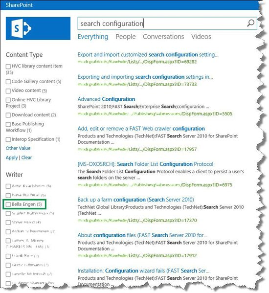
  
### Next article in this series

[How to add a custom search vertical to your search results page in SharePoint Server](how-to-add-a-custom-search-vertical-to-your-search-results-page.md)
  

