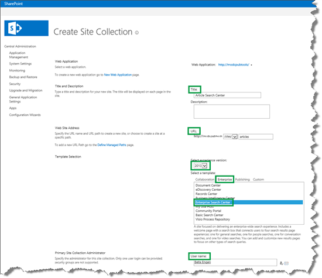
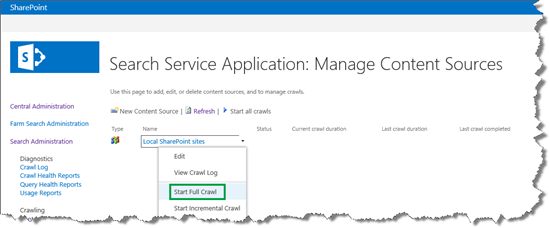
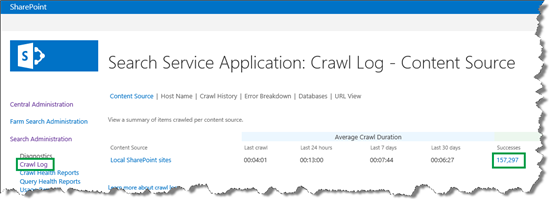
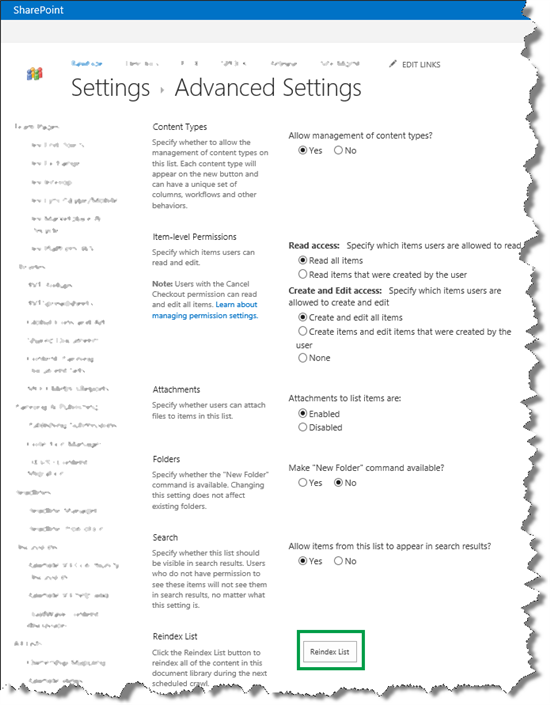

# How to create a Search Center Site Collection and enable crawling of your content in SharePoint Server

 **Summary:** Learn how to create a Search Center Site Collection and enable crawling of your content in SharePoint Server. 
  
In this article, you'll learn:
  
- [How to create a Search Center Site Collection](how-to-create-a-search-center-site-collection-and-enable-crawling-of-your-conten.md#BKMK_HowtoCreateaSearchCenterSiteCollection)
    
- [How to start a full crawl in Central Administration](how-to-create-a-search-center-site-collection-and-enable-crawling-of-your-conten.md#BKMK_HowtoStartaFullCrawlinCentralAdministration)
    
- [How to enable continuous crawls in Central Administration](how-to-create-a-search-center-site-collection-and-enable-crawling-of-your-conten.md#BKMK_HowtoEnableContinuousCrawlsinCentralAdministration)
    
- [How to set the continuous crawl interval](how-to-create-a-search-center-site-collection-and-enable-crawling-of-your-conten.md#BKMK_HowtoSettheContinuousCrawlInterval)
    
- [How to reindex a list](how-to-create-a-search-center-site-collection-and-enable-crawling-of-your-conten.md#BKMK_HowtoReindexaList)
    
## How to create a Search Center Site Collection
<a name="BKMK_HowtoCreateaSearchCenterSiteCollection"> </a>

To create a Search Center Site Collection, go to **Central Administration** --> **Create site collections**, and then enter details for the site collection. Here's what you have to enter: 
  
1. Enter a **title** for the website. 
    
2. Enter the website's **URL**. 
    
3. Select **2013** for the experience version. 
    
4. From the **Enterprise** tab, select **Enterprise Search Center**. 
    
5. In the field **Primary Site Collection Administration**, enter the site administrator's **user name**. 
    
     
  
Now that you have your Search Center Site Collection, you can move on to crawling content.
  
## How to start a full crawl in Central Administration
<a name="BKMK_HowtoStartaFullCrawlinCentralAdministration"> </a>

Before you can start a full crawl in Central Administration, you have to specify the content source that you want to crawl. When you run a full crawl, all content in the content source is crawled even if that content has already been added to the search index.
  
In a scenario where you only have SharePoint content, you can select to crawl the **Local SharePoint sites** content source. 
  
1. Go to **Central Administration** --> **Manage service applications** --> **Search Service Application** --> **Content Sources**. 
    
2. On the **Manage Content Sources** page, pause on the **Local SharePoint sites** content source, and select **Start Full Crawl** from the menu. 
    
     
  
    The status of the crawl is shown in the **Status** column. 
    
3. Refresh this page until the value in the **Status** column is **Idle**. That means that the full crawl has finished. 
    
     
  
4. Optionally, you can verify that your items are added to the search index by clicking **Crawl Log**. 
    
    In this scenario, 157,297 items appear in the search index.
    
     
  
## How to enable continuous crawls in Central Administration
<a name="BKMK_HowtoEnableContinuousCrawlsinCentralAdministration"> </a>

By default, content is automatically crawled every fourth hour. But, when changes are made to your content, you probably want it to be crawled as soon as possible so that users can find it on the Search Center. Nobody wants to start a full crawl manually every time that a change is made to their content, as this is neither efficient nor practical. So, to avoid this overhead, you can enable a  *continuous crawl*  of the content source that contains your content. 
  
Continuous crawls start automatically at 15-minute intervals. Any changes that were made to your content since the previous crawl are picked up by the crawler and added to the search index.
  
To enable continuous crawls:
  
1. Go to **Central Administration** --> **Manage service applications** --> **Search Service Applications** --> **Content Sources**. 
    
2. On the **Managed Content Sources** page, click the content source for which you want to enable continuous crawl. 
    
    In this scenario, the content source is **Local SharePoint sites**. 
    
3. Select **Enable Continuous Crawls**. 
    
     
  
## How to set the continuous crawl interval
<a name="BKMK_HowtoSettheContinuousCrawlInterval"> </a>

The default interval for continuous crawls is 15 minutes. But, you can set shorter intervals by using Microsoft PowerShell. The following code example sets the continuous crawl interval to 1 minute.
  
```
$ssa = Get-SPEnterpriseSearchServiceApplication
$ssa.SetProperty("ContinuousCrawlInterval", 1)
```

So, by enabling continuous crawls, your search index is automatically updated with the latest changes. But, there are some types of changes where continuous crawls are insufficient to update the search index, for example, if you enable managed properties as refiners (we'll show you how to do this in a later article). For these changes to be updated in the search index, you have two options:
  
- Do a full crawl.
    
- Do something called  *reindexing*  . 
    
The reason there are two options is because people who work with content (let's call them content managers) are  *not*  likely to have Search service application administration level rights. That is, they don't have access to Central Administration where they can start a full crawl. But, content managers are likely to have Site Owner rights, and Site Owners can do reindexing. 
  
## How to reindex a list
<a name="BKMK_HowtoReindexaList"> </a>

Here are the steps to mark a list or library for reindexing:
  
1. On your list or library, click the **LIST** or **LIBRARY** tab --> **List Settings** or **Library Settings** --> **Advanced Settings**. 
    
2. On the **Advanced Settings** page, click **Reindex List** or **Reindex Document Library**. 
    
     
  
The list will be reindexed during the next scheduled crawl.
    
So, overall, content managers can be happy because their content is added to the search index at short intervals, and Search service application administrators can be happy because they are not bothered by content managers constantly asking them to start a crawl.
  
### Next article in this series

[Plan to use refiners on a search results page in SharePoint Server](plan-to-use-refiners-on-a-search-results-page.md)
  

