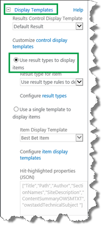
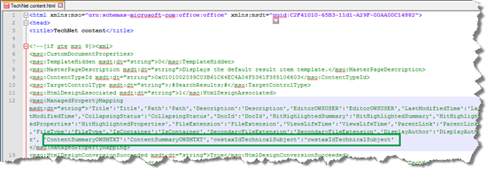

# How to display values from custom managed properties in search results - option 2 in SharePoint Server

 **Summary:** Learn a second option for displaying values from custom managed properties in SharePoint Server. 
  
In [How to display values from custom managed properties in search results - option 1 in SharePoint Server](how-to-display-values-from-custom-managed-properties-in-search-resultsoption-1.md) we showed a simple method to add a custom icon and values from two custom managed properties to your search results. In this topic, we'll look at a somewhat fuller method for changing the way search results are displayed that includes if statements and hit highlighting. In this article, you'll learn: 
  
- [Strategy for killing three birds with one stone - search results version](how-to-display-values-from-custom-managed-properties-in-search-results-–-option.md#BKMK_StrategyforKillingThreeBirdsWithOneStoneSearchResultsVersion)
    
- [How to display values from custom managed properties with hit highlighting, and get automatically improved relevancy](how-to-display-values-from-custom-managed-properties-in-search-results-–-option.md#BKMK_HowtoDisplayValuesfromCustomManagedPropertieswithHitHighlightingandGetAutomaticallyImprovedRelevancy)
    
## Strategy for killing three birds with one stone - search results version
<a name="BKMK_StrategyforKillingThreeBirdsWithOneStoneSearchResultsVersion"> </a>

First, let's state what we want to achieve:
  
- Display values from two custom managed properties.
    
- Apply hit highlighting to the two custom managed properties.
    
- Get automatically improved relevancy for our search results.
    
Before we look at details about how to achieve these goals, let's look at the strategy we want to follow. If this gets a bit complex, please try to hang in there. Hopefully it'll be clear by the end.
  
First, remember how we can think about hit highlighting:
  

  
1. The managed properties that are listed in the **Hit-highlighted properties (JSON)** section of the Search Results Web Part and the "magical summary" property are passed to the  *HitHighlightedProperties*  property. 
    
2. All values of the  *HitHighlightedProperties*  property are passed to the  *HitHighlightedSummary*  property. 
    
3. A truncated version of the values in  *HitHighlightedSummary*  is displayed in the Search Results Web Part with three dots at the end. 
    
Also remember that each item display template contains a reference to the  *Item_CommonItem_Body*  display template, and that this template contains an  *onlick*  method that will result in automatically improved relevance based on the end-user's click behavior. 
  

  
So our strategy is this: create variables in the item display template that will be passed on and rendered by the  *Item_CommonItem_Body*  display template. 
  
Specifically, that means that we have to do the following:
  
- Add the custom managed properties that we want to display in our search results to the **Hit-highlighted properties** in the **Search Results Web Part**. 
    
- Add the custom managed properties to an item display template.
    
- In the item display template, create a variable that will be used by the property  *HitHighlightedSummary*  to display our two custom managed properties with hit highlighting. 
    
- In the item display template, leave the reference  `_#=ctx.RenderBody(ctx)=#_` so that the  *Item_ComonItem_Body*  display template will render the search result. This makes sure that we get automatically improved relevancy. 
    
OK, now let's take it step-by-step, with examples of how we did this for our Search Center scenario.
  
## How to display values from custom managed properties with hit highlighting, and get automatically improved relevancy
<a name="BKMK_HowtoDisplayValuesfromCustomManagedPropertieswithHitHighlightingandGetAutomaticallyImprovedRelevancy"> </a>

First, you have to find the managed property names that correspond to the custom site columns that you want to use. We looked at how to do this in [How to display values from custom managed properties in search results - option 1 in SharePoint Server](how-to-display-values-from-custom-managed-properties-in-search-resultsoption-1.md).
  
Next, you have to do some configuration on the **Search Results Web Part**. Here are the steps: 
  
1. On the Search results page, choose the **Settings** menu, and then choose **Edit Page**. 
    
2. In the Search Results Web Part, choose **Web Part Menu** --> **Edit Web Part**. 
    
3. In the Web Part tool pane, choose to expand the **Display Templates** section, and then select **Use a single template to display items**. This will allow you to change the **Hit-highlighted properties (JSON)** field. 
    
     
  
4. In the **Hit-highlighted properties (JSON)** field, use the following format to add the custom managed properties that you want to add hit highlighting to: 
    
    "\<Managed property name\>"
    
    In our Search Center scenario, we wanted to apply hit highlighting to the  *ContentSummaryOWSMTXT*  and the  *owstaxIdTechnicalSubject*  managed properties. 
    
     
  
5. Select **Apply** to save the changes. This will close the **Display Templates** section. 
    
6. Select **Display Templates** to reopen the section, and select **Use result types to display items**. 
    
     
  
7. Click **OK** and save the page. 
    
    Next, you have to add the custom managed properties to an item display template. Here's what you should do:
    
8. Open the item display template that belongs to the result type for which you want to customize search results.
    
    In our Search Center scenario, this was  *TechNet content*  . 
    
9. In the item display template, in the **ManagedPropertyMapping** tag, use the following syntax to add the custom managed properties that you want to display: 
    
  ```
  '<Current item property name>':<Managed property name>'
  ```

    In our Search Center scenario, we wanted the values from the managed properties  *ContentSummaryOWSMTXT*  and  *owstaxIdTechnicalSubject*  to be displayed in the search result. To make the file easier to maintain, we named the current item properties the same as the managed properties. 
    
     
  
    Next, you have to create variables in the item display template that will be used and rendered by the  *Item_Common_Item_Body*  display template. Here's what you should do: 
    
10. Because you have no guarantee that the values of your custom properties will contain any of the entered query words, that is, hit highlighting won't be used, you have to create variables that guarantee that that the value of your custom properties will be displayed regardless of hit highlighting.
    
    The following screen shots show how we created two such variables for our custom properties  *ContentSummaryOWSMTXT*  and  *owstaxIdTechnicalSubject*  . 
    
     
  
11. In addition, we added a similar variable for the  *Title*  property. If you don't add this, the search results won't be rendered. 
    
     
  
12. The last step that you have to do in the item display template is to create a variable that will override the  *HitHighlightedSummary*  property used to display the values. 
    
     
  
13. Save the item display template.
    
14.     > [!NOTE]
    > You don't have to do this step if you are using SharePoint Online. Go to **Site settings** --> **Search Result Types**. Notice that a **Property Sync** alert is displayed. 
  
     
  
    This alert is displayed because we added managed properties to an item display template (what we did in step 9). To update the result types with the newly added managed properties, choose **Update**. 
    
     
  
    > [!IMPORTANT]
    > If you don't do this update, the newly added managed properties won't display in your search results. 
  
After we made these changes, when users entered a query in the Search Center, the search result included:
  

  
1. A custom icon
    
2. The value of  *Title*  with hit highlighting 
    
3. The value of  *ContentSummaryOWSMTXT*  with hit highlighting 
    
4. The value of  *owstaxIdTechnicalSubject*  (The query words did not match the property value, but because of the variable that we created in step 10, the value is displayed.) 
    
5. A link to the item in the list
    
We wanted to make one little change to how the value for  *owstaxIdTechnicalSubject*  was displayed. We wanted to give users a bit more context as to what this value represents. Therefore, we decided to add the text "Technical Subject:" before the value. Also, because this value is not always present for all list items, we decided it should only display when a value was present. 
  
To do this, we made a change to the variable that overrides the  *HitHighlightedSummary*  property: 
  

  
Notice that we added a slightly different color to the text "Technical Subject:". With this addition, the final search result is displayed as follows:
  

  
In [How to create a new result type in SharePoint Server](how-to-create-a-new-result-type.md), we had decided we wanted 6 different result types. After creating the  *TechNet content*  result type and display template, it was very easy to copy this work over to the other 5 result types. 
  
And here's the result:
  

  
So now that we have changed the way search results are displayed, the next step is to change the values that are displayed in the hover panel.
  
### Next article in this series

[How to display values from custom managed properties in the hover panel in SharePoint Server](how-to-display-values-from-custom-managed-properties-in-the-hover-panel.md)
  

