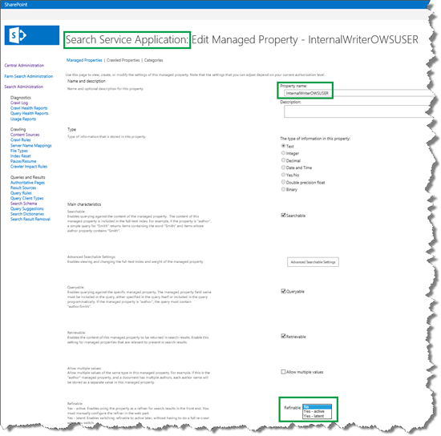
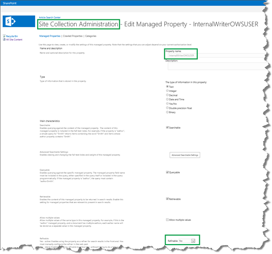

# Plan to use refiners on a search results page in SharePoint Server

 **Summary:** Learn how to plan to use refiners on a search results page in SharePoint Server 2016 or SharePoint Server 2013. 
  
In this article, you'll learn:
  
- [How refiners helped plan a trip to Japan](plan-to-use-refiners-on-a-search-results-page.md#BKMK_HowRefinersHelpedPlanaTriptoJapan)
    
- [What to look for when you identify refiners](plan-to-use-refiners-on-a-search-results-page.md#BKMK_WhattoLookforWhenYouIdentifyRefiners)
    
- [About making a managed property refinable](plan-to-use-refiners-on-a-search-results-page.md#BKMK_AboutMakingaManagedPropertyRefinable)
    
- [About refinable managed properties](plan-to-use-refiners-on-a-search-results-page.md#BKMK_AboutRefinableManagedProperties)
    
## How refiners helped plan a trip to Japan

Although the term "refiners" is new to you, there is a good chance you've already used them. For example, if you have ever bought a book online, most likely you used refiners to find the right book.
  
Suppose, for example, that you went online to your favorite bookstore to find a travel guide about Japan. You typed "Japan" into the search field, and as expected, pages of search results popped up. Trawling through page after page of results does not seem like much fun. Luckily, the site designers provided a way to narrow the search results. On the left side of the page is a "Categories" list that contain entries such as "Cooking," "Geography," "History," "Travel," and so on. You click "Travel," and in an instant, the search results show only travel books that contains the word "Japan."
  
But, turns out that there are many travel books out there on Japan. Therefore, you need to trim the results even more. You were looking for a paperback version. So, still focusing on the lists at the left side of the page, you spot a category called "Format" that contain terms like "Hardcover," "PDF," "Audio," "Digital," and "Paperback." So you click "Paperback" and got what you've been looking for: results for travel books about Japan in paperback! Unfortunately, the number of search results was still too large. Therefore, you continue to use the various lists on the left side of the page until you've drilled right down to five hopeful candidates, one of which makes it over the finish line and goes straight into your shopping cart.
  
Now, here's the techy part: when you were clicking "Travel" and "Paperback" you were, in fact, using refiners. In SharePoint terms, a refiner is a managed property that is made refinable. Refiner values are the values of a refinable managed property. So in the case of your online shopping trip, "Categories" and "Format" are refiners. "Travel" and "Paperback" are refiner values.
  
The article [From site column to managed property - What's up with that?](../administration/from-site-column-to-managed-propertywhat-s-up-with-that.md) explains how site columns are "transformed" into managed properties during a crawl. For example, in our Search Center scenario, we have a site column named "Internal Writer." For each list item, this site column contains the name of the writer of an article (remember, each list item represents an article). To help the user quickly narrow search results to articles that are written by a particular writer, exactly like you narrowed search results when shopping for a travel book on Japan, you had to make the managed property that represents the "Internal Writer" site column refinable. There is, of course, a bit more to it than that, and all the steps will be explained in later articles. 
  
## What to look for when you identify refiners

This is an easy one: to identify refiners, look for information that users will want to use to narrow their search results.
  
In our Search Center scenario, we wanted to use the following refiners:
  
- Manager
    
- Internal Writer
    
- Editor
    
- Content Type
    
- Requested Publish Date
    
## About making a managed property refinable

The first thing that you have to do when you configure refiners is to make the managed properties that you want to use, refinable. Depending on your permission level, you can do this from two places:
  
|**To refiner-enable a managed property from**|**Requires permission level**|
|:-----|:-----|
|Central Administration    |Search service application administrator    |
|Site Collection Administration    |Site collection administrator    |
   
There's a reason why you can do this from two places. If you are working with content (let's say you're a content manager), you're unlikely to have Search service application administration level rights, that is, you won't have access to Central Administration. But, you are very likely to have Site collection administrator permissions.
  
The previous article of this series ([How to configure the Search Results Web Part to use a new result source](how-to-configure-the-search-results-web-part-to-use-a-new-result-source.md#BKMK_HowtoConfiguretheSearchResultsWebParttoUseaNewResultSource)) explained how content managers can easily add content to the search index without having to pester Search service application administrators. So now that everyone's happy, we don't want to jeopardize this happiness by making content managers dependent on a Search service application administrator to enable refiners.
  
This article only describes the procedure as it can be performed by a Site collection administrator (content manager). For information on how Search service application administrators can make a managed property refinable, see [Enable automatically created managed properties as refiners in SharePoint Central Administration](../administration/configure-refiners-and-faceted-navigation.md#BKMK_EnableInCA).
  
## About refinable managed properties

The previous section stated "The first thing that you must do when you configure refiners is to make the managed properties that you want to use, refinable." Well, turns out that Site collection administrators (content managers) can't do this because they don't have the required permission level. But, they do have the permission level to map a crawled property to a refinable managed property.
  
Confused? Let's take a closer look.
  
Search service application administrators, who have access to Central Administration, can configure many things directly on a managed property. For example, the following screen shot shows how they can change the property named  *InternalWriterOWSUSER*  to be refinable by selecting either **Yes - active**, or **Yes - latent** from the Refinable menu. 
  

  
If we look at the same property from the perspective of a Site collection administrator, who is configuring the property on the site collection level, not only is the property name grayed out, but the **Refinable** choice menu is locked (it might not be easy to see on the screen shot, but the field is locked). 
  

  
Luckily, there are many "empty" managed properties that are enabled as refiners by default. In this context, "empty" means that a crawled property is not mapped to it. This means that Site collection administrators can map a crawled property to one of these refiner-enabled managed properties without having to depend on a Search service application administrator.
  
The table below provides an overview of the managed properties that are enabled as refiners by default.
  
|**Managed property name**|**Data type for mapping**|**Display format for refiner values**|
|:-----|:-----|:-----|
|RefinableDate00 - RefinableDate19    |Values contain dates    |Intervals    |
|RefinableDecimal00 - RefinableDecimal09    |Values contain numbers with maximum three decimals    |Intervals    |
|RefinableDouble00 - RefinableDouble09    |Values contain numbers with more than three decimals    |Intervals    |
|RefinableInt00 - RefinableInt49    |Values are whole numbers    |Intervals    |
|RefinableString00 - RefinableString99    |Values are strings. This includes values that use the data type Text, Person or Group, Managed Metadata, Choice, and Yes/No    |List    |
   
In our Search Center scenario, we had already identified the refiners that we wanted to use. For each of these refiners, we defined which refinable managed property we would use:
  
|**Refiner to use**|**Refinable managed property**|
|:-----|:-----|
|Manager    |RefinableString01    |
|Internal Writer    |RefinableString02    |
|Editor    |RefinableString03    |
|Content Type    |RefinableString04    |
|Requested Publish Date    |RefinableDate01    |
   
So now that we have a plan for which refiners to use, the next task is to do the actual refiner configuration.
  
### Next article in this series

[How to add refiners to your search results page in SharePoint Server](how-to-add-refiners-to-your-search-results-page.md)
  

