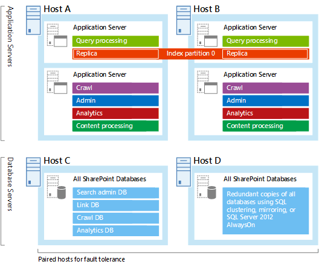
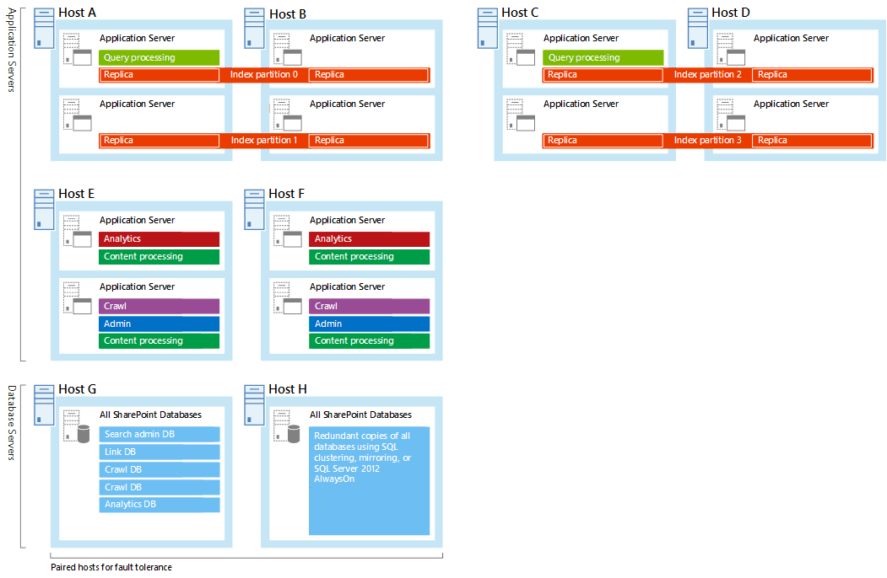
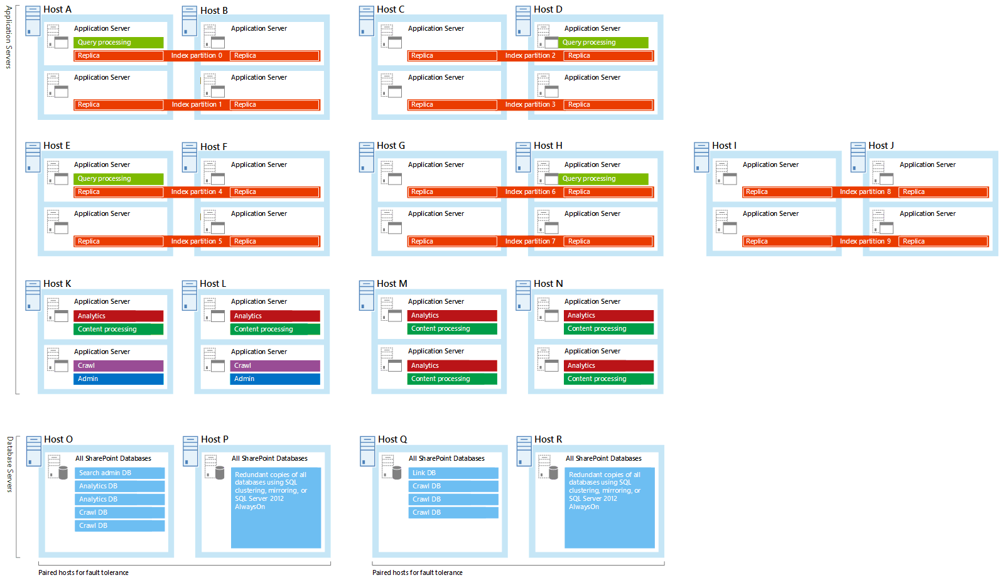
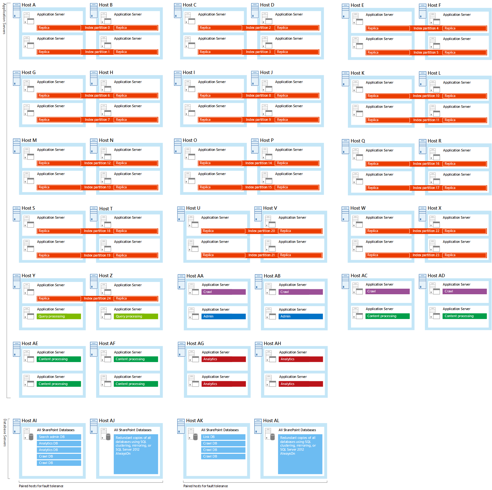

# Redesign enterprise search topology for more content and users in SharePoint 2016

 **Summary:** Learn how to redesign the topology of your enterprise search architecture for growth in content, growth in number of users, or both. 
  
Over time most search environments grow, both in amount of content and number of users. At some point the search environment outgrows the capacity and performance of your search architecture. The solution is to scale the topology of your search architecture:
  
1. Redesign your topology (this article)
    
2. Implement the redesigned topology ([Manage the search topology in SharePoint Server](manage-the-search-topology.md))
    
Are you familiar with the components of the search system in SharePoint Server, and how they interact? By reading [Overview of search architecture in SharePoint Server](search-architecture-overview.md) and [Search architectures for SharePoint Server 2016](https://download.microsoft.com/download/2/0/8/2081E053-4E56-4B87-87A4-9380D042B95D/SP_2016_Search_Architecture_Model.pdf) (or [Search architectures for SharePoint Server 2013](https://go.microsoft.com/fwlink/p/?LinkId=258643)) before you get going, you'll become familiar with search architecture, search components, search databases, and the search topology.
  
In this article, we'll show you step-by-step how to redesign your search topology.
  
- [Step 1: How much content do I have?](redesign-topology-for-more-content-and-users.md#BKMK_SStep1)
    
- [Step 2: What size search architecture should I scale to?](redesign-topology-for-more-content-and-users.md#BKMK_Step2)
    
- [Step 3: Which hardware requirements should I be aware of?](redesign-topology-for-more-content-and-users.md#BKMK_Step3)
    
After you've followed these steps you'll know:
  
- How many of each type of search component and search database your topology needs.
    
- Which application servers and database servers to deploy each search component on.
    
- What hardware resources each application server and database server needs.
    
## Step 1: How much content do I have?

The volume of content that you have in your search index affects what resources you need to host the farm. Check how many items that are searchable in your existing search environment. You find this number on the **Search administration** page in the SharePoint Central Administration website. To open the search administration page click **Manage service applications** in Central Administration and then click the name of the Search service application. 
  
Estimate how much you expect the number of searchable items to grow over the next 12 months and design the search topology for that amount. For example, if you have 8,000,000 indexed items, and you expect the volume of that content to grow 50% over the next 12 months. You should design for 12,000,000 searchable items.
  
## Step 2: What size search architecture should I scale to?

It's not always easy to assess how big or small to make your search architecture. The size of your search architecture depends on the volume of your content, the crawl rate, the query throughput, and the level of high availability that you require. There are sample search architectures that were tested by Microsoft that we advise using as a basis for your own farm. Compare your current search architecture with the sample search architectures and determine which sample best represents your current search architecture. Then consider which sample search architecture to scale to. The sample search architecture that you choose depends on how much content has to be searchable:
  
| **Volume of content (SharePoint 2016)** | **Sample search architecture** | **Volume of content (SharePoint 2013)** |
| :-------------------------------------- | :----------------------------- | :-------------------------------------- |
| 0-20 million items                      | Small search farm              | 0-10 million items                      |
| 0-80 million items                      | Medium search farm             | 0-40 million items                      |
| 0-200 million items                     | Large search farm              | 0-100 million items                     |
| 0-500 million items                     | Extra large search farm        | Not supported                           |
   
Although these sample search architectures use virtual machines, you can use both physical servers and virtual machines according to the strategy of the overall SharePoint Server solution of your search architecture.
  
### Small search farm

We've estimated that this search architecture can crawl 50 documents per second, and serve in the order of 10 queries per second. If you have up to 20 million items in a SharePoint Server 2016 farm, the small search farm will probably be the most suitable farm for you. With a crawl rate of 50 documents per second, it takes search 110 hours to crawl 20 million items in the first full crawl.
  

  
### Medium search farm

We've estimated that this search architecture can crawl 100 documents per second, and serve in the order of 10 queries per second. If you have between 20 and 80 million items in a SharePoint Server 2016 farm, the medium search farm will probably be the most suitable farm for you. With a crawl rate of 200 documents per second, it takes search 280 hours to crawl 80 million items in the first full crawl.
  

  
### Large search farm

We've estimated that this search architecture can crawl 200 documents per second, and serve in the order of 10 queries per second. If you have between 80 and 200 million items in a SharePoint Server 2016 farm, the large search farm will probably be the most suitable farm for you. With a crawl rate of 200 documents per second, it takes search 280 hours to crawl 200 million items in the first full crawl.
  

  
### Extra-large search farm

Microsoft tested this search architecture and measured that it can crawl 300-500 documents per second, and serve in the order of 10 queries per second. Only SharePoint Server 2016 supports this size search architecture. If you have up to 500 million items, a farm similar to the extra large search farm is a good starting point. With a crawl rate of 500 documents per second, it takes search about 300 hours to crawl 500 million items in the first full crawl.
  
Creating a search farm of this size requires you to carefully plan and tune the farm to get the performance you want. You might find it advantageous to seek expert guidance. It's also important to plan how to back up and restore a search farm of this size, and how to recover the farm if your data center has a major outage. We recommend that you practice backup, restore and recovery.
  

  
### Step 3: Which hardware requirements should I be aware of?

Now that you've determined the volume of your content and chosen a new topology to move to, the next step is to plan the hardware you'll need, as described in this section:
  
- [Choose to run the servers physically or virtually](redesign-topology-for-more-content-and-users.md#BKMK_Physical_Virtual)
    
- [Choose hardware resources for the host servers](redesign-topology-for-more-content-and-users.md#BKMK_HW_Resources)
    
  - [General storage](redesign-topology-for-more-content-and-users.md#BKMK_GenStorage)
    
  - [Minimum hardware resources for the small search farm](redesign-topology-for-more-content-and-users.md#BKMK_MinHWSmall)
    
  - [Minimum hardware resources for the medium search farm](redesign-topology-for-more-content-and-users.md#BKMK_MinHWMedium)
    
  - [Minimum hardware resources for the large search farm](redesign-topology-for-more-content-and-users.md#BKMK_MinHWLarge)
    
- [Plan storage performance](redesign-topology-for-more-content-and-users.md#BKMK_Storage_performance)
    
  - [Choose type of storage](redesign-topology-for-more-content-and-users.md#BKMK_ChooseStoragePerf)
    
  - [Search component IOPS requirements](redesign-topology-for-more-content-and-users.md#BKMK_SearchCompIOPS)
    
  - [Search database IOPS requirements](redesign-topology-for-more-content-and-users.md#BKMK_SearchDBIOPS)
    
- [Choose how your search architecture supports high availability](redesign-topology-for-more-content-and-users.md#BKMK_HiAvail)
    
#### Choose to run the servers physically or virtually

When you originally planned your search architecture, you decided to use physical servers or virtual machines, or a mix. Consider whether that decision still is valid. For example, if you move from the medium to the large sample search architecture, you might find it easier to manage the increased number of servers when you use virtual machines. Note also that although a virtual environment is easier to manage, its performance level can sometimes be slightly lower than that of a physical environment. A physical server can host more search components on the same server than a virtual server. You'll find useful guidance in [Overview of farm virtualization and architectures for SharePoint 2013](http://technet.microsoft.com/library/490c2bcc-a192-48a2-888a-29c24cfb1bce%28Office.14%29.aspx).
  
The small, medium, large, or extra large search architecture samples run on virtual machines, but they can also run on physical servers. In the sample farm architectures, just move the search components from the virtual machines to the host server and take away the virtual machines. Each physical server can host up to four index components, but only one of each type of the other search components. If you for example change the medium sample search architecture to use physical servers, you'll find that you have two content processing components on Host E. The solution is to take away one of the content processing components. This works because crawling, processing of content, and processing of analytics depend on the amount of resources that are available, not the number of content processing components.
  

  
#### Choose hardware resources for the host servers

Each search component and search database requires a minimum amount of hardware resources from the host server to perform well. But, the more hardware resources you have, the better the performance of your search architecture will be. So it's a good idea to have more than the minimum amount of hardware resources. The resources each search component requires depends on the workload, mostly determined by the crawl rate, the query rate, and the number of indexed items.
  
For example, when hosting virtual machines on Windows Server 2008 R2 Service Pack 1 (SP1), you can't use more than four CPU cores per virtual machine. With Windows Server 2012 or newer, you use eight or more CPU cores per virtual machine. Then you can scale out with more CPU cores for each virtual machine instead of scaling up with more virtual machines. Set up servers or virtual machines that host the same search components, with the same hardware resources. Let's use the index component as an example. When you host index partitions on virtual machines, the virtual machine with the weakest performance determines the performance of the overall search architecture.
  
**General storage resources**
  
Make sure that each host server has enough disk space for the base installation of the Windows Server operating system and for the SharePoint Server program files. The host server also needs free hard disk space for diagnostics such as logging, debugging, and creating memory dumps, for daily operations, and for the page file. Normally, 80 GB of disk space is enough for the Windows Server operating system and for the SharePoint Server program files.
  
Add storage for the SQL log space for each database server. If you don't set the database server to back up the databases often, the SQL log space uses lots of storage. For more information about how to plan SQL databases, see [Storage and SQL Server capacity planning and configuration (SharePoint Server)](../administration/storage-and-sql-server-capacity-planning-and-configuration.md).
  
The minimum storage that the analytics reporting database requires can vary. This is because the amount of storage depends on how users interact with SharePoint Server. When users interact frequently, there usually are more events to store. Check the amount of storage your current search architecture uses for the analytics database, and assign at least this amount for your redesigned topology.
  
#### Minimum hardware resources for the small search farm

This table shows the minimum amount of hardware resources that each application server or database server needs.
  
|                                               **Server**                                               | **On host** |     **Storage**      |       **RAM**       |     **Processor1**      | **Network bandwidth** |
| :----------------------------------------------------------------------------------------------------- | :---------- | :------------------- | :------------------ | :--------------------------------- | :-------------------- |
| Application server that has query processing and index components.                                     | A, B        | 500 GB2,3 | 32 GB2,3 | 1.8 GHz 8x CPU cores2,3 | 1 Gbps                |
| Application server that has crawl, search administration, analytics and content processing components. | A, B        | 200 GB               | 8 GB                | 1.8 GHz 4x CPU cores               | 1 Gbps                |
| Database server that has all search databases.                                                         | C, D        | 100 GB               | 16 GB               | 1.8 GHz 4x CPU cores               | 1 Gbps                |
   
1The number of CPU cores is specified here, not the number of CPU threads.
  
2With SharePoint Server 2013 the minimum amount of resources needed are 500 GB RAM, 16 GB RAM, and four CPU cores. 
  
3With SharePoint Server 2016 you can also use 500 GB storage, 16 GB RAM, and four CPU cores, but then each index component can only hold 10 million items and the search farm only supports the same volume of content as a SharePoint Server 2013 search farm. 
  
#### Minimum hardware resources for the medium search farm

This table shows the minimum amount of hardware resources that each application server or database server needs.
  
|                                          **Server**                                          | **On host** |     **Storage**      |       **RAM**       |     **Processor1**      | **Network bandwidth** |
| :------------------------------------------------------------------------------------------- | :---------- | :------------------- | :------------------ | :--------------------------------- | :-------------------- |
| Application server that has query processing and index components.                           | A, B, C, D  | 500 GB2,3 | 32 GB2,3 | 1.8 GHz 8x CPU cores2,3 | 1 Gbps                |
| Application server that has an index component.                                              | A, B, C, D  | 500 GB2,3 | 32 GB2,3 | 1.8 GHz 8x CPU cores2,3 | 1 Gbps                |
| Application server that has analytics and content processing components.                     | E, F        | 300 GB               | 8 GB                | 1.8 GHz 4x CPU cores               | 1 Gbps                |
| Application server that has crawl, search administration, and content processing components. | E, F        | 100 GB               | 8 GB                | 1.8 GHz 4x CPU cores               | 1 Gbps                |
| Database server that has all search databases.                                               | G, H        | 400 GB               | 16 GB               | 1.8 GHz 4x CPU cores               | 1 Gbps                |
   
1The number of CPU cores is specified here, not the number of CPU threads.
  
2With SharePoint Server 2013 the minimum amount of resources needed are 500 GB RAM, 16 GB RAM, and four CPU cores. 
  
3With SharePoint Server 2016 you can also use 500 GB storage, 16 GB RAM, and four CPU cores, but then each index component can only hold 10 million items and the search farm only supports the same volume of content as a SharePoint Server 2013 search farm. 
  
#### Minimum hardware resources for the large search farm

This table shows the minimum amount of hardware resources that each application server or database server needs.
  
|                                **Server**                                 |         **On host**          |     **Storage**      |       **RAM**       |     **Processor1**      | **Network bandwidth** |
| :------------------------------------------------------------------------ | :--------------------------- | :------------------- | :------------------ | :--------------------------------- | :-------------------- |
| Application server that has query processing and index components.        | A, B, C, D, E, G, H          | 500 GB2,3 | 32 GB2,3 | 1.8 GHz 8x CPU cores2,3 | 1 Gbps                |
| Application server that has an index component.                           | A, B, C, D, E, F, G, H, I, J | 500 GB2,3 | 32 GB2,3 | 1.8 GHz 8x CPU cores2,3 | 1 Gbps                |
| Application servers that have analytics and content processing components | K, L, M, N                   | 300 GB               | 8 GB                | 1.8 GHz 4x CPU cores               | 1 Gbps                |
| Application servers that have crawl and search administration components  | K, L                         | 100 GB               | 8 GB                | 1.8 GHz 4x CPU cores               | 1 Gbps                |
| Database server that have search databases                                | O, P, Q, R                   | 500 GB               | 16 GB               | 1.8 GHz 4x CPU cores               | 1 Gbps                |
   
2With SharePoint Server 2013 the minimum amount of resources needed are 500 GB RAM, 16 GB RAM, and four CPU cores. 
  
3With SharePoint Server 2016 you can also use 500 GB storage, 16 GB RAM, and four CPU cores, but then each index component can only hold 10 million items and the search farm only supports the same volume of content as a SharePoint Server 2013 search farm. 
  
#### Minimum hardware resources for the extra large search farm

This table shows the minimum amount of hardware resources that each application server or database server needs. You can only build this sample farm with SharePoint Server 2016.
  
|                                          **Server**                                          | **On host** | **Storage** | **RAM** | **Processor1** | **Network bandwidth** |
| :------------------------------------------------------------------------------------------- | :---------- | :---------- | :------ | :------------------------ | :-------------------- |
| Application server that has index components.                                                | A-X         | 500 GB      | 32 GB   | 1.8 GHz 8x CPU cores      | 1 Gbps                |
| Application server that has query processing and index components.                           | Y, Z        | 500 GB      | 32 GB   | 1.8 GHz 8x CPU cores      | 1 Gbps                |
| Application servers that have crawl, search administration, or content processing components | AA-AF       | 100 GB      | 8 GB    | 1.8 GHz 4x CPU cores      | 1 Gbps                |
| Application servers that have analytics processing components                                | AG, AH      | 800 GB      | 8 GB    | 1.8 GHz 4x CPU cores      | 1 Gbps                |
| Database servers that have search databases                                                  | AI-AL       | 500 GB      | 16 GB   | 1.8 GHz 4x CPU cores      | 1 Gbps                |
   
1The number of CPU cores is specified here, not the number of CPU threads.
  
#### Plan storage performance

The speed of the storage affects the search performance. Make sure that the storage you have is fast enough to handle the traffic from the search components and databases. Disk speed is measured in I/O operations per second (IOPS).
  
The way that you decide to distribute data from the search components and from the operating system across your storage, affects search performance. It's a good idea to:
  
- Split the Windows Server operating system files, the SharePoint Server program files, and diagnostic logs across three separate storage volumes or partitions with normal performance.
    
- Store the search component data on a separate storage volume or partition. For index components, this storage must also have high performance.
    
    > [!NOTE]
    > You can set a custom location for search component data when you install SharePoint Server on a host. Any search component on the host that needs to store data, stores it in this location. To change this location later, you have to reinstall SharePoint Server. 
  
#### Choose type of storage

For an overview of storage architectures and disk types, see [Storage and SQL Server capacity planning and configuration (SharePoint Server 2013)](https://technet.microsoft.com/en-us/library/cc298801.aspx). The servers that host the index, analytics processing, and the search administration components, or search databases, require storage that can maintain low latency, while providing sufficient I/O operations per second (IOPS). The following tables show how many IOPS each of these search components and databases require.
  
If you deploy shared storage like SAN/NAS, the peak disk load of one search component typically coincides with the peak disk load of another search component. To get the number of IOPS search requires from the shared storage, you need to add up the IOPS requirement of each of these components.
  
#### Search component IOPS requirements

| **Component name**  |                                                       **Component details**                                                       |                                                                       **IOPS requirements**                                                                       | **Use of separate storage volume/partition** |
| :------------------ | :-------------------------------------------------------------------------------------------------------------------------------- | :---------------------------------------------------------------------------------------------------------------------------------------------------------------- | :------------------------------------------- |
| Index component     | Uses storage when merging the index and when handling and responding to queries.                                                  | 300 IOPS for 64 KB random reads.     100 IOPS for 256 KB random writes.     200 MB/s for sequential reads.     200 MB/s for sequential writes.    | Yes                                          |
| Analytics component | Analyzes data locally, in bulk processing.                                                                                        | No                                                                                                                                                                | Yes                                          |
| Crawl component     | Stores downloaded content locally, before it sends it to a content processing component. Storage is limited by network bandwidth. | No                                                                                                                                                                | Yes                                          |
   
#### Search database IOPS requirements

|       **Database name**        | **IOPS requirements** |         **Typical load on I/O subsystem.**          |
| :----------------------------- | :-------------------- | :-------------------------------------------------- |
| Crawl database                 | Medium to high IOPS   | 10 IOPS per 1 document per second (DPS) crawl rate. |
| Link database                  | Medium IOPS           | 10 IOPS per 1 million items in the search index.    |
| Search administration database | Low IOPS              | Not applicable.                                     |
| Analytics reporting database   | Medium IOPS           | Not applicable.                                     |
   
#### Choose how your search architecture supports high availability

If you aren't familiar with high availability strategies, here's an article that will get you started: [Create a high availability architecture and strategy for SharePoint Server](../administration/plan-for-high-availability.md). When you host redundant search components and databases on separate fault domains, an outage in one part of the farm doesn't take down the complete service. But, search performance will degrade because the search components can't share the load any longer. To reduce the possibility of losing a single server it's a good idea to improve local redundancy. For each host server in your search architecture:
  
- Use RAID storage on each server.
    
- Install multiple redundant network connections on each server.
    
- Install multiple redundant power supplies with independent wiring or an uninterruptible power supply (UPS) for each server.
    
All of the sample search architectures host redundant search components on independent servers. In the sample search architectures, the rightmost host in each host pair is redundant. Here's the large search architecture with outlined redundant hosts:
  

  

