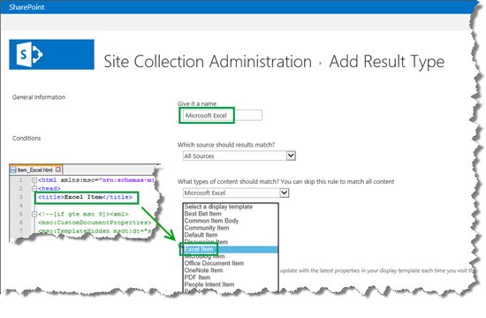
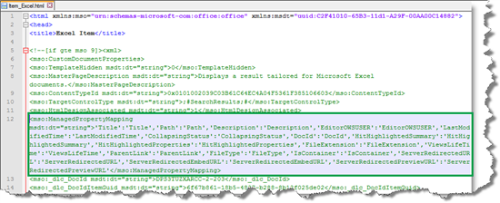
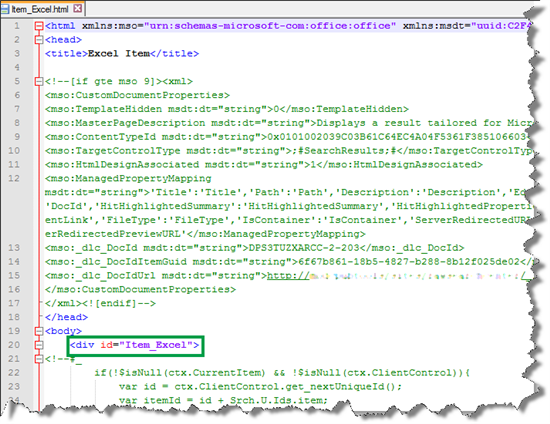
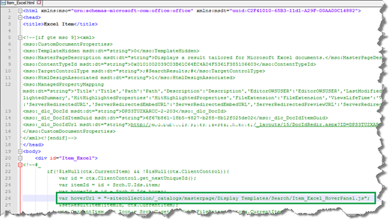
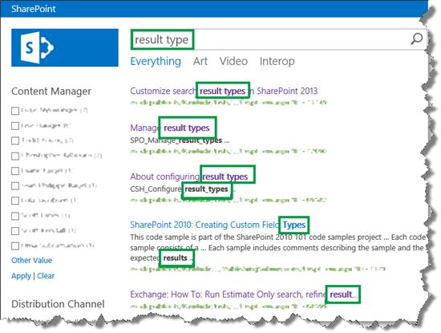
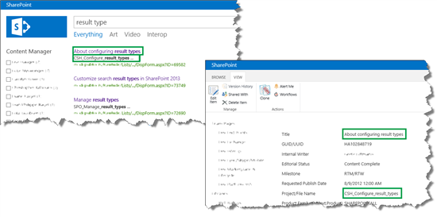
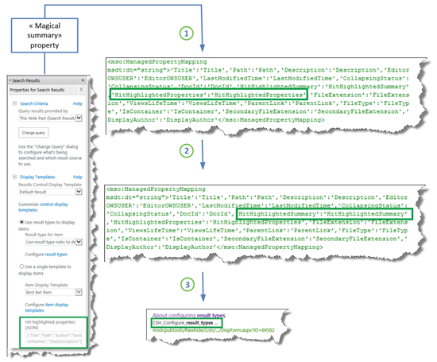

# Understanding how item display templates and hit highlighting work in the classic search experience in SharePoint Server

 **Summary:** Learn how item display templates and hit highlighting work in SharePoint Server. 
  
In this article, you'll learn:
  
- [How to map your network drive](understanding-how-item-display-templates-and-hit-highlighting-work.md#BKMK_HowtoMapYourNetworkDrive)
    
- [Why it's important to know about managed property names](understanding-how-item-display-templates-and-hit-highlighting-work.md#BKMK_WhyitisImportanttoKnowAboutManagedPropertyNames)
    
- [About important elements in the item display template](understanding-how-item-display-templates-and-hit-highlighting-work.md#BKMK_AboutImportantElementsintheItemDisplayTemplate)
    
- [About hit highlighting](understanding-how-item-display-templates-and-hit-highlighting-work.md#BKMK_AboutHitHighlighting)
    
- [How hit highlighting works - it is magic!](understanding-how-item-display-templates-and-hit-highlighting-work.md#BKMK_HowHitHighlightingWorksitisMagic)
    
## How to map your network drive
<a name="BKMK_HowtoMapYourNetworkDrive"> </a>

When working with display templates, you'll make life a lot easier for yourself if you map your network drive. By doing this, you'll be able to work with display templates from Windows Explorer. For instructions, see [How to map your network drive](../administration/stage-6-upload-and-apply-a-new-master-page-to-a-publishing-site.md#BKMK_HowToMapYourNetworkDrive).
  
## Why it's important to know about managed property names
<a name="BKMK_WhyitisImportanttoKnowAboutManagedPropertyNames"> </a>

The [How search works in a few words](how-to-change-the-way-search-results-are-displayed.md#BKMK_HowSearchWorksinaFewWords) section of the introductory topic in this series explained how site columns and site column values are "transformed" into managed properties and managed property values during a crawl. It is important that you learn to find the name of the managed property that represents a site column, because to add new information to your search results, you'll have to add the managed property name to an item display template. If you are uncertain how managed properties are named, see [From site column to managed property - What's up with that?](../administration/from-site-column-to-managed-propertywhat-s-up-with-that.md).
  
Confusing? Well, don't despair. We'll show you the steps of how to find and add a managed property name to an item display template later in this series.
  
## About important elements in the item display template
<a name="BKMK_AboutImportantElementsintheItemDisplayTemplate"> </a>

The article [Understanding how search results are displayed in SharePoint Server](understanding-how-search-results-are-displayed.md) explained that SharePoint Server includes many item display templates. Although these display templates are not 100% identical, they all contain certain elements that control how search results are displayed. 
  
Let's dive in and open an item display template, for example: **Item_Excel**. 
  
> [!NOTE]
> Because we have mapped a network drive, we can open the file in our favorite HTML editor, for example, **Notepad++**. 
  

  
### About the \<title\> tag

The top of the display template has a **\<title\>** tag. The text in this tag is what will be shown when you do configurations in the SharePoint UI, for example, when you configure a result type. 
  
The following screen shot shows how the text from the **\<title\>** tag in the item display template, **Excel Item**, is shown in the configuration of the **Microsoft Excel** result type. 
  

  
### About the ManagedPropertyMapping element

After the **\<title\>** tag, there's a set of elements in a **\<mso:CustomDocumentProperties\>** tag, the most important of which is **\<mso:ManagedPropertyMapping\>**. 
  
The **ManagedPropertyMapping** element contains the managed properties that can be used to display the search results. The following syntax is used to store these properties in the item display template: 
  
```
'<Display template reference name>':<Managed property name>'
```

The following screen shot shows the default **ManagedPropertyMapping** element for the **Excel Item** display template. 
  

  
Notice that the display template reference name is the same as the managed property name, for example  `'Title':'Title' or 'FileType':'FileType'`. Even though this might seem a bit confusing at first, having identical names will make it easier to maintain the file.
  
By default, the managed properties that are included in this element vary slightly for the different item display templates. But, there are two managed properties that are included in all display templates:  *HitHighlightedProperties*  and  *HitHilightedSummary*  . We'll explore these two properties in the "How hit highlighting works - it is magic!" section of this topic. 
  
### About the \<body\> tag

Inside the **\<body\>** tag, there is a **\<div\>** tag with an ID. By default, the ID for this **\<div\>** tag matches the name of the file. In our case, this is **Item_Excel**. 
  

  
Any HTML or code that the display template should use to display search results is included inside this **\<div\>** tag. 
  
In this **\<div\>** tag there are one or more blocks that begin with **\<!--#_** and end with **_#--\>**. JavaScript code is used inside these blocks, and HTML outside the blocks. You can also use these blocks to control the HTML with conditional statements. We'll show you how you can do this in a later article. 
  
### About the hover panel display template variable

We have to consider one variable that's used inside this block: **var hoverUrl**. In [Understanding how search results are displayed in SharePoint Server](understanding-how-search-results-are-displayed.md), we covered how each item display template contains a reference to a hover panel display template. The variable **var hoverUrl** contains this reference. 
  
The following screen shot shows how **var hoverUrl** points to the **Item_Excel_HoverPanel** hover panel display template. 
  

  
### About the icon that shows in search results

I also want to mention the value **ctx.CurrentItem.csr_Icon**. This value points to the icon that should be displayed next to each search result, for example the Excel icon. 
  
The following screen shot shows how the value **ctx.CurrentItem.csr_Icon** points to an icon. 
  

  
Later in this series, we'll look at how you can change this value so that it points to a custom icon.
  
### About the reference to the common item display template

Toward the end of the **\<div\>**, a very important line of code is included: **_#=ctx.RenderBody(ctx)=#_**. In [Understanding how search results are displayed in SharePoint Server](understanding-how-search-results-are-displayed.md), we looked at how this is a reference to the item display template that's used by all result types.
  
The following screen shot shows how **_#=ctx.RenderBody(ctx)=#_** is used in the **Item_Excel** display template. 
  

  
## About hit highlighting
<a name="BKMK_AboutHitHighlighting"> </a>

Even if you have never heard of hit highlighting before, you've seen the feature in action, even though you might not have given it much thought.
  
The hit highlighting feature takes the words a user has entered in a search box and displays them in bold in the search results. That way, users can easily scan search results to see the context in which their query words are found. For example, the following screen shot shows that "result type" was entered in the search box. In the search results, "result" and "type" are displayed in bold.
  

  
## How hit highlighting works - it is magic!
<a name="BKMK_HowHitHighlightingWorksitisMagic"> </a>

By default, hit highlighting is enabled for certain managed properties. To see these managed properties, on a search results page, edit the **Search Results Web Part**. In the Web Part Tool Pane expand the **Display Templates** section. The properties that are enabled for hit highlighting are listed in the **Hit-highlighted properties (JSON)** section. 
  

  
There is a bit more to it than that, but for now it's important that you know where these managed properties are listed.
  
Let's go back to our "result type" search and take a closer look at the first search result, which. was returned because the values in the **Title** and **Project/File Name** columns contained the words we were looking for. 
  

  
As was previously explained in the "About the ManagedPropertyMapping element" section of this topic, the **ManagedPropertyMapping** element in the item display template contains the managed properties that can be used to display search results. Based on this, you can understand why "About configuring **result types** " is displayed. It is because "About configuring result types" is the value of  *Title*  in the list item, and  *Title*  is one of the managed properties found in the ManagedPropertyMapping element in the display template. The words "result type" are displayed in bold (hit highlighted) because  *Title*  is one of the hit highlighted listed in the Search Results Web Part. 
  
But why is "CSH_Configure_ **result_types…** "displayed in the search results? In the list item we can see that this is the value for Project/File Name, but the managed property for that site column is not included in the **ManagedPropertyMapping** element in display template. Neither is it listed as one of the hit highlighted properties in the Search Results Web Part. So why is this value displayed? 
  
### About the "magical summary" property

If you guessed hit highlighting, you are correct. In addition to the default properties that you saw in the **Hit-highlighted properties (JSON)** section of the **Search Results Web Part**, there is a property that contains a summary for each item. This is almost like a magical property, because it stores a summary of each item in the search index. This summary is created under the SharePoint hood, so you don't have to worry about that. What's important is that when I searched for "result type," a match was found in both the Title and this "magical summary" property. 
  
If you are now thinking, hang on! I understand that the value for  *Title*  is displayed because  *Title*  is one of the managed properties found in the in the **ManagedPropertyMapping** element display template. But I don't see any "magical summary" property in the **ManagedPropertyMapping** element of the display template. So how can the value be displayed? 
  
Well, that is where the two properties  *HitHighlightedProperties*  and  *HitHilightedSummary*  are useful. The diagram below does not represent how SharePoint actually handles these properties. However you can think about it in the following way: 
  

  
1. The managed properties that are listed in the **Hit-highlighted properties (JSON)** section of the Search Results Web Part and the "magical summary" property are passed to the  *HitHighlightedProperties*  property. 
    
2. All values of the  *HitHighlightedProperties*  property are passed to the  *HitHighlightedSummary*  property. 
    
3. A truncated version of the values in  *HitHighlightedSummary*  is displayed in the Search Results Web Part. 
    
If you look closely at the search results, you'll notice that many search results are displayed with three dots at the end.
  

  
These dots indicate that these are values from the  *HitHighlightedSummary*  property. 
  
If you only want to display a minimum amount of information for each search result, you can rely on the hit highlighting magic and probably be OK with the default way search results are displayed. But, if you want custom information to be displayed for each search result, you'll have to do some customization.
  
In the next article you'll learn the first step in customizing search results: creating a new result type.
  
#### Next article in this series

[How to display values from custom managed properties in search results - option 1 in SharePoint Server](how-to-display-values-from-custom-managed-properties-in-search-resultsoption-1.md)
  

