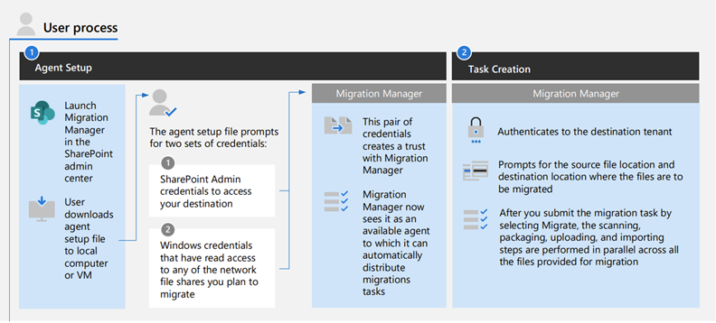

# Migrate your content to Microsoft 365

Moving to Microsoft 365? There are several tools and methods you can use; what is best for you and your organization depends on a number of factors. What is the size and amount of content you need to move? Where does it currently reside? Taking the time to plan your migration, including taking an inventory and assessment of your data, is key to a successful migration.

## Migrating File Shares
Migrating your file shares with Migration Manager lets you have a centralized way of connecting servers, creating tasks, and automatically load balancing your migration tasks. You are guided through the steps of migrating your file shares, from the setup of agents, the creation of tasks, and the migration to Microsoft 365. You can specify global or task level settings, view all-up task progress, and download aggregated summary and task level reports.

## Migrating Box 

Collaborate all in one place by migrating your Box documents, data, and users to OneDrive, SharePoint, and Teams in Microsoft 365.

To learn more about which tool to use, see the following table.

>[!Note]
>When you migrate your content to Microsoft 365, you are copying the files.  Your source files are not deleted.

## Which tool to use

|**Tool/method**|**Description**|**Best for**|
|:-----|:-----|:-----|
|Migration Manager|Available in the SharePoint Admin center, Migration Manager provides a centralized way of connecting servers, creating tasks, and automatically distributing your migration tasks.   Go to [Migration Manager](https://aka.ms/ODSP-MM) in the new SharePoint admin center. Sign in with an account that has admin permissions for your organization.  To learn more, see: [Get started with Migration Manager](mm-get-started.md)|Ideal for customers migrating file shares.|
|SharePoint Migration Tool|The SharePoint Migration Tool (SPMT) can migrate your files from SharePoint on-premises document libraries, lists or regular files shares.   Download either the current release or the latest public preview:   [SharePoint Migration Tool (current release)](https://spmtreleasescus.blob.core.windows.net/install/default.htm) or  [SharePoint Migration Tool Public Preview](https://spmtreleasescus.blob.core.windows.net/betainstall/default.htm)|Ideal for migrating SharePoint Server 2010, 2013, and 2016 environments.|
|Mover|Service for cloud to cloud migration. To learn more, see: [Mover](https://mover.io/)|Ideal for migrating data from other cloud service providers.|
|PowerShell|Using the PowerShell version of the SPMT. See [Migrate to SharePoint using PowerShell](https://docs.microsoft.com/sharepointmigration/overview-spmt-ps-cmdlets).|SPMT is ideal for migrating SharePoint Server 2010, 2013, and 2016 environments via PowerShell. |
|Microsoft FastTrack |Microsoft FastTrack services can help you get started with your migration to the cloud.|When you need assistance to help you get started on your migration project.|
|Azure Data Box| The Microsoft Azure Data Box is a service that lets you order a device from the Microsoft Azure portal. You can then copy TBs of data from your servers to the device, ship it back to Microsoft, and your data is copied into Azure. Once your data is in Azure, use SPMT to migrate content to SharePoint.   To learn more, see [Migrate using the Azure Data Box](how-to-migrate-file-share-content-to-SPO-using-AzureDataBox.md)|Ideal when you want to remove the dependency on your WAN link to transfer data.|
|OneDrive sync app    |After installing the OneDrive sync app and syncing your library, you can drag and drop files to a folder on the computer and the content will automatically sync with either OneDrive or SharePoint.    To learn more, see:  [OneDrive sync app](https://docs.microsoft.com/onedrive/one-drive-sync)|Ideal for individuals wanting to move files.|
|Manual upload    |Uploading files one at a time to SharePoint.   |Best for smaller files.|
|SharePoint Assessment Tool|  A tool to assess and identify issues with SharePoint Server content prior to migration.  To download: [SharePoint Migration Assessment Tool](https://www.microsoft.com/download/details.aspx?id=53598) | Ideal for assessing SharePoint Server 2010 and 2013 content prior to migration.|

### Mover acquisition

>[!Note]
> Microsoft has acquired **Mover**, a leading provider of cloud file migration, including admin-led and self-service offerings. As customer demand to move content to the cloud continues to grow, Mover will help make it easier than ever for customers to migrate files to Microsoft 365.
>
>**Mover** supports migration from over a dozen cloud service providers – including Box, Dropbox, Egnyte, and Google Drive – into OneDrive and SharePoint, enabling seamless file collaboration across Microsoft 365 apps and services, including the Office apps and Microsoft Teams.
>
>Learn more:  [Microsoft acquires Mover to simplify and speed file migration to Microsoft 365](https://aka.ms/migration/news)

