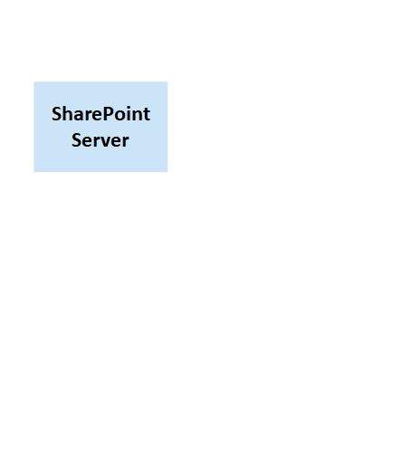

# Migrate your content to Microsoft 365

Moving to Microsoft 365? Let us help you migrate your content easily and securely.

 

## Migrate File Shares
Migrating your file shares with Migration Manager lets you have a centralized way of connecting servers, creating tasks, and automatically load balancing your migration tasks. You're guided through the steps of migrating your file shares, from the setup of agents, the creation of tasks, and the final migration to Microsoft 365. You can specify global or task level settings, view all-up task progress, and download aggregated summary and task level reports.

**Get started!**  [Migrating File shares](mm-get-started.md)

[**What's new**](mm-whats-new.md)

## Migrate SharePoint Server sites and content

Migrate your SharePoint Server sites and content to take advantage of the latest collaboration, intelligence, and security solutions in Microsoft 365. The modern experience features in Microsoft SharePoint are designed to be compelling, flexible, and more performant. Migrate your SharePoint Server 2010, 2013, and 2016 environments.

**Get started!**  [Migrate SharePoint Server to Microsoft 365](introducing-the-sharepoint-migration-tool.md)

[**What's new**](new-and-improved-features-in-the-sharepoint-migration-tool.md)

## Cloud to cloud migrations
Are you migrating from another Cloud providers? The [Mover tool](https://mover.io/) is ideal for:

- Box
- Microsoft 365 tenant to tenant migration
- G Suite Drive
- Dropbox
- Egnyte
- Amazon S3
- Azure Blob Storage
- Google Cloud Storage

**Get started!** [Mover migration tool](https://mover.io/)

[**What's new**](mover-release-notes.md)

## Other resources

- **Microsoft FastTrack**.  Microsoft FastTrack services can help you get started with your migration to the cloud.|When you need assistance to help you get started on your migration project. 

- **Azure Data Box**. Want to remove the dependency on your WAN link to transfer data?  The Microsoft Azure Data Box is a service that lets you order a device from the Microsoft Azure portal. You can then copy TBs of data from your servers to the device, ship it back to Microsoft, and your data is copied into Azure. Once your data is in Azure, use SPMT to migrate content to SharePoint. To learn more, see [Migrate using the Azure Data Box](how-to-migrate-file-share-content-to-SPO-using-AzureDataBox.md). 

- **OneDrive sync app**  Are you an individual user wanting to move files from your on-premises environment to OneDrive or SharePoint?  After installing the OneDrive sync app and syncing your library, you can drag and drop files to a folder on the computer and the content will automatically sync with either OneDrive or SharePoint. To learn more, see: [OneDrive sync app](/onedrive/one-drive-sync).

>[!Note]
>When you migrate your content to Microsoft 365, you are copying the files.  Your source files are not deleted.

**Mover acquisition**

>[!Note]
> Microsoft has acquired **Mover**, a leading provider of cloud file migration, including admin-led and self-service offerings. As customer demand to move content to the cloud continues to grow, Mover will help make it easier than ever for customers to migrate files to Microsoft 365.
>
>**Mover** supports migration from over a dozen cloud service providers – including Box, Dropbox, Egnyte, and Google Drive – into OneDrive and SharePoint, enabling seamless file collaboration across Microsoft 365 apps and services, including the Office apps and Microsoft Teams.
>
>Learn more:  [Microsoft acquires Mover to simplify and speed file migration to Microsoft 365](https://aka.ms/migration/news)