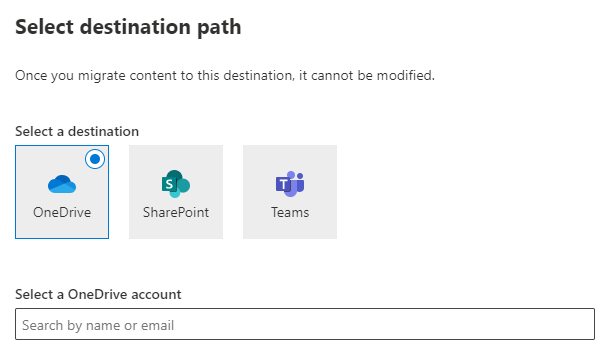
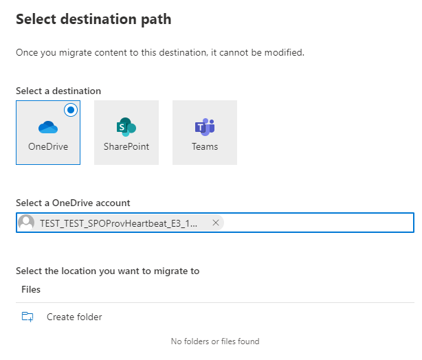
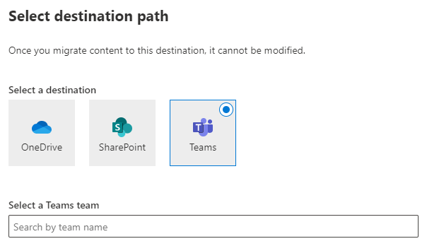
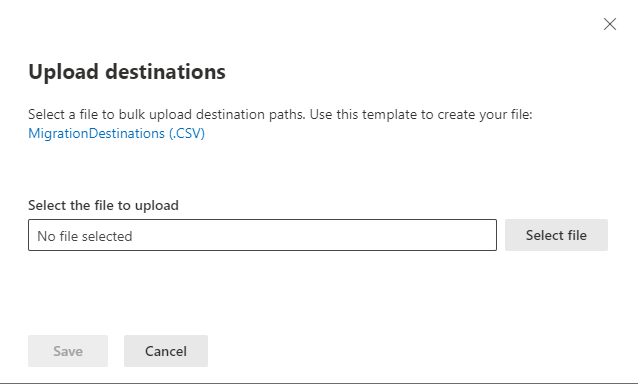

# Preview - Step 4:   Review destination paths

>[!Important]
> This feature is currently in private preview and subject to change without notice.

In this step, you are reviewing the destination paths of the accounts you have move to the migrations list, and making sure they are correct. An account cannot be migrated without a destination indicated and once you migrate content to a destination it cannot be modified.

## Single destination edit

If a destination is missing, highlight the row. A panel will appear to the right. Under **Destination**, click **Edit.**  you will be given the option of selecting a OneDrive, SharePoint, or Teams path as a destination.

### OneDrive

1. Highlight the row. Under **Destination**, click **Edit.**
2. Select **OneDrive** as a destination.

3. Select a folder (optional).

4. Click **Save path**.

###  SharePoint

1. Highlight the row. Under **Destination**, click **Edit.**
2. Select **OneDrive** as a destination.

3. Select a location where you want to move the content.

4. Click **Save path**.

### Teams

1. Highlight the row. Under **Destination**, click **Edit.**
2. Select **OneDrive** as a destination.

3. Select a channel.

4. Click **Save path**.

## Upload destinations using a CSV file

If you have many destinations to edit, you can choose to upload a bulk destinations CSV file.  Download the *MigrationDestinations.csv* file template to your computer and enter your destinations. Save your file as a .csv file using any name you wish. 

1. From the Migrations tab, select **Upload destinations** from the menu bar.
2. Select the file to upload with your destinations.
4. Click **Save**.  

>[!Important]
>Review your destination CSV file before you upload it to make sure you have entered the values in correctly.  The destination file is not validated, and once you have migrated to these destinations it cannot be undone.

[Step 5: Map identities](mm-box-step5-map-identities.md)