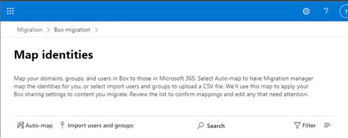

# Step 5: Map identities of Box accounts to Microsoft 365 accounts (preview)

>[!Note]
> Features described in this topic are part of a public preview release. The content and the functionality may change and are not subject to the standard SLAs for support.
>
>This preview release currently supports only small to medium Box accounts as features may not work on large Box accounts. For large Box accounts, we recommend you use the [Mover migration tool](https://Mover.io).

Identity Mapping is when you match the user and group identities that have access to your source environment (in this case Box) and map those identities to Microsoft 365 user and group identities. This process is important to migration. If identities are not properly set up prior to migration, it can result in users losing access to content. It can also result in information being incorrect at the destination.

Map your groups and users in Box to those in Microsoft 365 to migrate your Box sharing settings.

1. Select the Migrations tab.
2. Select **Map identities** on the menu bar.

 
3.  Select **Auto-map** to have Migration Manager map the identities for you or select **Import users and groups** to upload the values using a CSV file.

 

## Mapping individual identities

1. To edit a single mapping, highlight the row. Enter the mapping Microsoft 365 user account. 
2. Select **Save**.

## Import users and groups

If you have many mappings to edit, you can choose to upload a CSV file containing your users and groups mappings. Download the  file template to your computer and enter your destinations. Save your file as a .csv file using any name you wish. 

Upload your own users and groups mappings using the M
1. Select **Import users and groups**.
2. Download the mapping.csv template file, inserting your own mappings. You can name the .csv any name you wish.
3. Choose **Select file**. Navigate to your mapping .csv file and select.
4. Select **Save**.
5. Select **Close**.

>[!Important]
>Make sure to verify your mappings before uploading the file.  The file will not be validated, and once migration cannot be changed.

[**Step 6: Migrate and monitor**](mm-box-step6-migrate-monitor.md)

>[!NOTE]
>Migration Manager Box preview isn't available for users of Office 365 operated by 21Vianet in China. It's also not available for users of Microsoft 365 with the German cloud that use the data trustee *German Telekom*. It is supported for users in Germany whose data location isn't in the German datacenter.
>
> This feature is also not supported for users of the Government Cloud, including GCC, Consumer, GCC High, or DoD.