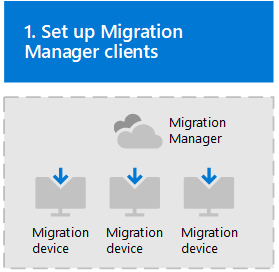
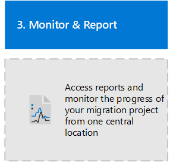

# Get started with the Migration Manager

Migrating content to the cloud is a time and resource intensive process and normally involves scaling up resources to accommodate the large volume of content that you are moving. This comes at a high operational cost of individually managing each server and the migrations tasks that are running on it. Plus you aren't able to automatically load balance your jobs, or view at a glance the progress and status of your migration tasks across all your devices.

Migration Manager answers those challenges by providing you a centralized way of connecting servers, creating tasks, and automatically load balancing your migration tasks.  

Located in the SharePoint Admin Center, the Migration Manager guides you through the setup of your devices and the creation of your tasks.  You can specify global or task specific settings, view all-up task progress, and download summary and detailed reports.

### How does it work? 

It works in three simple steps:

- **Connect.** Connect your computer or virtual machine to the SharePoint tenant where you want to migrate content

**Create tasks.** Create a task by entering the URL of the file share that you want to migrate (your source) and URL of the SharePoint site to where you are migrating (your destination). Migration Manager does the rest. However many tasks you create, Migration Manager will assign it to the next available client.

**Monitor and report.** Monitor progress across all clients and access reports from one central location. 

## How do I get started? 

To get started, make sure you have:
 
- **Access to the destination**: You must be either a global admin or SharePoint Online admin to the Office 365 tenant where you want to migrate your content.

- **Access to the source**: Windows credentials that have read access to any of the network file shares you plan to migrate 

- **Computer or VM** that has the necessary prerequisites installed:  See here for the [List of prerequisites](mo-setup-clients.md) 

- **Assigning tasks.** Migration Manager automatically assigns tasks to a available client, it does the load balancing for you. You cannot manually assign a task to a specific client.  

### Related links

[How to set up clients in Migration Manager](mo-setup-clients.md) 
[Migration Manager settings](mo-settings.md) 
[How to format your CSV or JSON file for bulk upload into the Migration Manager](mo-bulk-upload-format.md) 
[Migration Manager FAQs](mo-migrationmanager-faqs.md) 