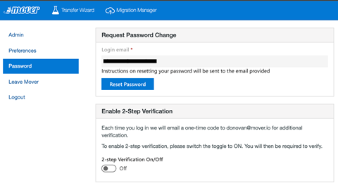
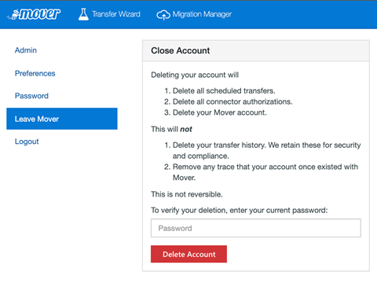

# Account FAQ

## How do I reset my password?

**From the sign in screen**

To change your account password from the login screen, follow these steps.

1. Select **Forgot password**.
2. On the next screen, enter your account email, and select **Reset Password**.
3. Follow the steps we send to your account email and you're done!

**From your account panel**

If you are already logged in to our app, you can change your password there, too.

1. Log in. To visit your **Account** settings (**shortcut**), in the top right corner of our app, select account email.
2. In the left-hand menu, select **Password**.
3. Select **Reset Password**.
4. Follow the steps we send to your account email and you're done!

## How do I enable multi-factor authentication?

To enable multi-factor authentication, follow these steps.

1. Log in. To visit your **Account** settings (**shortcut**), in the top right corner of our app, select account email.
2. From the left-hand menu, select **Password**.
3. Under **Enable 2-Step Verification**, select **TURN ON**.

>[!Note]
>You are automatically signed out of your account.

4. Log in to your email, and copy the verification code sent to you. If a verification code email does not appear in your inbox [or spam], just below the verification window in our app sign-in, select **Didn't get the code? Resend now**.

5. Enter the **Verification Code**. You now have 2-Step verification enabled.
6. To turn off 2-Step verification, return to the **Password** tab, and under Enable 2-Step Verification, select **TURN OFF**.

## How do I delete my account?

Deleting your account deletes all your scheduled transfers, multi-user migrations, and authorized connectors.

To close your account, follow these steps.

1. Log in. To visit your **Account** settings (**shortcut**), in the top right corner of our app, select **account email**.
2. On the left hand side, select **Leave Mover**.
3. Read all of the text on that page.
4. If you are ready, enter your current password, and select **Delete Account**.
5. A prompt appears. Select **OK**.

To reiterate:

**Deleting your account:**

- Deletes all scheduled transfers.
- Deletes all connector authorizations.
- Deletes your Mover account.

**This will not:**

- Delete your transfer history. We retain these for security and compliance.
- Remove any trace that your account once existed with Mover.

>[!Important]
>Deleting your account is **not** reversible.

 

## How do I edit my email notifications?

By default, you receive an email every time a transfer is completed. To edit your email notification settings:

1. Log in. To visit the account settings, in the top right of our app, select your email address.
2. Select **Preferences**.
3. You have the option to receive emails **On Completion** (default), **Never**, or **Only on Errors**.

## Can I change my account email?

Unfortunately at this time, we do not allow you to change the email associated with your account.

You may, however, delete your account — losing the schedules, connector authorizations, and transfer history associated with it — and create a new account with the email you would prefer.

## How do I check my transfer usage?

Checking your usage of our app lets you know the total number of gigabytes you have transferred over the history of your account.

To check your transfer data usage, follow these steps.

1. Log in. To visit your **Account** settings, in the top right corner of our app, select **account email**.
2. By default, you are already in the **Plan** section.

## How do I add an administrator to a Mover account?

To add an Administrator to your Mover account: 
1. Log in to your account 
2. Select your username in the upper right corner
3. Choose the “Admin” tab
4. Enter the email you wish to add under "add a mover account as your administrator". 

>[!Note]
> This lets the Administrator to have full access to your account and act on your behalf for:
>- Existing connectors
>- Authorizing new connectors under your account
>- Monitoring existing migrations
>- Creating new migrations under your account
>- The newly added Administrator will not receive and email invitation to administer your account. 
>- The user must have their own valid Mover account before they can be added as an Administrator

## As an administrator, how do sign in using a different Mover account?  

1. Log in as yourself. 
2. Select your username in the upper right corner
3. Select the “Admin” tab.
4. Under **Accounts you administer**, select the account you want to log in to.
5. Select **Login As**.

## Login-as options

(1) Shows the account you logged in as
 
(2) Allows you to return to your own Mover account
 
(3) List of existing connectors under the account

(4) Monitor and execute migrations in the **Migration Manager** on the user’s behalf.