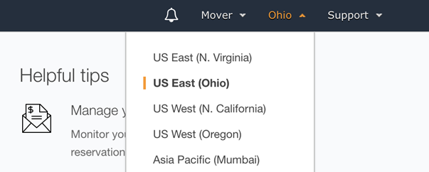
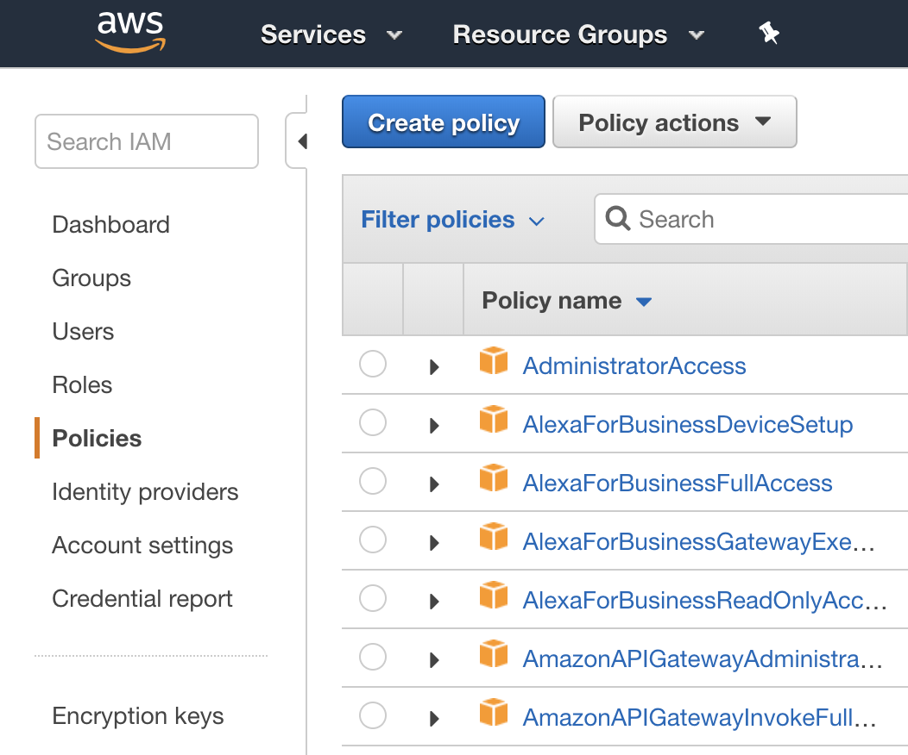
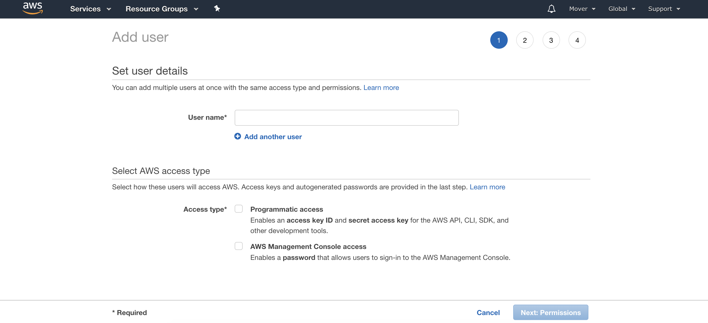
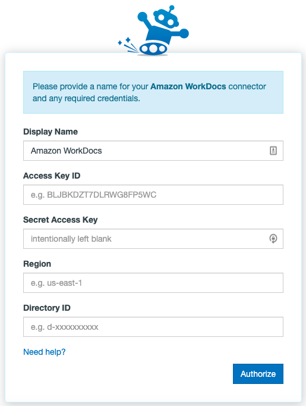
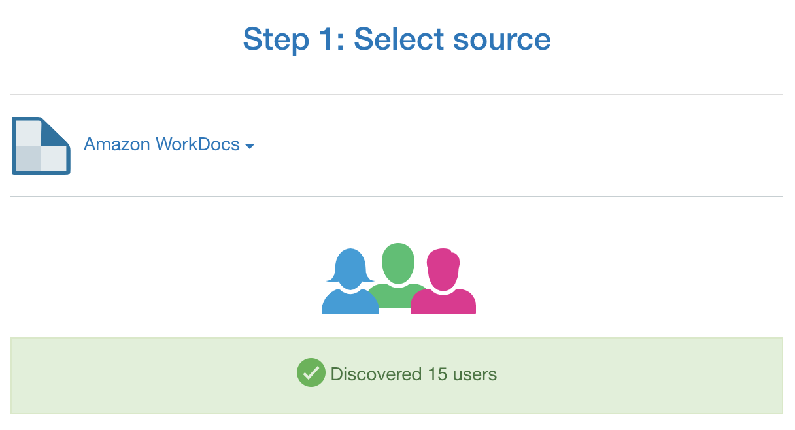

# Authorizing the AmazonWorkDocs Connector

## Amazon WorkDocs FAQ

### User Count
At this time, Amazon WorkDocs can sometimes return an inflated or incorrect user count to us when you load the connector in the Transfer Wizard. This number is purely cosmetic and should not affect your migration setup or migration in any way.

## Authorizing Amazon WorkDocs

To authorize or add an Amazon WorkDocs account as a Connector, follow these steps:

1. Find Your Amazon Region
In the AWS Console go to the WorkDocs service. In the top right-hand corner in between the account’s email address and the “Support” link, click the Region selector and note which region is highlighted.



**Note Your Region**:  Use this table or the [Amazon documentation page](http://docs.aws.amazon.com/AWSEC2/latest/UserGuide/using-regions-availability-zones.html) to get the Region Code for your WorkDocs installation.

|Code|Name|
|:-----|:-----|
|us-east-1|	US East (N. Virginia)|
|us-east-2|	US East (Ohio)|
|us-west-1|	US West (N. California)|
|us-west-2|	US West (Oregon)|
|eu-west-1|	EU (Ireland)|
|eu-central-1|EU (Frankfurt)|
|ap-northeast-1	|Asia Pacific (Tokyo)|
|ap-northeast-2|Asia Pacific (Seoul)|
|ap-southeast-1	|Asia Pacific (Singapore)|
|ap-southeast-2	|Asia Pacific (Sydney)|
|ap-south-1	|Asia Pacific (Mumbai)|
|sa-east-1	|South America (São Paulo)|

2. Find Your Directory ID
WorkDocs is backed by Amazon’s Directory Service. Each WorkDocs installation will have a Directory Service instance. We will need the Directory ID for the WorkDocs installation in order to grant the user access to it.

- Click the Services Menu in the AWS Console and select “Directory Service”.
- Find the Directory Name that corresponds to your WorkDocs installation. If you created the WorkDocs installation with the default “Simple AD” the name should be something like “corp.workdocssitename.com”.
- Note the Directory ID in the first column or click the item and copy the ID from the details page.

Details page:


3. Set Your IAM Access Policy
The user you will create to give us access to your WorkDocs installation will need to be granted full access. This is accomplished using an IAM Access Policy.

- In the AWS Console select “IAM” from the Services menu
- Click “Policies” in the left-hand column
- Click “Create Policy”



- Click the “Select” button next to “Create Your Own Policy”
- Enter a policy name (e.g. “WorkDocsFullAccess”) and description
- Copy and paste the following into the “Policy Document” section:

```json
{
    "Version": "2012-10-17",
    "Statement": [
        {
            "Sid": "WorkDocsFullAccess",
            "Effect": "Allow",
            "Action": [
                "workdocs:*"
            ],
            "Resource": [
                "*"
            ],
            "Condition": {
                "StringEquals": {
                    "Resource.OrganizationId": "directory_id"
                }
            }
        }
    ]
}
```

- Replace directory_id with the Directory ID noted earlier.
- Click “Validate Policy”
- Click “Create Policy”


4. Create an IAM User
We need to create a user that will have access to WorkDocs in order to complete the migration. This user’s key and secret will be shared with our app.

- In the AWS Console select “IAM” from the Services menu
- Click “Users” in the left hand column
- Click “Create New User”
- Enter a user name. E.g. “workdocs_migration_access”



- Click “Create Users”
- Click “Show User Security Credentials”
- Note the “Access Key ID” and “Secret Access Key”. The “Secret Access Key” will not be shown anywhere in the AWS Console again, but a new key and secret can be generated if needed.


- Click “Close” or “Download Credentials” to save a CSV file with the key and secret of the user created.
- Click on the new user in the list of users
- Click the “Permissions” tab
- Click “Attach Policy”
- Find the Policy created earlier (“WorkDocsFullAccess” if you used the suggested name)
- Click “Attach Policy”


The user should now have full access to WorkDocs.

5. Authorize With Us in App

- In the Transfer Wizard click **Authorize New Connector**.
- 


- Find Amazon WorkDocs in the Connector list.
- Click **Authorize**.


- A new window (tab) will open. Name your Connector (Optional).
- Enter your Access Key ID and Secret Access Key.
- Enter your Region and Directory ID.



- Click **Authorize**.


## Connecting Your Source Amazon WorkDocs Account

If you are not already connected after you have authorized your source, click Amazon WorkDocs and load the connector. An icon will appear and show you how many users you are migrating.



## Connecting Your Destination Office 365 Account

If you are not already connected after you have authorized your destination, click Office 365 and load the connector. An icon will appear and show you how many users you are migrating.


## Creating a new migration

Select **Continue Migration Setup**, and our app moves to the **Migration Manager**.


The next step creates a user list of those transfering.

From your newly created migration in the **Migration Manager**, there are two ways to add users:

- Select **Add Users**.


- Or, select **Migration Actions**, and then select **Add to Migration**.


Select one of two options:

1. Auto Discover Users.
  - Select **Automatically Discover and Add Users**, and our app automatically finds your users and attempts to match them up.

2. Upload Migration CSV File.
  - Either drag a file into the designated space, or select **Choose a file to upload**, and add a customized CSV file for your migration.


>[!Note]
>You still get to finalize your migration before any data moves!
