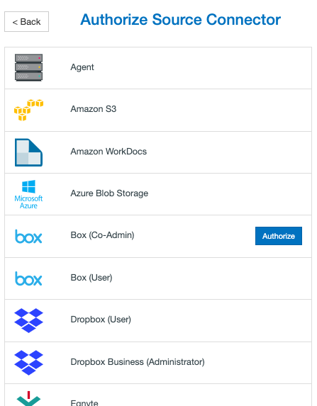
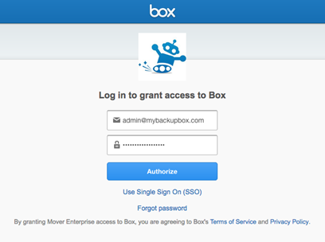
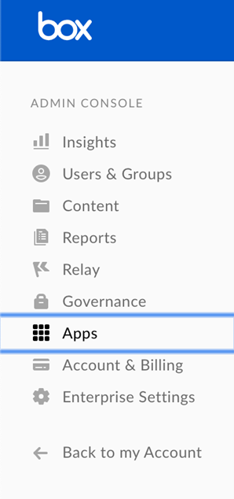
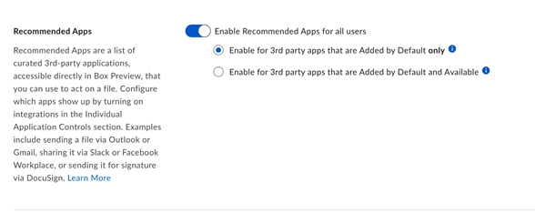
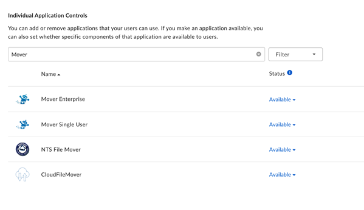
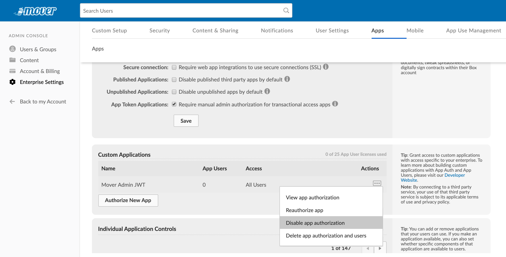
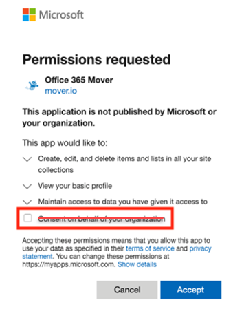
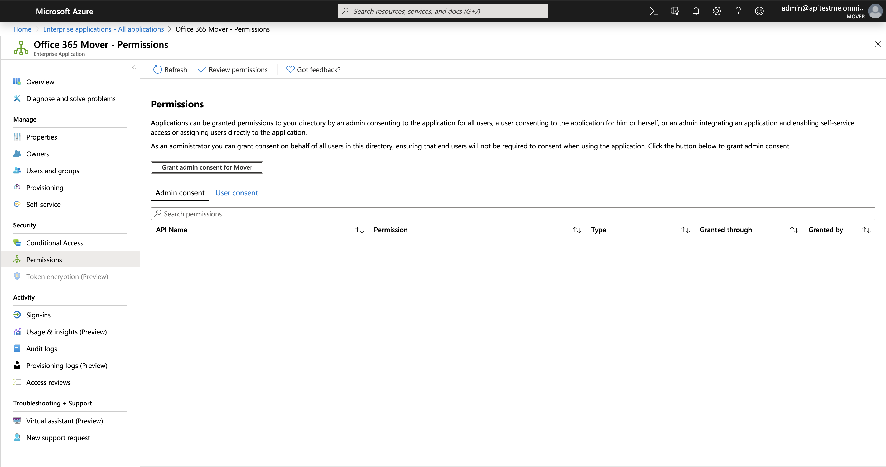

# Authorizing the Box Connector

## Box FAQ

### Should we disable our Box accounts?
Disabling employee access to their Box accounts mitigates any risk of them accessing data after the migration takes place.

This practice:

1. Keeps their Box accounts for a few weeks before deleting them.
2. Keeps their Box data available in read-only format.

Think of your employees' needs and what works best for the team.

### What happens to Box Notes?

Our app does not currently support Box Notes conversion.

### Locked files

We automatically unlock locked Box files and download them.

The file(s) remain unlocked after this process, so if you want to re-lock the files, you must do so from Box directly.

### Disable email notifications

In Box, there are settings to notify users when downloads occur for content they own. This can equate to spam during a migration because our app downloads all their files.

When logged in as a Box admin, disable this setting from:  https://app.box.com/master/settings/notification

### Box data reporting

We've found that Box occasionally has hiccups with reporting storage quotas in their service. If you discover that there is a discrepancy between what we are reporting and what Box's dashboard and/or reporting informs you, you must contact their support team and ask them to refresh/recalculate the storage quotas on your account (frequently, you need to escalate this beyond their first-level support).

For more info about this issue, see **here** and **here**.

## Authorizing Box (Co-Admin)

Authorizing Box as an Administrator or a Co-Administrator is straightforward. To authorize or add a Multi-User Box account as a connector, follow these simple steps:

1. Navigate to **[Add Mover as a Custom Application](https://app.box.com/master/custom-apps)**. 

2. Select **Authorize New App**. 

3. Enter the API Key: `7ypzdr66s3m80h3hutop34u7yml8928x`
4. Select **Next**.  
  
5. In the new window, select **Authorize** to authorize our app.  
  
6. In the Mover app, return to the **Transfer Wizard**, and select **Authorize New Connector**.  
  
7. In the **Connector** list, find **Box (Co-Admin)**.
8. Select **Authorize**. 
  
    A new window (tab) opens.
9. Name your **Connector** <optional>.  
  
10. Select **Authorize** again. 
11. If you are not logged in, to grant access, you can use either your Box credentials, or a SSO account.  
  
12. To grant our app access to your Box account, select **Allow**.  
  

You should now be connected to Box with Co-Admin authorization!

## Troubleshooting a Box (Co-Admin) connector

**App Permissions**: Your organization may default all apps to disabled. See the following quick guide about how to ensure our app is enabled.

1. Under **Enterprise Settings**, navigate to **Apps**. Here is a shortcut link: https://app.box.com/master/settings/apps   
  
2. In the **Recommended Apps** section, ensure "Enable for 3rd party apps that are Added by Default only" is checked.  
  
3. Under **Individual Application Controls**, navigate to our app.
4. Select **Available**.  
  

## Box permission requirements
For authorization, our app requires an **Administrator** or **Co-Administrator**. The following table lists the scopes we require:

|**Permission**|**(Details) Allows our app to...**|
|:-----|:-----|
|Read and write all files and folders stored in Box    |Read, create, update, and overwrite data in Box.|
|Manage Enterprise    |Manage any data found in the authorized Box directory.|
|Admin can make calls on behalf of Users    |Grants permission for our app to contact Box servers on behalf of users' accounts.|
|Admin or co-admin can make calls for any content in their enterprise    |Grants our app permission to contact Box servers on behalf of administrators or co-administrators regarding any data found in your business's Box directory.|

## Removing app access
Deleting or disabling the account used to Authorize Box (Co-Admin) does not remove our app's access to Box.

To remove our app's access to Box:

1. On the **Box Admin Console**, under **Enterprise Settings**, navigate to the **Apps** panel.
- Scroll down to **Custom Applications**.
- Select **...**, and in the dropdown menu, select **Disable app authorization**.

>[!Note]
>To delete a custom app, you must contact Box.

## Authorizing Microsoft 365

>[!Warning]
>To fully authorize the **Microsoft 365 Connector**, a global admin is required to grant permissions to the Microsoft 365 Mover app within the Azure portal.
>
>The global admin must grant these permissions *after* the **Microsoft 365 Connector** is authorized within the main Mover app.

The following instructions show you how to complete the authorization steps in the right order.

Some steps in the authorization process can be completed by a global or SharePoint admin in Microsoft 365. At the beginning of each step, we indicate who can complete it.

1. **Global or SharePoint admin**: Log into the main Mover app via **app.mover.io**. In the **Transfer Wizard**, select **Authorize New Connector**.

>[!Note]
>Whether the **Microsoft 365 Connector** is your source or destination connector (or both), you'll need to go through this authorization process.

2. **Global or SharePoint admin**: In the **Connector** list, find **Microsoft 365**. Select **Authorize**.

3. **Global or SharePoint admin**: A window with an **Authorize** button appears. It prompts you to provide a display name <optional> for your **Microsoft 365 Connector**.  Select **Authorize**.

4. **Global or SharePoint admin**: Follow the on-screen instructions. You are redirected to a Microsoft login screen where you can log in with your Microsoft admin privileges and continue to authorize the connector.

>[!Warning]
>If you are a **global admin**, a slightly different login screen appears.  
>
>**DO NOT** select the option **Consent on behalf of your organization**. This option **must** remain clear.

- 

5. **Global or SharePoint admin**: After authorizing the connector, you are redirected to the **Mover Transfer Wizard**, and an error appears, like the following. This means it is now time for a global admin in your tenant to grant permissions to the Microsoft 365 Mover app in the Azure portal.

If you're a **SharePoint admin**: To grant permissions and finish the authorization process (Steps 6 – 9), point your global admin to **aka.ms/office365moverauth**.

If you're a **global admin**: Continue with Steps 6–9.

6. **Global admin**: Log in to the Azure Portal via **aka.ms/office365moverauth**. A list of **Enterprise applications** appears.

7. **Global admin**: Find and select the Microsoft 365 Mover app. A page appears that provides an overview of our app.

8. **Global admin**: In the left menu, find and open **Permissions**. Select **Grant admin consent for Mover**.

9. **Global admin**: A pop-up window appears that guides you through the rest of the permissions process. When complete, it closes automatically, and your **Microsoft 365 Connector** is fully authorized and ready to go.

## Troubleshooting a Microsoft 365 connector

### App access error

If you encounter an error on authorization, try signing out of any Microsoft accounts, and attempt to authorize the **Connector** in an Incognito Window.

### Global admin account provisioning

Your global admin user must have a Microsoft 365 account provisioned in order to administer other Microsoft 365 accounts. If you create a service account for our app, ensure you also assigned a Microsoft 365 license and walked through the Microsoft 365 setup process.

### User provisioning

Are your Microsoft 365 users provisioned? All Microsoft 365 users must log in to their Microsoft 365, and open Microsoft 365 for us to transfer into their accounts. You can also provision Microsoft 365 accounts via Windows PowerShell using the following commands (replace your URL and email appropriately):

`Connect-SPOService -Url https://example-admin.sharepoint.com -credential user@example.com`

`Request-SPOPersonalSite -UserEmails "neverloggedintest@example.onmicrosoft.com"`

### Microsoft 365 permission requirements

Our app requires a global admin for authorization. The following table lists the scopes we require:

|**Permission**|**(Details) Allows our app to...**|
|:-----|:-----|
|Create, edit, and delete items and lists in all your site collections|Create or delete document libraries and lists in all site collections on your behalf.|
|View your basic profile|See your basic profile (name, picture, user name).|
|Maintain access to data you have given it access to|See and update the data you gave it access to, even when you are not currently using our app. This does not give our app any additional permissions.|

## Connecting your source Box account

If you are not already connected after you have authorized your source, select **Box**, and load the connector. An icon appears, and shows you how many users you are migrating.

## Connecting your destination Microsoft 365 account

If you are not already connected after you have authorized your destination, select **Microsoft 365**, and load the connector. An icon appears and show you how many users you are migrating.

## Creating a new migration

Select **Continue Migration Setup**, and our app moves to the **Migration Manager**.

The next step creates a user list of those transfering.

From your newly created migration in the **Migration Manager**, there are two ways to add users:

- Select **Add Users**.

- Or, select **Migration Actions**, and then select **Add to Migration**.

Select one of two options:

1. Auto Discover Users.
  - Select **Automatically Discover and Add Users**, and our app automatically finds your users and attempts to match them up.

2. Upload Migration CSV File.
  - Either drag a file into the designated space, or select **Choose a file to upload**, and add a customized CSV file for your migration.

>[!Note]
>You still get to finalize your migration before any data moves!

## Creating a new migration from a CSV (optional)

Sometimes you have thousands of users and a complicated directory schema that you want to import. In these cases, it's desirable to plan out your migration in a spreadsheet.

In these cases, we trust the CSV upload option is useful. This lets you lay out all your users and directories, and then provide it to us in a .csv format for us to create your migration.

### Users to migrate

Your CSV file must follow this format:

A heading for the source and destination, followed by the paths, and optional tags on each line.

`Source Path,Destination Path,Tags` 
`user1@example.com,user__1@corp.example.com,"Pilot, IT"` 
`user2@example.com,user__2@corp.example.com,"Pilot, Sales"` 
`user3@example.com/src dir,user3@example.com/migrated,"Pilot, IT"` 
`Source Shared Drive,user4@example.com/Team Folder,"Pilot, Sales"` 
`https://TENANT02.sharepoint.com/sites/SiteName/Shared%20Documents,user5@example.com,"Marketing, Sales"` 

>[!Note]
>Ensure your CSV has no spaces after each comma separated value. Values that require commas must be wrapped in quotation marks.

Download an example CSV:

**example_CSV_map.csv**

>[!Note]
>When URL mapping to SharePoint, you must remove everything after /Shared%20Documents; otherwise,the URL fails.

For example, this full URL won't work:
`https://TENANT01.sharepoint.com/sites/SiteName/Shared%20Documents/Forms/AllItems.aspx`

Change it to:
`https://TENANT01.sharepoint.com/sites/SiteName/Shared%20Documents`

### Creating your CSV in Excel

To use an Excel spreadsheet to create your CSV:

1. Ensure you have two columns, one titled `Source Path`, and one `Destination Path`.
2. List the relative paths, domains, and usernames on the subsequent rows.
3. Export your spreadsheet as a CSV:
  a. Select **File**.
  b. Select **Save As**.
  c. From the **File Format** options, select **CSV**.

## Reviewing your users

### Checking paths

Confirm that the users in the Box source match the users in the Microsoft 365 destination. Usually the emails/usernames match up, but it depends how you structure and name your users. *Be diligent during this step!*

### Editing

Be aware that Users can only be edited if they haven't been scanned, or had a transfer run.

To edit a user source entry:

1. To select a user row, on the left side of a row, select the respective checkbox.
2. On the right and directly above the user rows, find **User Actions**, or right-click the user row for which you want to edit the source path.
3. A new side panel opens, enabling you to edit the Box source path.
4. To select your parent source path, double-click it, and to complete your edit, select **Save**.

To edit a user destination entry:

1. To select a user row, on the left side of a row, select the respective checkbox.
2. On the right and directly above the user rows, find **User Actions**, or right-click the user row for which you want to edit the destination path.
3. A new side panel opens, enabling you to edit the Microsoft 365 destination path.
4. To select your parent destination path, double-click it. To complete your edit, select **Save**.

You can also choose to edit your user entries via CSV, though this is a fairly in-depth process. *If you are simply looking to make a handful of edits to your paths, we recommend using the previous method.*

To edit or update your current existing user pairings:

1. Near the top right of the **Migration Manager**, select **Migration Actions**.
2. Select **Update Migration**.
3. Upload your .csv file. 

Tips for creating the CSV:
  - The CSV needs to follow this format:
     - `ID, Source Path, Destination Path` 
     - `id12345, /first.last@example.com, /f.last@example.com`

  - The `ID` column is required to specify the existing row in the **Migration Manager**, whereas the source and destination path are optional - as in, you don't need to enter both if you only want to edit the destination path, for example - and leaving both of those columns blank mean no changes are made.
 
      - To get the ID for each row: 
        a. Find and select **Migration Actions**. 
        b. Select **Customize Columns**, and select **ID**. 
        
        You'll now be able to see the ID appearing in each row. If you refresh the page, this info disappears unless you select **Save Column State**.

Download an example CSV here:

[example_path_edit.csv](https://github.com/MicrosoftDocs/OfficeDocs-SharePoint/tree/live/migration/downloads/example_path_edit.csv)

4. After you've created your CSV file using these instructions and format, you can drag and drop the file into our app, or select **Choose a file to upload**. Changes to your user pairings are implemented immediately.

### Adding

If you missed users in your original CSV upload, or simply want to add new user entries to the current migration, add them via CSV. All entries you add in this manner are appended to the current migration, meaning this won't modify existing rows, and it is possible to create duplicate entries alongside the ones that already exist.

To add new users:

1. Near the top right of the **Migration Manager**, select the **gear** icon.
2. Select **Add to Migration**.
3. Upload your .csv file. 

Tips for creating the CSV:
  - CSV needs to follow this format: 
    `Source Path, Destination Path` 
    `/first.last@example.com, /flast@example.com`
  - **CSV is created the same way you would if you initially created the migration with a CSV**.
4. After you've created your CSV file using these instructions and format, drag and drop the file into our app, or select **Choose a file to upload**. Changes to your user pairings are implemented immediately.

### Duplicating

At any time, you may duplicate a user in the **Migration Manager** list. To duplicate a user entry:

1. To choose a user row, on the left side of a row, select the respective checkbox. You may select more than one entry at a time.
2. On the right and directly above the user rows, find **User Actions**, or right-click the user row you want to duplicate.
3. In the context menu, select **Duplicate # User**.
4. Select **OK**. 

A new user entry appears. From here, you can change the directory, schedule, or even the entire user.

### Scheduling

You can set an hourly, daily, weekly, or monthly schedule for each user, even after they have been run.

To create or edit a schedule:

1. Select the user pairing(s) you want to schedule.
2. Select the **User Actions** dropdown menu.
3. Select **Schedule # Users**.
4. Configure your Hourly, Daily, Weekly, or Monthly setup, including the timing and day of the week (where applicable).
5. Select **Apply Schedules to X Users**.

### Deleting

Be aware that users can only be deleted if they haven't been scanned, or had a transfer run.

To delete a user entry:

1. To choose a user row, on the left side of a row, select the respective checkbox. You can select more than one entry at a time.
2. On the right and directly above the user rows, select **User Actions**, or right-click the user row you want to delete.
3. In the context menu, select **Delete User**.
>[!Important]
>This is permanent and cannot be undone unless you create a new entry.

## Reviewing your permission map

The permission map is a critical part of your migration.

When a user is migrated, we transfer files and folders and share any required data. We already know who is copying data, but we also need to know who might have content shared with them, even if they don't copy data.

To stay organized, we'll provide a secondary list of your users, called a permission map. This list includes everyone who could possibly receive sharing permissions to any files or folders that might be migrated. This even includes users who are not migrating data.

Another important consideration is that usernames and emails aren't always consistent across platforms, and the permission map helps us line up everyone.

**Example**: `jane@example.com` is actually `j.smith@example.com`

We automatically detect users and handle perfect matches. Any inconsistencies must be manually reconciled. The permission map can be continually updated, because with each incremental pass of the migration, permissions are reapplied.

1. To view your permission map, in the top right of the **Migration Manager**, select **Migration Actions**, and then, from the dropdown menu, select **Edit Permission Map**.

You may either auto-discover or upload a permission map file. We automatically pair perfect matches. If a user or group in Box does not have a perfect match in Microsoft 365, you can correct it in our interface.

2. Select **Auto-discover Users**.

3. At any time, you may view and edit your permission map.

  

>[!Note]
>A blank destination entry automatically cancels any permission sharing for that user or group.

>[!Note]
>Adding a new line for a specific users - for example, user01@gmail.com to user01@hotmail.com - that perfectly matches auto-discovered permissions by the domain - for example, @gmail.com to @hotmail.com - is automatically removed. Our app marks these as redundant entries.

## Uploading a permission map <optional>

You can upload a permission map in CSV format. This overwrites any existing permission map, so use caution. In an ideal world, all users are matched. If there are a few unmatched users, from the web interface, you can manually add names to the **Destination** field.

Ensure that your permission map follows this strict format:

A heading for the source and destination, followed by domain names, groups, usernames, or emails.

`Source User, Destination User` 
`example.com, example.com` 
`corp.example.com, example.com` 
`user@example.com, differentuser@example.com` 
`group, group` 

Permission maps should have two specific entries:

1. Any domain names that are wildcard matched, (for example, `example.com, example.com` or `contoso.com, corp.contoso.com`). This instructs our app to match any users with those domain names in their source email to their new destination email domain.
2. Imperfect matches. Users that are differently named between the source and destination domains need to be explicitly listed, (for example, `firstname@contoso.com, firstname_lastname@contoso.com`).
3. Groups can also be included for most connectors. These are explicitly required and are not matched with a domain wildcard, (for example, `Sales Team, Global Sales Team`).
4. We strip all leading and trailing spaces from each path value, unless it is wrapped in quotation marks.

Download an example CSV:

[example_permission_map_box.csv](https://github.com/MicrosoftDocs/OfficeDocs-SharePoint/tree/live/migration/downloads/example_permission_map_box.csv)

### Creating your CSV in Excel

If you are using an Excel spreadsheet to create your CSV:

- Ensure you have two columns, one titled `Source User`, and one `Destination User`. Check the spelling on the domains, usernames, and groups listed.

For example:

`Source User, Destination User` 
`example.com, example.com` 
`eric@example.com, ewarnke@example.com` 
`joshua@example.com, jbadach@example.com` 
`Sales Team,Global Sales Team`

### Exporting a permission map

You can export a permission map in CSV format.

1. Select **File**.
2. Select **Save As**.
3. From the **File Format** options, select **CSV**.

## Migration Manager overview

The **Migration Manager** is the key part of our app. It is the primary screen for interacting during the data migration process.

### Migration Manager dashboard

Use the **Migration Manager** dashboard for a summary of your overall migration. This is covered in depth **here**.

### Main menu bar

Use our app's main navigation bar to switch between the **Migration Manager**, **Transfer Wizard**, and your **Account** details, as well as contact support if you run into any issues during your migration.

### Migration selection

Use the **Migration Selection** bar to navigate between separate multi-user migrations, as well as individual normal transfers.

Here, you are also able to edit and personalize the names of each multi-user migration.

### Migration actions

Use the **Migration Actions** menu to access things such as: the migration reports, the columns displayed, and the overall layout of your migration to best suit your personal needs.

### Filters

Use the **Active Filters** bar to search your migration for specific key terms or custom tags you have applied.

You can also view more in-depth instructions by selecting the info button directly to the right of the **Active Filters** search bar, or by viewing the **Active Filter** list.

### User display

The user display is the central focus of the **Migration Manager**, and displays all the users in the current migration.

This section of our app provides you with a column-by-column breakdown of each individual user in a migration. Here, you can also duplicate and edit source/destination paths of a user, as well as view the logs of any scanned or completed transfers.

### User actions and finalization

This area of the screen contains the **User Actions** dropdown menu, the **Scan User** and **Start Migrating Users** buttons.

**User Actions** opens a new dropdown menu enabling you to interact with a selected transfer.

**Scan # Users** performs a scan of the selected users. This helps identify any problematic files, folders, or connectors.

**Start # Migrating Users** opens a side tab enabling you to finalize and begin the migration.

