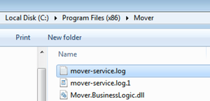
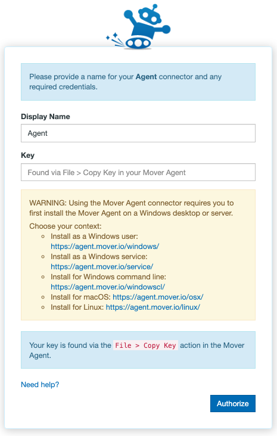
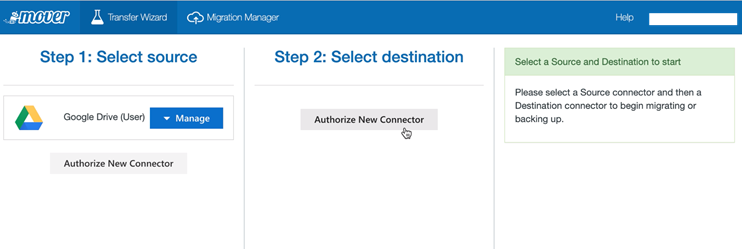
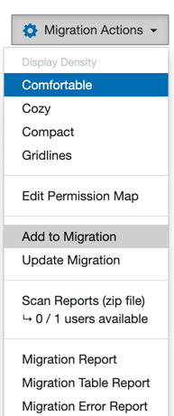
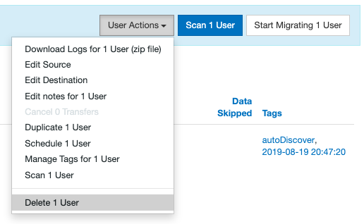
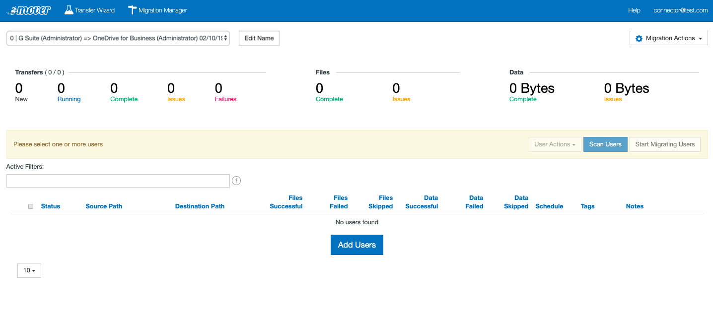

# Authorizing the File share Connector

## Agent FAQ

### Windows

The Windows Agent has two installers, one for the user-context and one for the service-context. The Windows Agent requires Microsoft .NET Framework 4.6.2 or greater.

The differences between Windows installers are as follows:

#### User-context installer

- **Select to download**.
- Installs and is run as the currently logged in Windows user.
- Automatically updates.
- Has access to local drives.
- Has access to mapped network drives.
- Is not available if the user logs out of Windows, or your remote desktop session expires.

#### Service-context installer

- **Select to download**.
- Installs and is run as a Windows service.
- Must be manually updated.
- Has access only to local drives.
- Is always available, even if the current user logs out, or your remote desktop session expires.

#### Command line agents

The following Agents operate using a command line interface versus a user interface.

### macOS

- **Select to download**.
- Navigate to the download location, and unzip the **Mover Agent**.
- Via the terminal, browse to the now unzipped `moveragent` folder, and run `./agent`.
- Copy the key from the line that reads `[1] INFO ocess.BifrostService: Bifrost service initialized with connector key: <key>`.
- Open our app, and in the **agent authorization** box, paste the key.

>[!Note]
>The minimum system requirements are macOS 10.12.

### Linux

- **Select to download**.
- Navigate to the download location, and unzip the Agent.
- Via the terminal, browse to the now unzipped `moveragent` folder and run `./agent`.
- Copy the key from the line that reads `[1] INFO ocess.BifrostService: Bifrost service initialized with connector key: <key>`.
- Open our app in your browser, and paste the key into the agent authorization box.

### Windows command line installer (beta)

- **Select to download**.
- Installs and is run as a command line executable.
- Must be manually updated.
- Built from the same code base as the Linux and macOS agents.

### How does the agent view users?

The Agent works with files and folders. All users who are separated into their own folders can easily be mapped to their new location in Microsoft 365.

A good example would be a large listing of home drives. Each home drive for a user could be transfered to their respective new user in Microsoft 365.

### Troubleshooting the agent

#### Checking the agent version

To check which version of the Server Client you have installed, on the menu bar, select the **Help** tab.

If you are using the Mac or Linux version of our Agent, to find out the version you are using, follow these instructions: **Show Agent Version**.

#### Accessing server agent log

To access the **Agent Log**, navigate to the folder directory that you installed the desktop agent. A .log file appears that you can review, and send to our support team if an error should occur.

>[!Note]
>The agent .log file default location is `Windows\System(32/64)\config\systemprofile\AppData\Local\Mover`

#### Commands for agent (Mac and Linux only)

Our Agent supports the following commands:

- Start the Agent
- Stop the Agent
- Show Agent Help
- Show Agent Version
- Check Agent Status
- Disconnect the Agent
- Connect the Agent
- Monitor Agent Activity

#### Start the agent

To start the Agent, use:  `./agent start`.

`$ ./agent start` 
`Mover Agent Starting` 
`Mover Agent Key:`  `0000000000000000000000000000000` 
`Ctrl-C To Stop`

#### Start the agent in the background

To start the Agent in the background, use: `./agent start &`.

`$ ./agent start &[1] 8667` 
`$ Mover Agent Starting` 
`Mover Agent Key:`  `00000000000000000000000000000000` 
`Ctrl-C To Stop`

#### Stop the agent

If the Agent is running in the foreground of the terminal, to stop the Agent, press `Ctrl-C`.

`^CMover Agent Stopping`

If the Agent is running the background or in another terminal session, use:  `./agent Stop`.

`$ ./agent stop` 
`Connecting to Mover Agent` 
`Sending stop command` 
`Mover Agent Stopping` 
`Mover Agent stopped` 
`[1]+ Done ./agent start`

#### Show agent help

To get a list of commands and options, use:  `./agent -h`.

`$ ./agent -h` 
`Mover Agent 1.0.6968.0` 
`Usage: agent [options] [command]`

`Options:` 
`-? | -h | --help Show help information` 
`-v | --version Show version information`

`Commands:`

- `connect| Connect to a running instance of the Agent and issue a connect command` 
- `disconnect| Connect to a running instance of the Agent and issue a disconnect command` 
- `monitor| Connect to a running instance of the Agent and monitor agent activity` 
- `start| Start the Agent` 
- `status| Connect to a running instance of the Agent and retrieve the current status` 
- `stop| Stop the Agent`

For more info about a command, use `agent [command] --help`.

#### Show agent version

To show the Agent version, use:  `./agent -v`

`$ ./agent -v` 
`Mover Agent` 
`1.0.6968.0 (Unix 18.6.0.0)`

#### Check agent status

To check the status of the Agent, use:  `./agent status`

`$ ./agent status` 
`Connecting to Mover Agent` 
`Mover Agent Key:`  `00000000000000000000000000000000` 
`Mover Agent Status: online`

#### Disconnect the agent

To disconnect the Agent, use:  `./agent disconnect`

`$ ./agent disconnect` 
`Connecting to Mover Agent` 
`Sending disconnect command` 
`Mover Agent disconnected.`

`$ ./agent status` 
`Connecting to Mover Agent` 
`Mover Agent Key:` 
`00000000000000000000000000000000` 
`Mover Agent Status: offline`

#### Connect the agent

To connect the Agent, use:  `./agent connect`

`$ ./agent connect` 
`Connecting to Mover Agent` 
`Sending connect command` 
`Mover Agent connected.`

`$ ./agent status` 
`Connecting to Mover Agent` 
`Mover Agent Key:` 
`00000000000000000000000000000000` 
`Mover Agent Status: online`

#### Monitor agent activity

To monitor the Agent activity, use:  `./agent Monitor`. To stop monitoring Agent activity, use: `Ctrl-C`.

`$ ./agent monitor` 
`Connecting to Mover Agent` 
`Mover Agent Key:`  `00000000000000000000000000000000` 
`Connected to bifrost.mover.io on ports 8081 and 4002.` 
`Ready to transfer!Browse: /` 
`Browse: /Users` 
`Browse: /Users/mover` 
`Browse: /Users/mover/AgentTestData` 
`Browse: /Users/mover/AgentTestData/TestDocuments` 
`Upload: /Users/mover/AgentTestData/TestDocuments/TestTextDocument.txt` 
`Upload: /Users/mover/AgentTestData/TestDocuments/file.txt` 
`Upload: /Users/mover/AgentTestData/TestDocuments/picture.jpg` 
`^C`

## Setting up the migration

### Authorizing the desktop and server agent

To enable swift and painless copying of data from on-premises desktop and server hard drives, we provide a very tiny agent that any Windows operating system can install.

#### Compatibility

Windows XP is not supported.
All other versions of Windows require the .NET Framework 4.6 for the Agent to function.
Download and manually install .NET Framework 4.6 from this **link**.

#### Security

The Agent may only initiate outbound communication with our own servers. All communication is via encrypted TLS and no service other than ours is allowed to work with the agent.

#### Windows installation

For Mac and Linux, the Agent folder appears in your Downloads, and is run through **command line operations**.

1. Download the Agent .exe, and select **Run**.

  

2. Agree to the **Terms of Use**, and select an install destination.

3. Navigate to the installed destination, and to run the desktop Agent, select the **Mover** icon.

4. To copy the Agent Key, in the dropdown menu, select **File** and **Copy Key**.

#### Authorizing the agent in our app

1. In the **Transfer Wizard**, select **Authorize New Connector**.

2. In the **Connector** list, find **Agent (Desktop or Server)**.
3. Select **Authorize**.

4. A new window opens, and you are prompted to name your **Connector** <optional>.
5. Enter your required Key that you copied from the installed agent (found via the **File** > **Copy Key** action in the Agent).
6. Select **Authorize**.

##### Additional screenshots

### Troubleshooting an agent connector

#### What operating systems are supported by the Mover agent?

The Mover Agent supports many operating systems:

- Windows Vista
- Windows 7
- Windows 8
- Windows 8.1
- Windows 10

#### Removing the Mover agent

You can stop using the Mover Agent.

To stop the Mover Agent from connecting to the Mover's servers, select **Disconnect from Mover**.

To completely uninstall the Mover Agent, use the Windows program manager.

### Authorizing Microsoft 365

>[!Warning]
>To fully authorize the **Microsoft 365 Connector**, a global admin is required to grant permissions to the Microsoft 365 Mover app within the Azure portal.
>
>The global admin must grant these permissions *after* the **Microsoft 365 Connector** is authorized within the main Mover app.

The following instructions show you how to complete the authorization steps in the right order.

Some steps in the authorization process can be completed by a global or SharePoint admin. At the beginning of each step, we indicate who can complete it.

1. **Global or SharePoint admin**: Log into the main Mover app via **app.mover.io**. In the **Transfer Wizard**, select **Authorize New Connector**.

>[!Note]
>Whether the **Microsoft 365 Connector** is your source or destination connector (or both), you must complete this authorization process.

2. **Global or SharePoint admin**: In the **Connector** list, find **Microsoft 365**. Select **Authorize**.

3. **Global or SharePoint admin**: A window with an **Authorize** button appears. It prompts you to provide a display name <optional> for your **Microsoft 365 Connector**.  Select **Authorize**.

4. **Global or SharePoint admin**: Follow the on-screen instructions. You will be redirected to a Microsoft login screen where you can log in with your Microsoft admin privileges, and continue to authorize the connector.

>[!Warning]
>If you are a **global Admin**, a slightly different login screen will display.  
>
>**DO NOT** select the option **Consent on behalf of your organization**. This option **must** remain unselected.

- 

5. **Global or SharePoint admin**: After authorizing the connector, you are redirected to the **Mover Transfer Wizard**, and an error appears, like the following. This means it is now time for a global admin in your tenant to grant permissions to the Microsoft 365 Mover app in the Azure portal.

If you're a **SharePoint admin**: To grant permissions and finish the authorization process (Steps 6 – 9), point your global admin to **aka.ms/office365moverauth**.

If you're a **global admin**: Continue with Steps 6 – 9.

6. **Global admin**: Log into the Azure portal via aka.ms/office365moverauth. A list of **Enterprise applications** appears.

7. **Global admin**: Find and select the Microsoft 365 Mover app. A page appears that provides an overview of our app.

8. **Global admin**: In the left menu, find and open **Permissions**. Select **Grant admin consent for Mover**.

9. **Global admin**: A pop-up window appears that guides you through the rest of the permissions process. When complete, it closes automatically, and your **Microsoft 365 Connector** is fully authorized and ready to go.

### Troubleshooting a Microsoft 365 Connector

#### App access error

If you encounter an error on authorization, try signing out of any Microsoft accounts, and in an Incognito window, attempt to authorize the Connector.

#### Global admin account provisioning

Your global admin user must have a Microsoft 365 account provisioned to administer other Microsoft 365 accounts. If you create a service account for our app, ensure you are also assigned a Microsoft 365 license and walked through the Microsoft 365 setup process.

#### User provisioning

Are your Microsoft 365 users provisioned? All Microsoft 365 users need to have logged in to their Microsoft 365, and opened up Microsoft 365 for us to be able to transfer into their accounts. You can also provision Microsoft 365 accounts via Windows PowerShell using the following commands (replace your URL and email appropriately):

`Connect-SPOService -Url https://example-admin.sharepoint.com -credential user@example.com`

`Request-SPOPersonalSite -UserEmails "neverloggedintest@example.onmicrosoft.com"`

#### Microsoft 365 permission requirements

Our app requires a global admin for authorization. The following table lists the scopes we require:

|**Permission**|**(Details) Allows out app to...**|
|:-----|:-----|
|Create, edit, and delete items and lists in all your site collections|Create or delete document libraries and lists in all site collections on your behalf.|
|View your basic profile|See your basic profile (name, picture, username).|
|Maintain access to data you have given it access to|See and update the data you gave it access to, even when you are not currently using our app. This does not give our app any additional permissions.|
  a. Select **File**.
  b. Select **Save As**.
  c. From the **File Format** options, select **CSV**.

### Connect your source agent for Windows

If you are not already connected after you have authorized your source, select **Agent for Windows**, and load the connector. An icon appears showing you the folders you are migrating.

### Connect your destination Microsoft 365 account

If you are not already connected after you have authorized your destination, select **Microsoft 365**, and load the connector. An icon appears and show you how many users you are migrating.

#### Create a new migration

Select **Continue Migration Setup**, and our app moves to the **Migration Manager**.

The next step creates a user list of who is transfering.

From your newly created migration in the **Migration Manager**, there are two ways to add users:

- Select **Add Users**.

- Or, select **Migration Actions**, then select **Add to Migration**.

Select one of two options:

1. Auto Discover Users:
  - Select **Automatically Discover and Add Users**, and our app automatically finds your users, and attempts to match them up.

2. Upload Migration CSV File:
  - Either drag a file into the designated space, or select **Choose a file to upload**, and add a customized CSV file for your migration.

>[!Note]
>You still get to finalize your migration before any data moves!

#### Creating a new migration from a CSV (optional)

Sometimes you have thousands of users and a complicated directory schema that you want to import. In these cases, it's desirable to plan out your migration in a spreadsheet.

In these cases, we hope the CSV upload option is useful. This allows you to lay out all your users and directories and then give it to us in a .csv format for us to create your migration.

##### Paths to migrate

Your CSV file must follow this format:

A heading for the source and destination, followed by the paths, and optionally tags on each line.

`Source Path,Destination Path,Tags` 
`D:/Users/user1,user1@example.com,"Pilot, Home Folder"` 
`E:/Share/Marketing,Marketing Team Folder/subdir,"Pilot, Department"` 

>[!Note]
>Ensure your CSV has no spaces after each comma separated value. Values that require commas must be wrapped in quotation marks.

Download an example CSV here:

**Example_CSV_Map.csv**

#### Creating your CSV in Excel

If you are using an Excel spreadsheet to create your CSV:

1. Ensure you have two columns, one titled `Source Path`, and one `Destination Path`.
2. List the relative paths, domains, and usernames on the subsequent rows.
3. Export your spreadsheet as a CSV:
  a. Select **File**.
  b. Select **Save As**.
  c. From the **File Format** options, select **CSV**. 

#### Reviewing your users

##### Checking paths

Confirm that the users in the File Servers source match the users in the Microsoft 365 destination. Usually the emails/usernames match up, but it depends how you structure and name your users. *Be diligent during this step!*

#### Editing

Be aware that users can only be edited if they haven't been scanned, or had a transfer run.

To edit a user source entry:

1. To select a user row, on the left side of a row, select the respective checkbox.
2. On the right and directly above the user rows, find **User Actions**, or right-click the user row for which you want to edit the source path.
3. A new side panel opens, enabling you to edit the File Servers source path.
4. To select your parent source path, double-click it, and to complete your edit, select **Save**.

To edit a user destination entry:

1. To select a user row, on the left side of a row, select the respective checkbox.
2. On the right and directly above the user rows, find **User Actions**, or right-click the user row for which you want to edit the destination path.
3. A new side panel opens, enabling you to edit the Microsoft 365 destination path.
4. To select your parent destination path, double-click it. To complete your edit, select **Save**.

You can also choose to edit your user entries via CSV, though this is a fairly in-depth process. *If you are simply looking to make a handful of edits to your paths, we recommend using the previous method.*

To edit or update your current existing user pairings:

1. Near the top right of the **Migration Manager**, select **Migration Actions**.
2. Select **Update Migration**.
3. Upload your .csv file. 

Tips for creating the CSV:
  - The CSV needs to follow this format:
     - `ID, Source Path, Destination Path` 
     - `id12345, /first.last@example.com, /f.last@example.com`

  - The `ID` column is required to specify the existing row in the **Migration Manager**, whereas the source and destination path are optional - as in, you don't need to enter both if you only want to edit the destination path, for example - and leaving both of those columns blank mean no changes are made.
 
      - To get the ID for each row: 
        a. Find and select **Migration Actions**. 
        b. Select **Customize Columns**, and select **ID**. 
        
        You'll now be able to see the ID appearing in each row. If you refresh the page, this info disappears unless you select **Save Column State**.

Download an example CSV here: 

[example_path_edit.csv](https://github.com/MicrosoftDocs/OfficeDocs-SharePoint/tree/live/migration/downloads/example_path_edit.csv)

4. After you've created your CSV file using these instructions and format, you can drag and drop the file into our app, or select **Choose a file to upload**. Changes to your user pairings are implemented immediately.

#### Adding

If you missed users in your original CSV upload, or simply want to add new user entries to the current migration, you can add them via CSV. All entries added in this manner are appended to the current migration, meaning this won't modify existing rows, and it is possible to create duplicate entries alongside the ones that already exist.

To add new users:

1. Near the top right of the **Migration Manager**, select the **gear** icon.
2. Select **Add to Migration**.
3. Upload your .csv file. 

Tips for creating the CSV:
  - CSV needs to follow this format: 
    `Source Path, Destination Path` 
    `/first.last@example.com, /flast@example.com`
  - **CSV is created the same way you would if you initially created the migration with a CSV**.
4. After you've created your CSV file using these instructions and format, drag and drop the file into our app, or select **Choose a file to upload**. Changes to your user pairings are implemented immediately.

#### Duplicating

At any time, you may duplicate a user in the **Migration Manager** list. To duplicate a user entry:

1. To choose a user row, on the left side of a row, select the respective checkbox. You may select more than one entry at a time.
2. On the right and directly above the user rows, find **User Actions**, or right-click the user row you want to duplicate.
3. In the context menu, select **Duplicate # User**.
4. Select **OK**. 

A new user entry appears. From here, you can change the directory, schedule, or even the entire user.

#### Scheduling

You can set an hourly, daily, weekly, or monthly schedule for each user, even after they have been run.

To create or edit a schedule:

1. Select the user pairing(s) you want to schedule.
2. Select the **User Actions** dropdown menu.
3. Select **Schedule # Users**.
4. Configure your Hourly, Daily, Weekly, or Monthly setup, including the timing and day of the week (where applicable).
5. Select **Apply Schedules to X Users**.

##### Deleting

Be aware that users can only be deleted if they haven't been scanned, or had a transfer run.

To delete a user entry:

1. To choose a user row, on the left side of a row, select the respective checkbox. You can select more than one entry at a time.
2. On the right and directly above the user rows, select **User Actions**, or right-click the user row you want to delete.
3. In the context menu, select **Delete User**.
>[!Important]
>This is permanent and cannot be undone unless you create a new entry.

### Migration Manager overview

The **Migration Manager** is the key part of our app. It is the primary screen for interacting during the data migration process.

#### Migration Manager dashboard

Use the **Migration Manager** dashboard for a summary of your overall migration. This is covered in depth **here**.

#### Main menu bar

Use our app's main navigation bar to switch between the **Migration Manager**, **Transfer Wizard**, and your **Account** details, as well as contact support if you run into any issues during your migration.

#### Migration selection

Use the **Migration Selection** bar to navigate between separate multi-user migrations, as well as individual normal transfers.

Here, you are also able to edit and personalize the names of each multi-user migration.

#### Migration actions

Use the **Migration Actions** menu to access things such as: the migration reports, the columns displayed, and the overall layout of your migration to best suit your personal needs.

#### Filters

Use the **Active Filters** bar to search your migration for specific key terms or custom tags you have applied.

You can also view more in-depth instructions by selecting the info button directly to the right of the **Active Filters** search bar, or by viewing the **Active Filter** list.

#### User display

The user display is the central focus of the **Migration Manager**, and displays all the users in the current migration.

This section of our app provides you with a column-by-column breakdown of each individual user in a migration. Here, you can also duplicate and edit source/destination paths of a user, as well as view the logs of any scanned or completed transfers.

#### User actions and finalization

This area of the screen contains the **User Actions** dropdown menu, the **Scan User** and **Start Migrating Users** buttons.

**User Actions** opens a new dropdown menu enabling you to interact with a selected transfer.

**Scan # Users** performs a scan of the selected users. This helps identify any problematic files, folders, or connectors.

**Start # Migrating Users** opens a side tab enabling you to finalize and begin the migration.

