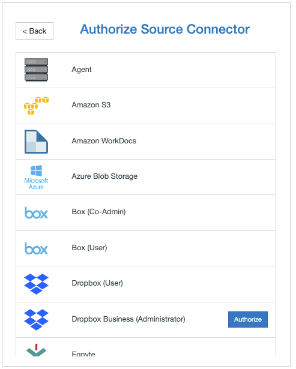

# Authorizing Dropbox Connector

## Dropbox FAQ

### What happens to my unmounted folders?

Dropbox supports a selective sync function which can cause problems when trying to transfer a shared folder that is *mounted* in a specific way in Dropbox's file system. These folders can not be transfered, but we can detect these folders upon request to help identify them.

### What about Dropbox Team folders?

For easy access, our app displays Team Folders in the root of your connector (among the users).

If you're editing the source or destination paths in our app, select the back button to find the root listing of users and team drives, and select the source/destination that you want.

If you're creating a user mapping via CSV, map your Accounting Team Folder as `/Accounting` which is different than your Accounting user `/accounting@company`.com.

### How does Dropbox manage sharing and permissions?

Dropbox restricts sharing based on files or folders already shared. For example, if you have shared a subfolder, Dropbox does not allow you to change the sharing permissions of the individual subfolders or files within that folder, nor are you allowed to modify the sharing scheme of the parent until you have unshared the subfolder.

## Authorizing Dropbox Business (Multi-User)

Authorizing **Dropbox Business** as an administrator is straightforward. To authorize or add a Multi-User Dropbox Business account as a connector, follow these steps.

>[!Important]
>You MUST be an Administrator. A non-administrator account does not work.

1. In the **Transfer Wizard**, select **Authorize New Connector**. 

 

2. In the **Connector** list, find **Dropbox**.
3. Select **Authorize**.

 

4. A new window (tab) opens. Name your Connector <optional>. 

 

5. Select **Authorize** again.

6. If you are not logged in, you can use either your Dropbox credentials or an SSO account to grant access.

 

7.  To grant our app access to your Dropbox Account, select **Allow**. 

 

## Connect your source Dropbox account

If you are not already connected after you have authorized your source, select **Dropbox**, and load the connector. An icon appears, and show you how many users you are migrating.

## Connect your destination Office 365 account

If you are not already connected after you have authorized your destination, select **Office 365**, and load the connector. An icon appears and show you how many users you are migrating.

