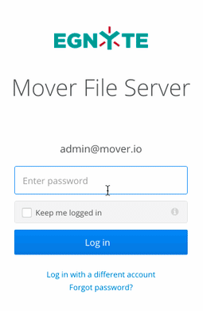

# Setting up the Egnyte source connector

## Egnyte FAQ

### What is different about Egnyte?

Unlike other cloud storage providers, Egnyte has a `Shared` folder and a `Private` folder. When migrating from Egnyte, our app defaults to the **Private** folders when autocompleting the user to user migration setup.

### How will my paths look when Egnyte is my source?

During the migration setup (described later in this guide), you can edit the path(s) to specify where in Egnyte you want the data to go. From the root level of Egnyte, you can go into `/Private` that lists the individual users and their data, or `/Shared` which is the main shared data repository.

Most cloud storage providers, Egynte, for example, start the listing with a user such as `/user@example.com/marketing data`. Egnyte does not do this, so you would be looking at a path such as `/Shared/marketing data` if it's a Shared folder, or `/Private/example/marketing data` if it's a Private folder.

## Authorizing Egnyte (Multi-User)

Authorizing **Egnyte** as an administrator is straightforward. To authorize or add a Multi-User Egnyte account as a connector, follow these steps.

>[!IMPORTANT]
>You MUST be an Administrator. A non-administrator does not work.

1. In the **Transfer Wizard**, select **Authorize New Connector**. 

2. In the **Connector** list, find **Egnyte**.
3. Select **Authorize**.

4. A new window (tab) opens. Name your Connector <optional>. 

5. Provide the Egnyte domain, for example, if your Egnyte domain is companyname.egnyte.com, enter "company name".

6. Select **Authorize**.

7. If you are not already logged in, use either your Egnyte credentials or an SSO account.

8. To grant our app access to your Egnyte Account, select **Allow Access**.

### Egnyte permission requirements

Our app requires an **Administrator** for authorization. The following table lists the scopes we require:

|**Permission**|**(Details) Allows our app to...**|
|:-----|:-----|
|Create and manage bookmarks    |Access and migrate bookmark data.|
|View and manage folder permissions|Access and create folder permission.|
|View and manage groups|View all groups under in the available Egnyte Directory.|
|View and manage users|View, edit, and manage users under the available Egnyte Directory.|
|Generate audit reports    |Generate and view reports available in the Egnyte Report Center.|
|Create and manage links|Create and manage internal links.|
|Read and write all files and folders|View, edit, copy and paste, all data from within the Egnyte-available Directories.|

## Connecting your source Egnyte account

If you aren't already connected after you have authorized your source, select **Egnyte**, and load the connector. An icon appears, and show you how many users you are migrating.

## Connecting your destination Office 365 account

If you are not already connected after you have authorized your destination, select **Office 365**, and load the connector. An icon appears and show you how many users you are migrating.

