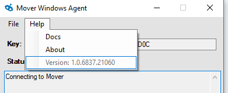
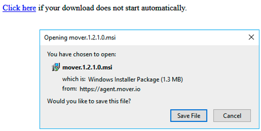
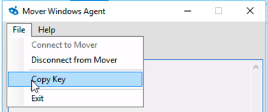
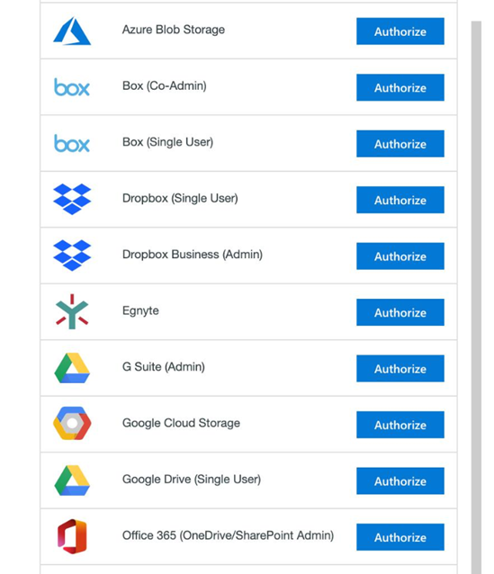

# Authorizing the File share Connector

## Agent FAQ

The Mover file share agent is written using .NET Core, and therefore is available across many platforms.

>[!Important]
>As of September 26,2020, the minimum required Agent version is 1.3.5.0.

 
**[Click here to select your operating system and download the agent.](https://aka.ms/MoverAgent)**

### Windows

The Windows Agent has two installers, one for the user-context and one for the service-context. The Windows Agent requires Microsoft .NET Framework 4.6.2 or greater.

The differences between Windows installers are as follows:

#### User-context installer

- Installs and is run as the currently logged in Windows user.
- Automatically updates.
- Has access to local drives.
- Has access to mapped network drives.
- Is not available if the user logs out of Windows, or your remote desktop session expires.

#### Service-context installer

- Installs and is run as a Windows service.
- Must be manually updated.
- Has access only to local drives.
- Is always available, even if the current user logs out, or your remote desktop session expires.

#### Command line agents

The following Agents operate using a command line interface versus a user interface.

### macOS

- Navigate to the download location, and unzip the **Mover Agent**.
- Via the terminal, browse to the now unzipped `moveragent` folder, and run `./agent`.
- Copy the key from the line that reads `[1] INFO ocess.BifrostService: Bifrost service initialized with connector key: <key>`.
- Open our app, and in the **agent authorization** box, paste the key.

>[!Note]
>The minimum system requirements are macOS 10.12.

### Linux

- Navigate to the download location, and unzip the Agent.
- Via the terminal, browse to the now unzipped `moveragent` folder and run `./agent`.
- Copy the key from the line that reads `[1] INFO ocess.BifrostService: Bifrost service initialized with connector key: <key>`.
- Open our app in your browser, and paste the key into the agent authorization box.

### Windows command line installer (beta)

- Installs and is run as a command line executable.
- Must be manually updated.
- Built from the same code base as the Linux and macOS agents.

### How does the agent view users?

The Agent works with files and folders. All users who are separated into their own folders can easily be mapped to their new location in Office 365.

A good example would be a large listing of home drives. Each home drive for a user could be transferred to their respective new user in Office 365.

### Troubleshooting the agent

#### Checking the agent version

To check which version of the Server Client you have installed, on the menu bar, select the **Help** tab.

If you are using the Mac or Linux version of our Agent, to find out the version you are using, follow these instructions: **Show Agent Version**.

#### Accessing server agent log

To access the **Agent Log**, navigate to the folder directory that you installed the desktop agent. A .log file appears that you can review, and send to our support team if an error should occur.

>[!Note]
>The agent .log file default location is `Windows\System(32/64)\config\systemprofile\AppData\Local\Mover`

#### Commands for agent (Mac and Linux only)

Our Agent supports the following commands:

- [Start the Agent](#start-the-agent)
- [Stop the Agent](#stop-the-agent)
- [Show Agent Help](#show-agent-help)
- [Show Agent Version](#show-agent-version)
- [Check Agent Status](#check-agent-status)
- [Disconnect the Agent](#disconnect-the-agent)
- [Connect the Agent](#connect-the-agent)
- [Monitor Agent Activity](#monitor-agent-activity)

#### Start the agent

To start the Agent, use:  `./agent start`.

`$ ./agent start` 
`Mover Agent Starting` 
`Mover Agent Key:`  `0000000000000000000000000000000` 
`Ctrl-C To Stop`

#### Start the agent in the background

To start the Agent in the background, use: `./agent start &`.

`$ ./agent start &[1] 8667` 
`$ Mover Agent Starting` 
`Mover Agent Key:`  `00000000000000000000000000000000` 
`Ctrl-C To Stop`

#### Stop the agent

If the Agent is running in the foreground of the terminal, to stop the Agent, press `Ctrl-C`.

`^CMover Agent Stopping`

If the Agent is running the background or in another terminal session, use:  `./agent Stop`.

`$ ./agent stop` 
`Connecting to Mover Agent` 
`Sending stop command` 
`Mover Agent Stopping` 
`Mover Agent stopped` 
`[1]+ Done ./agent start`

#### Show agent help

To get a list of commands and options, use:  `./agent -h`.

`$ ./agent -h` 
`Mover Agent 1.0.6968.0` 
`Usage: agent [options] [command]`

`Options:` 
`-? | -h | --help Show help information` 
`-v | --version Show version information`

`Commands:`

- `connect| Connect to a running instance of the Agent and issue a connect command` 
- `disconnect| Connect to a running instance of the Agent and issue a disconnect command` 
- `monitor| Connect to a running instance of the Agent and monitor agent activity` 
- `start| Start the Agent` 
- `status| Connect to a running instance of the Agent and retrieve the current status` 
- `stop| Stop the Agent`

For more info about a command, use `agent [command] --help`.

#### Show agent version

To show the Agent version, use:  `./agent -v`

`$ ./agent -v` 
`Mover Agent` 
`1.0.6968.0 (Unix 18.6.0.0)`

#### Check agent status

To check the status of the Agent, use:  `./agent status`

`$ ./agent status` 
`Connecting to Mover Agent` 
`Mover Agent Key:`  `00000000000000000000000000000000` 
`Mover Agent Status: online`

#### Disconnect the agent

To disconnect the Agent, use:  `./agent disconnect`

`$ ./agent disconnect` 
`Connecting to Mover Agent` 
`Sending disconnect command` 
`Mover Agent disconnected.`

`$ ./agent status` 
`Connecting to Mover Agent` 
`Mover Agent Key:` 
`00000000000000000000000000000000` 
`Mover Agent Status: offline`

#### Connect the agent

To connect the Agent, use:  `./agent connect`

`$ ./agent connect` 
`Connecting to Mover Agent` 
`Sending connect command` 
`Mover Agent connected.`

`$ ./agent status` 
`Connecting to Mover Agent` 
`Mover Agent Key:` 
`00000000000000000000000000000000` 
`Mover Agent Status: online`

#### Monitor agent activity

To monitor the Agent activity, use:  `./agent Monitor`. To stop monitoring Agent activity, use: `Ctrl-C`.

`$ ./agent monitor` 
`Connecting to Mover Agent` 
`Mover Agent Key:`  `00000000000000000000000000000000` 
`Connected to bifrost.mover.io on ports 8081 and 4002.` 
`Ready to transfer!Browse: /` 
`Browse: /Users` 
`Browse: /Users/mover` 
`Browse: /Users/mover/AgentTestData` 
`Browse: /Users/mover/AgentTestData/TestDocuments` 
`Upload: /Users/mover/AgentTestData/TestDocuments/TestTextDocument.txt` 
`Upload: /Users/mover/AgentTestData/TestDocuments/file.txt` 
`Upload: /Users/mover/AgentTestData/TestDocuments/picture.jpg` 
`^C`

## Authorizing the desktop and server agent

To enable swift and painless copying of data from on-premises desktop and server hard drives, we provide a very tiny agent that any Windows operating system can install.

### Compatibility

Windows XP is not supported.
All other versions of Windows require the Microsoft .NET Framework 4.6 for the Agent to function.

[Download and manually install Microsoft .NET Framework 4.6](https://www.microsoft.com/en-ca/download/details.aspx?id=48130)

### Security

The Agent may only initiate outbound communication with our own servers. All communication is via encrypted TLS and no service other than ours is allowed to work with the agent.

### Windows installation

For Mac and Linux, the Agent folder appears in your Downloads, and is run through **command line operations**.

1. Download the Agent .exe, and select **Run**.

  

2. Agree to the **Terms of Use**, and select an install destination.

3. Navigate to the installed destination, and to run the desktop Agent, select the **Mover** icon.

4. To copy the Agent Key, in the dropdown menu, select **File** and **Copy Key**.

### Authorizing the agent in our app

1. In the **Transfer Wizard**, select **Authorize New Connector**.

2. In the **Connector** list, find **Agent (Desktop or Server)**.
3. Select **Authorize**.

4. A new window opens, and you are prompted to name your **Connector** <optional>.
5. Enter your required Key that you copied from the installed agent (found via the **File** > **Copy Key** action in the Agent).
6. Select **Authorize**.

## Troubleshooting an agent connector

### What operating systems are supported by the Mover agent?

The Mover Agent supports many operating systems:

- Windows Vista
- Windows 7
- Windows 8
- Windows 8.1
- Windows 10

### Removing the Mover agent

You can stop using the Mover Agent.

To stop the Mover Agent from connecting to the Mover's servers, select **Disconnect from Mover**.

To completely uninstall the Mover Agent, use the Windows program manager.

### Agent Connection Issues

- Ensure bifrost-v2.mover.io is not blocked and it is connecting directly to port 443 on the network.
- Ensure that you have downloaded the [Auzure IP ranges and service tags](https://www.microsoft.com/download/details.aspx?id=56519)
- Ensure that no firewalls, third-party applications, plugins or even their IT department or ISP are not throttling/blocking the connection.
- The Agent also cannot connect via a proxy and must directly connect to the network.

## Connect your source agent for Windows

If you are not already connected after you have authorized your source, select **Agent for Windows**, and load the connector. An icon appears showing you the folders you are migrating.

