# How to Migrate from G Suite Drive to Microsoft 365

## Introduction

Our purpose is to act as an intermediary between various web technologies that don't play nice together. We take your files from one place and copy them to another. No downloads and nothing to watch over—our web-hosted app does all the work!

Undertaking any corporate migration is a daunting task. When moving from G Suite Drive to Microsoft 365, there are many things to consider. Our team has done this enough times to have learned a thing or two. We hope this guide helps you migrate successfully from G Suite Drive to Microsoft 365.

If you experience any issues, do not hesitate to ask us questions!

>[!Tip]
> Need help? [Open a support request here](https://support.microsoft.com/en-us/supportforbusiness/productselection?sapId=c3fa6eba-e1f0-0715-4519-94a9740c5f2c)

### File processing summary

When we transfer a file, a temporary copy is downloaded from **G Suite Drive** to a temporary server and then uploaded to Microsoft 365. Upon successful upload, that file is deleted from the temporary server. When your migration is complete, that temporary server is eliminated. Any log data expires in 90 days, and is never retained by us. We do not perform any actions beyond copying files and folders and sharing permissions. We never perform delete operations.

## Communicating with stakeholders

A migration is a significant undertaking for any organization. Trying to grasp the entire extent of all data and communicating with your employees is complicated. We sympathize!

Before, during, and after a migration, it is critical to communicate clearly and effectively with your user base. We provide timely support and communication materials to your transition team to help you communicate these changes with each stakeholder.

**Management** — Management needs succinct info about the how's and why's of the migration, such as costs, benefits, and expectations. You must paint a clear picture about what a successful migration should look like. Granular info is important when running a department.

For example, the Sales Manager must know how operations will be affected, such as *Can employees still work over the weekend, if needed?*

**Users** — These are your bread-and-butter employees. They need to know when changes are taking place and who to go to with questions or issues.

Key questions to address:

- Why are we migrating our data?
- How does it impact me?
- What are the benefits?
- How disruptive is this change going to be?
- What are the differences between G Suite Drive and Microsoft 365, and how do I reconcile them?

**Third parties** — If people outside your organization have access to collaborate on documents, this could potentially be interrupted and require resharing of data. We describe best practices for this event in our guide.

**IT Helpdesk/Support staff** — If your organization is large enough to have specific support staff for other employees, they will need to understand each step of the migration.

## Planning

Planning is the most difficult part of a migration. It is also one of the most critical phases to get correct. To have a smooth and stress-free migration, you must gather relevant organizational info, determine project timelines, and mitigate any surprises that may appear.

### Gathering info

Before migration, it is important to gather all the info you need to run the migration smoothly. Make sure you have confirmed the info from the following checklist.

**Migration info checklist**

- Number of users to migrate
- Data ownership
- Data distribution
- Amount of data to move
- Number of files to move
- Individual file sizes and/or file sizes on average
- Who is your migration team?
- Who is your designated contact with us?
- Who is our point of contact with you?

### Scanning

To help with your planning, we offer a scanning feature. Our scan identifies how many users own data and how much there is to move.

This scan is effectively a simulated dry-run migration, with no set destination, which helps to identify any problematic files/folders before you begin migrating data.

>[!Note]
>The scan is available in our **Migration Manager** after you have first set up a migration.

Read through this guide to better understand the full migration process, or skip ahead to **Setting Up the Migration**. For detailed instructions about how to run the scan, see **Scanning.**

### Number of users to migrate

Each *user* is defined by a unique source and destination pairing.

For example:

- user01@example.com => user02@example.com
- user01@example.com => user03@example.com

These would be considered two separate *user licenses* because they have different destinations.

We also apply the term *user* to separate internal or external drives migrating to a single destination account.

For example:

- /C:\/Archive => user01@example.com
- /D:\/Sales => user01@example.com

These qualify as two separate *user licenses* because there are two separate sources going to the same destination.

Migrations are run on a per-user basis. Because of our app's scalable infrastructure, it is feasible to run dozens of users or thousands simultaneously. Any number of users can be migrated in whatever pre-defined order or grouping you desire.

**Collaborators-only**: Your fiscal budget need only include users that own data in G Suite Drive. Anyone that strictly engages as a collaborator in G Suite Drive (for example, they only share other users' content), do not have any data copied, and therefore do not incur a fee.

**Setting permissions is free**: Users that strictly collaborate in G Suite Drive receive equivalent sharing permissions in Microsoft 365 for free.

## Data distribution

Determining the distribution of data across the user base is an extremely important component of a migration because we copy data in a highly parallel manner, and our servers transfer data as fast as each cloud storage provider can handle. Both G Suite Drive and Microsoft 365 have rate limits for how fast data can be downloaded and uploaded.

The more users simultaneously being transfered, the higher our throughput for your migration. **We highly recommend that users with very large data sets be broken into smaller accounts to facilitate faster transfers.**

>[!Note]
>To maximize throughput, users should not own  greater than 5TB of data. The more users you have and the smaller the amounts of data they own, the faster your migration proceeds.

For example:

- If one user owns 10 TB of data, we recommend dividing that between 10 users so that each one owns 1 TB.

If data cannot be broken up, this should not hinder other users from migrating. As a general rule, users with a lot of data require a lot of time to migrate.

### Amount of data to move

Knowing the total volume of data you are moving helps to create a more realistic timeline for your migration.

### Your migration team

Establish a migration team to lead your organization through the project. The team's role includes liaising with us, undergoing training, and notifying employees of each change during the migration process.

An IT Manager or the Head of IT is a good choice for our point of contact because they understand the ins and outs of your organization's systems. To ensure a smooth, successful migration, we work closely together and be with you every step of the way.

## Timelines

### Be realistic

The amount of time required to plan, execute, and wrap up a migration depends on many factors. Organizational requirements, budget, security reviews, and support from management are just a few.

We typically see corporate transfers take a minimum of 30 days to plan and execute. Ensure you allot yourself enough time for each stage, which we cover later on in this guide.

### Evaluate your user base

It is critical that you plan which users are migrating and when. Ask yourself questions like these:

- *Is the entire organization migrating, or just a few users?*
- *Is everyone migrating at once, or are you splitting them into batches like department, office, or region? If so, why?*

>[!Note]
>Batching migrations this way increases complication, and may extend your migration.

We recommend migrating during a slower organizational period, such as the weekend, to avoid work interruptions.

### Keep your accounts active

When migrating from G Suite Drive to Microsoft 365, you need to ensure all your users are active and accessible. Knowing exactly when your G Suite Drive may shut down or expire is key to safely planning enough time to migrate.

### Consider migration speed factors

We're the fastest way to migrate your data, but the speed of your migration may still be affected by bottlenecks. Speed bottlenecks include, but aren't limited to, the following:

- Number of files and folders being moved
  - This is objectively the biggest speed limit on the Internet, as it determines the total number of operations required. Most providers rate limit their ingress to one file per second per user. This isn't universally true, but it's a baseline conservative metric you can use when estimating.
  - Our observable average across our customers is a 2.4 MB average file size.
  - Knowing file size is necessary to estimate transfer speed. If you are not able to determine exact numbers, most services can provide reports that illustrate individual or average file size.
- Total amount of data being moved.
  - Total data can affect speed, but it is ultimately overshadowed by the number of files.
- Server connections with the source or destination **Connector**.
- Complexity of permissions or sharing schemes, if applicable.

What may be surprising is how large of an impact factors other than the size of the data you are moving can have.

For example, it is common for there to be half a second of overhead per file being moved. If you are moving 200,000 files, this would be 200,000 seconds or more than two days' worth of overhead alone!

Suffice to say, we cannot give you exact estimates on time because there are too many factors at play at any given point. By the time you have read this section we could have easily copied several files totalling many GB or a few hundred files equaling a small amount of data.

We are available to have a conversation with you about estimates.

### Notify stakeholders about the migration

Your employees have different needs with respect to their data, and it is paramount to know what those are. Take a shopping list of all departments, contact their managers, and identify key concerns in their processes and apps.

Keep in mind that while cloud storage is sometimes just a container for files, people might also be using it with third-party apps or for more advanced collaboration.

#### Example emails to send

**Subject**: ATTENTION: Decision to Migrate from G Suite Drive to Microsoft 365

**Message**: A few months ago, management decided we will leaving G Suite Drive and transitioning to Microsoft 365. In Microsoft 365, all employees will have access to cloud storage and its included apps.

We will manage the migration to ensure all of our data gets transfered securely and efficiently. Let me know if you have any questions or concerns about the process.
 

**Subject**: ATTENTION: Important Info Regarding Cloud Data Migration

**Message**: As you know from prior emails, we are moving from G Suite Drive to Microsoft 365 as our cloud storage provider.

To assist in this migration, we ask all employees to finish working and upload any last changes to files in G Suite Drive by 17:00 PT on Friday, April 7, 2020. Changes to files or data in G Suite Drive after this time will not be moved.

On Monday, April 10, 2020, all employees will be using Microsoft 365.

Questions and concerns can be directed to your immediate manager and/or our technical support staff via the usual channels.

## Connectors

### What is a connector?

A **Connector** is what we call our link to your cloud storage accounts.

To set up a transfer, you must grant us access to your cloud storage accounts. Without this link, we are unable to communicate with them.

Creating a **Connector** may involve authenticating via OAuth or with normal username/password credentials. You only need to authenticate once per account.

Our authorization is lost when you delete the **Connector**, delete your account with us, or revoke our access through your cloud service's security settings.

### Which connector to use for each Microsoft service

|**Microsoft service**|**Which Mover connector to use**|
|:-----|:-----|
|Azure Blob Storage|Azure Blob Storage Connector|
|OneDrive Consumer|    OneDrive Consumer Connector|
|OneDrive (Administrator)|    Microsoft 365 Connector|
|OneDrive (User)|    OneDrive (User) Connector|
|SharePoint|Microsoft 365 Connector|

## Deleting connectors

Deleting a **Connector** revokes our access to your cloud storage accounts. To confirm that we have been deauthorized, visit the security settings in your respective cloud service and check for our app.

Using our app to remove our authorization with a particular cloud service is simple:

1. From the **Transfer Wizard**, and for the **Connector** type you want to deletes, select **Manage ▼**.
2. To the right of **Connect**, select arrow ▼.
3. Select **Delete**.
4. Confirm you want to delete, and you're done!

>[!Note]
>Deleting a **Connector** is permanent and cannot be reversed. The **Connector** type disappears from the **Transfer Wizard**. To add a new **Connector**, select **Authorize New Connector**.

### Reauthorizing connectors

Reauthorizing a **Connector** is sometimes necessary if we lose authorization or access to your cloud storage accounts or web servers. It is also a good first step in trying to resolve most issues with your **Connectors**.

The process to authorize a Connector again is very simple:

1. Find the **Connector** type you want to reauthorize.
2. Select **Manage ▼**.
3. For other **Connector** options, next to **Connect**, select ▼.
4. Select **Reauthorize**.
5. Follow the same steps you performed when you first created the **Connector** to renew the authorization tokens/permissions.

>[!Note]
>You are unable to change the display name of the **Connector**. If you want to rename it, you must delete and re-add the **Connector**.

**Connectors** are deauthorized automatically if they haven't transfered any data in the last 90 days. If you try to load a deauthorized **Connector** in the **Transfer Wizard**, an error message appears, along with a prompt to reauthorize the **Connector**.

## Migration FAQ

### What gets transfered?

Only owned folders and the root files for each user are copied. If a user is not the owner of data they can access, we do not copy it. Content may be automatically re-shared once it is migrated so that each user has access to their content exactly as before.

### Does Mover sync files?

Our app offers a source-to-destination delta—when you run a transfer, we compare the destination directory to the source, and only transfer new or modified files over. We call this our incremental feature.

We compare the timestamps of the files in both the source and destination and transfer the newest versions only. The incremental feature is always on.

Here are a few examples of how we deal with changes to files and folders.

**Content changes**: If a document is edited in your source or you have added a few new files, we copy them to your destination on the next incremental run, overwriting the previously existing file(s) in the destination.

**Name changes**: If the name of a file or folder changes in G Suite Drive, we treat it as a brand new object. This can lead to duplicate files being migrated to Microsoft 365, or worse: entire folders worth of data being duplicated from the changed folder downwards.

**Example**: Changing the path `/Sales/Clients` to `/Global Sales/Clients` results in two copies of your `Sales` folder after the `Global Sales` folder is also copied during an incremental pass.

### Does Mover delete files?

We never delete your data from any source. Our app simply takes your data from one place and copies it to another—akin to *copy and paste* rather than *cut and paste.* We also don't retain any of your cloud storage data for any reasons.

We strive to keep your users' experience as similar as possible between G Suite Drive and Microsoft 365.

### How are permissions affected?

When moving from G Suite Drive to Microsoft 365, user roles *on folders* change.

During a migration, we do not explicitly set a user as an owner of data.

In Microsoft 365, ownership of files and folders is always implicitly set by virtue of copying data into a user.

#### Translating permissions

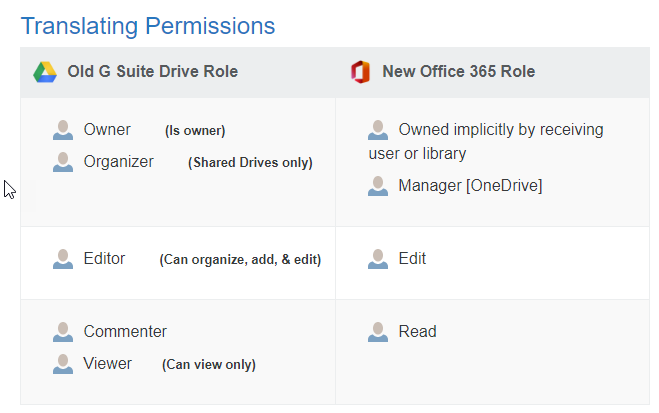

>[!Note]
>Our app only sets permissions on folders.

### Can I rearrange content during a migration?

Not recommended. Any major changes in directory structure should happen before or after your migration. It is also not a good idea to use our app to rearrange content.

The risks that come with rearranging content during the migration are primarily in the form of data duplication; our incremental process sees all changes as new data. So, for example, if you change a folder name at the root, we detect that as a new folder, and all of the contents is re-transfered, including all subfolders.

When sharing permissions are transfered, both owners and collaborators receive duplicate data if content has been rearranged or renamed.

### What happens to external sharing links?

Our app does not recreate external sharing links. After migration, these have to be set in the destination manually.

### What about external collaborators?

We do not share content with external collaborators. This policy is in place to protect your organization, and industry best practice is to never automatically share sensitive internal data with external users.

### Does Mover preserve file versions?

We do not preserve file versions. During a migration, only the most recent version of a file are transfered from G Suite Drive to Microsoft 365.

### Does Mover notify users?

We automatically suppress all emails to users so they are not bombarded with excessive notifications about the data they now have access to.

## Account FAQ

### How do I reset my password?

**From the sign in screen**

To change your account password from the login screen, follow these steps.

1. Select **Forgot password**.
2. On the next screen, enter your account email, and select **Reset Password**.
3. Follow the steps we send to your account email and you're done!

**From your account panel**

If you are already logged in to our app, you can change your password there too.

1. When logged in, select account email in the top right corner of our app to visit your **Account** settings (**shortcut**).
2. From the left-hand menu, select **Password**.
3. Select **Reset Password**.
4. Follow the steps we send to your account email and you're done!

### How do I enable multi-factor authentication?

To enable multi-factor authentication, follow these steps.

1. Log in to our app, and select your account email in the top right corner of our app to visit your **Account** settings (**shortcut**).
2. From the left-hand menu, select **Password**.
3. Under **Enable 2-Step Verification**, select **TURN ON**.

>[!Note]
>You are automatically signed out of your account.

4. Log in to your email, and copy the verification code sent to you. If a verification code email does not appear in your inbox [or spam], just below the verification window in our app sign-in, select **Didn't get the code? Resend now**.

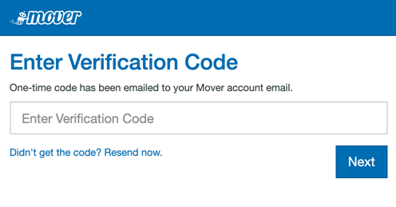

5. Enter the **Verification Code**. You now have 2-Step verification enabled.

6. To turn off 2-Step verification, return to the **Password** tab, and under Enable 2-Step Verification, select **TURN OFF**.

### How do I delete my account?

Deleting your account deletes all your scheduled transfers, multi-user migrations, and authorized connectors.

To close your account, follow these steps.

1. When logged in, in the top right corner of our app, select **account email** to visit your **Account** settings (**shortcut**).
2. On the left hand side, select **Leave Mover**.
3. Read all of the text on that page.
4. If you are ready, enter your current password, and select **Delete Account**.
5. A prompt appears. Select **OK**.

To reiterate:

**Deleting your account:**

- Deletes all scheduled transfers.
- Deletes all connector authorizations.
- Deletes any subscriptions associated with your account.
- Deletes your Mover account.

**This does not:**

- Delete your transfer history. We retain these for security and compliance.
- Remove any trace that your account once existed with Mover.

>[!Important]
>Deleting your account is **not** reversible.

### How do I edit my email notifications?

By default, you receive an email every time a transfer is completed. To edit your email notification settings:

1. To visit the account settings, in the top right of our app, select your email address.
2. Select **Preferences**.
3. You have the option to receive emails **On Completion** (default), **Never**, or **Only on Errors**.

### Can I change my account email?

Unfortunately at this time, we do not allow you to change the email associated with your account.

You may, however, delete your account — losing the schedules, connector authorizations, and transfer history associated with it — and create a new account with the email you would prefer.

### How do I check my transfer usage?

Checking your usage of our app lets you know the total amount of gigabytes you have transfered over the history of your account.

To check your transfer data usage, follow these steps.

1. When logged in, in the top right corner of our app, select **account email** to visit your **Account** settings.
2. By default, you are already in the **Plan** section.

## G Suite FAQ

### How is G Suite Drive different?

In Drive, content may exist in multiple locations based on how each user prefers to organize their files. This sharing paradigm in G Suite Drive differs from most other providers.

When a folder is shared to another user, it appears in their **Shared with Me** section. From there, it can be added to the user's **My Drive**, and then placed in any folder of their choosing, including other shared folders.

### G Suite Shared Drives

For easy access, our app displays **Shared Drives** (previously **Team Drives**) in the root of your connector (among the users).

If you're editing the source or destination paths in our app, simply select the back button to find the root listing of users and Shared Drives, and select the source/destination that you would like.

If you're creating a user mapping via CSV, you would map your Accounting Shared Drive as /Accounting, which is different than your Accounting user /accounting@company.com.

### G Suite Shared Drives permissions

Our app is not able to read or write permissions to Google Shared Drives. Shared Drives do not allow explicit folder level permissions. Rather, Shared Drive permissions are set based on the Shared Drive members.

### What's the difference between file versions and revision history?

Revision history for Google Docs, Sheets, and Slides is different than file versions in Google Drive. Revision history refers to the ability to see earlier versions of a file, and view who made specific edits to the document. During the migration, revision history is not transfered. Only the most recent version of a file is transfered.

### What isn't transfered

#### What happens to Google Drawings, Forms, Sites, and Maps?

Google does not allow us to export Drawings, Forms, Sites, and Maps from Drive. These are not transfered.

#### What about Docs, Slides, and Sheets?

Google's proprietary formats are not compatible with anything other than G Suite Drive. When migrating from G Suite, our app converts to the Microsoft Office format from Google's format.

Any Google format that is larger than 10 MB when it is converted fails. This is a limitation Google has placed on their infrastructure. For more info, see https://developers.google.com/drive/api/v3/reference/files/export.

>[!Note]
>The only way to migrate/download a Google format file is to request that they [Google] convert it. Mover does not control the conversion process, and the forced limitations are strictly on Google's end.

#### Files marked as restricted

G Suite Drive enables owners to disable the ability for users to copy, download, or print a file on a per-file basis. This feature must be disabled on each file for which it has been enabled, in order for a migration to function properly, or you receive an error stating:

`Permissions issue: File marked as restricted or not copyable`

To disable this feature, see the **Sharing** settings for a file, and select **Advanced**. Check the checkbox for the owner of the file to **Disable options to download, print, and copy for commenters and viewers.**

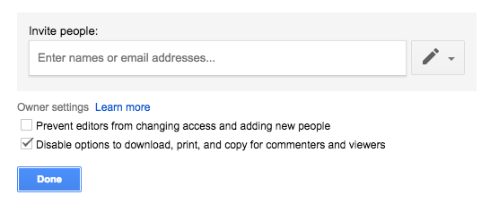

## Required pre-scan of G Suite Drive

Permissions and ownership of data in a G Suite Drive source can be complicated. To retain a similar directory structure and sharing scheme in the destination, our app must make some decisions on who owns what and where that data is best located.

*G Suite Drive allows files and folders to exist in different places for different users.*

When a folder is shared out to another user, it appears in their **/Shared with me** section. From there, it can be added to the user's /My Drive and then placed in any folder of their choosing, including their own folders, or other shared folders.

Microsoft 365 does not support this same nesting of shared data, which is why we've developed a solution.

##### Examples

See the following two examples for how users might create conflicting folder structures.

**Example 1**:
1. Mark shares a folder with Eric.
2. Eric views **Shared with me**, and selects **Add to My Drive** on this new shared folder.
3. In **My Drive**, Eric drags this new folder to a different folder.
4. There are now two conflicting subfolders that our app must make a decision on.

**Example 2**:
Any file or folder in a user's My Drive may be arbitrarily added to a new location. These files or folders will be viewable in multiple places. The *correct* location is now unclear.

#### The solution

In order to ensure your users still have access to all their important files, our app automatically makes an intelligent decision on which folder becomes the source of truth when multiple users have conflicting views.

Before your migration, our app can perform a pre-scan of all your source G Suite users. Users are ordered by priority, typically with administrators and department heads at the top. This determines the order of conflict resolution, with higher priority users winning over lower priority users.

The pre-scan process is fairly complicated; however, there are some basic rules:

1. When a folder in the root of a user's /My Drive conflicts with a folder in another user's /My Drive/subfolder, the subfolder always will win. Root folders never take priority over a subfolder during a conflict.
2. If a folder, which exists as a subfolder, is in different locations for different users, our app transfers ownership of the entire folder and all of its contents to the higher priority user, and shares it again with the user that lost the conflict.

Here is a visual guide to the pre-scan decision process:

### Before and after

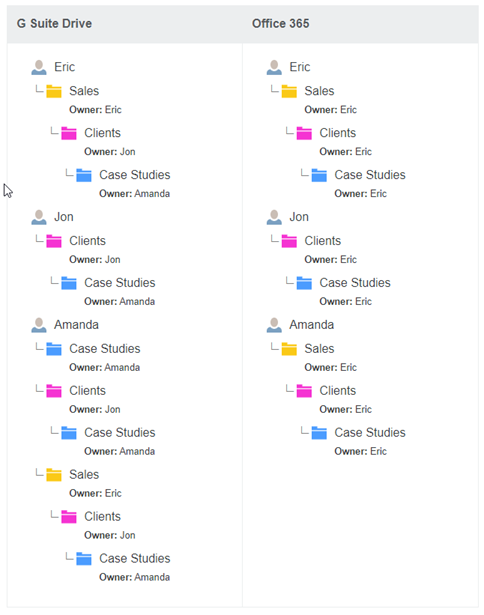

### Security concerns

Because of the nature of G Suite Drive's sharing model, it can open up some security concerns when migrating to Microsoft 365. The problem stems from the idea of negatively setting permissions, for example, sharing a parent folder, then removing permissions from some subfolders. All Microsoft 365 destination subfolders inherit their parent permissions, which could have unintended consequences when performing a migration.

In the previous scenario, our app would reapply collaborator permissions to the /Human Resources folder, and all subfolders inside it would inherit those permissions.

### Requirements

To perform a Google pre-scan, our engineers require the following:

- A fully set up migration in our app, with transfers created for all users you want to migrate
- A full list of all of your users in order of priority:
  - Single column list of all account emails on your source Google domain (.csv/.xlsx).
  - Includes all users you are migrating, even if they are non-priority.
  - Highest priority at the top, lowest priority at the bottom, for example:
    `ceo@email.com`
    `manager@email.com`
    `employee@email.com`

- The migration ID
  - To get the migration ID:
    - Find and select **Migration Actions**.
    - Select **Customize Columns**, and select **Migration ID**.
    - You'll now be able to see the migration ID appearing in each row. If you refresh the page, this info disappears unless you select **Save Column State**.

>[!Important]
>The Google pre-scan must be run before the (counting) scan, otherwise the file counts will not be accurate. A Google pre-scan request could take up to one business day to be fielded, so provide all of the aforementioned info with at least 24 hours notice.

## Microsoft 365 FAQ

### Will there be unsupported files and characters?

We automatically process file and folder names to ensure they are accepted by Microsoft 365.

- Files larger than `15 GB` are not migrated.
- Files with a size of `0 bytes` (zero-byte files) are not migrated.
- The following characters in file or folder names are removed:
`" * : < > ? / \ |`
- Leading tildes (`~`) are removed.
- Leading or trailing whitespace is removed.
- Leading or trailing periods (`.`) are removed.
- For all invalid file or folder names and other Microsoft 365 limitations, see **here**.

In some possible circumstances with older sites, any file or folder ending in `_files` could fail. If you experience these errors, contact Support.

Microsoft currently has no file type limitations, meaning you can upload data with any file extension. For more info, see **here**.

#### Character limits for files and folders

Filenames may be up to 256 characters.
Folder names may have up to 250 characters.
Total path length for folder and filename combinations may be up to 400 characters. For more info, see **below**.

### What happens to long paths?

During a pre-scan, our app automatically detects and reports paths that are too long for OneDrive or SharePoint to accept. The current path length limit for Microsoft 365 is 400 characters. The path length is calculated when going in to Microsoft 365 and includes your tenant URL, user site, path, and any character encoding.

**Example**:

This path is 93 characters long despite "Documents/Old Docs" being only 18 characters.
https://example-my.sharepoint.com /personal /example_user /%2FDocuments%2FOld%20Docs
If a file exists that has a very long path, our app skips it, and reports it in your log files.

To save time and headaches, before you migrate, you are encouraged to shorten any identified long paths.

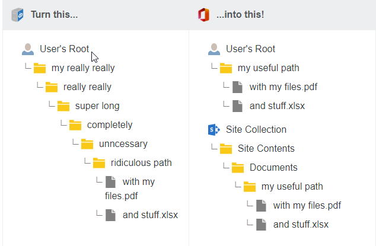

### Are timestamps preserved?

The original timestamps from G Suite Drive are preserved when migrating into Microsoft 365.

>[!Note]
>Timestamps are only applied to files/data transfered and not folders. Folders and Folder structure are created in the destination during migration, and reflect the date of the migration.

### Is file authorship preserved?

When migrating from G Suite Drive into Microsoft 365, the *modified by* author is preserved; however, the *created by* is changed to the user.

### Does the Mover app interact with the sync client in OneDrive for Business?

We do not interact with the sync client in OneDrive for Business. We recommend disabling it prior to a migration. If you use it during a migration, it tries to sync all the migrating data.

### What happens to shared data?

Data shared with a user by another user appears in the **Shared with me** folder. Data owned by a user appears in the user's designated destination folder.

### What about notifications?

The Mover app silences notifications during the migration to prevent users from being spammed.

### What happens to data shared to Microsoft 365 Groups?

Data shared to a Microsoft 365 Group does not appear in the **Shared with me** section. Microsoft also does not notify users that they are now a member of a Microsoft 365 Group.

>[!Note]
>This is a limitation of Microsoft 365 Groups and cannot be changed on our end. The user must navigate to the appropriate group within either their Outlook Desktop Client, or by logging into their prefered email through **outlook.office.com**.

After the user has logged in:

1. Navigate to the left hand menu.
2. Scroll down the folder listings to **Groups**.
  a. If the available groups are not visible, to open the group directory, select the small arrow beside the **Groups** listing.
3. Select the desired group.
From here, the left-hand menu should change, enabling you to open and edit **Files/Notes** within the selected Microsoft 365 Group.

### What SharePoint site formats are supported?

Both Modern and Classic sites are supported, and appear the same in our app.

### What will my file paths look like in SharePoint?

During the migration setup (described later in this guide), you can edit the path(s) to specify where in SharePoint you would like your data to go. From the root level of SharePoint, you can go into **Site Collections**, and inside each **Site Collection**, directories for **Site Contents** and **Subsites** appear.

**Site Contents** takes you to document libraries (for example, the **Documents** section), whereas **Subsites** takes you to the **Subsites** of that site collection. Navigating **Subsites** takes you through the same dichotomy.

Most cloud storage providers, G Suite Drive for example, start the listing with a user, such as `/user@example.com/Marketing Folder`. SharePoint does not do this, so you would be looking at a path such as `/Marketing/Site Contents/Documents`.

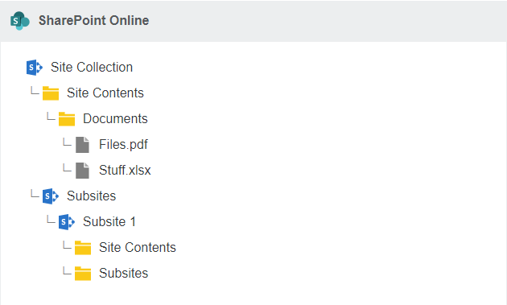

### How does library permissions inheritance affect migration?

To set specific permissions on folders in a document library, inheritance must be disabled. Permissions inheritance is typically turned on by default, which makes all the data within the library subject to the permissions set on the library. This is similar behavior to team folders or team drives in other cloud services, whereby if users have access to the root level, they have access to everything contained within.

If inheritance is not disabled at the root, any permissions we try to set on individual folders are overridden by the library access permissions.

**To disable inheritance:**

In the Library settings, visit **Permissions for this document library**:

1. Select **Stop Inheriting Permissions**. This enables you to select the permissions you would like to remove:
   - Site members
   - Site visitors
2. Select **Remove User Permissions**.

This prevents site members/visitors from inheriting permissions to all the data that we migrate into that library, allowing permissions to only those site members who we explicitly write to the folders themselves.

For more info about SharePoint permissions inheritance, see **here**.

### Does Mover support Microsoft Teams?

Microsoft Teams appears and operates the same as a SharePoint site.

### What is the item limit for SharePoint?

Many sites claim that SharePoint has a 5,000-item limit. This is not true. The SharePoint 5,000-item limit applies to how many items appear in a search list view: a maximum of 5,000.

SharePoint sites do have file size and number limits, which are covered in detail here: **SharePoint limits**.

Some list view options may prevent search list views with more than 5,000 items from appearing.

## Setting up the migration

### Authorizing G Suite Drive (Administrator)

To authorize or add a **G Suite Drive** account as a **Connector**, follow these simple steps:

>[!Important]
>You must be a G Suite Administrator.

1. From your **Google Apps** dashboard, select our app's grid logo, and then select **Admin**.
2. Select **Apps**, and then select **Marketplace Apps**.
3. Near the top right, to add a new app, select **+**, and search for **Mover**.
>[!Important]
>When our app opens in a new tab/window, to verify that you are viewing the Marketplace using your admin Google account, at the top right, select the **account** icon.
4. Select **Domain Install**, and then select **Continue**.
5. Select the checkbox stating you agree to the **Terms of Use**, and then select **Accept**.
6. Select **Next**. To close the overlay window, select **Done**.
You should see our app installed amongst any other third-party apps you have. If it does not appear, simply refresh the page.

We now have access to your users and their data, so we can move on to **Connector** authorization.

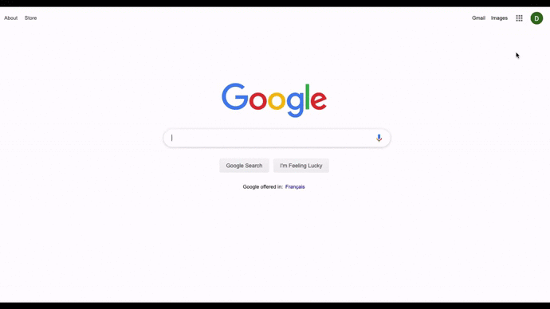

7. After install, select **our app**, and ensure that you grant Data Access. This is an extra security step required by G Suite.

8. In the **Transfer Wizard**, select **Authorize New Connector**.

9. In the **Connector** list, find **G Suite (Administrator)**.
10. Select **Authorize**.
11. A new window (tab) opens. Name your Connector <optional>.

12. Select **Authorize** again.
13. If you are not logged in, to sign in, use your Google credentials.

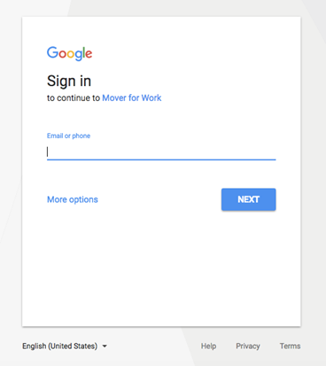

14. To grant our app access to your G Suite (Administrator) Account, select **Allow**.

### Troubleshooting a G Suite (Administrator) connector

#### App permissions

For us to be able to view and transfer data to and from G Suite Drive, you must have our app installed as per the instructions in **Connector Creation**. In some cases, you may have our app installed, but disabled. If you are having problems connecting, you should ensure our marketplace app is enabled for all users. To access your third-party app settings in **Google Apps**, follow the same steps.

#### Google Drive permission requirements

Our app requires a Global Admin for authorization. The following table provides a detailed list of the scopes we require.

|**Permission**|**(Details) Allows our app to...**|
|:-----|:-----|
|See, edit, create, and delete all of your Google Drive files    |Permission to edit, create, overwrite, and organize data in your Google Drive.|
|View usage reports for your G Suite domain    |Grant permission to view reports about how users are using Google Apps within your G Suite domain.|
|View domains related to your customers    |View domain aliases and multi-domains (secondary domains) for your customers.|
|View and manage the provisioning of groups on your domain    |Provision and modify groups on your domain, as well as view and modify details and metadata of groups on your domain.|
|View users on your domain    |View basic details and metadata of users on your domain.|

### Authorizing Microsoft 365

>[!Warning]
>To fully authorize the **Microsoft 365 Connector**, a Global Admin is required to grant permissions to the Microsoft 365 Mover app within the Azure portal.
>
>The Global Admin must grant these permissions *after* the **Microsoft 365 Connector** is authorized within the main Mover app.

The following instructions show you how to complete the authorization steps in the right order.

Some steps in the authorization process can be completed by a Global Admin or an SPO Admin. At the beginning of each step, we indicate who can complete it.

1. **Global Admin or SPO Admin**: Log in to the main Mover app via **app.mover.io**. In the **Transfer Wizard**, select **Authorize New Connector**.

>[!Note]
>Whether the **Microsoft 365 Connector** is your source or destination connector (or both), you'll need to go through this authorization process.

2. **Global Admin or SPO Admin**: In the **Connector** list, find **Microsoft 365**. Select **Authorize**.

3. **Global Admin or SPO Admin**: A window with an **Authorize** button appears. It prompts you to provide a display name <optional> for your **Microsoft 365 Connector**.  Select **Authorize**.

4. **Global Admin or SPO Admin**: Follow the on-screen instructions. You are redirected to a Microsoft login screen where you can log in with your Microsoft admin privileges and continue to authorize the connector.

>[!Warning]
>If you are a **Global Admin**, a slightly different login screen will display.  
>
>**DO NOT** select the option **Consent on behalf of your organization**. This option **must** remain unselected.

- 

5. **Global Admin or SPO Admin**: After authorizing the connector, you are redirected to the **Mover Transfer Wizard**, and an error appears, like the following. This means it is now time for a Global Admin in your tenant to grant permissions to the Microsoft 365 Mover app in the Azure portal.

If you're an **SPO Admin**: To grant permissions and finish the authorization process (Steps 6–9), point your Global Admin to **aka.ms/office365moverauth**.

If you're a **Global Admin**: Continue with Steps 6–9.

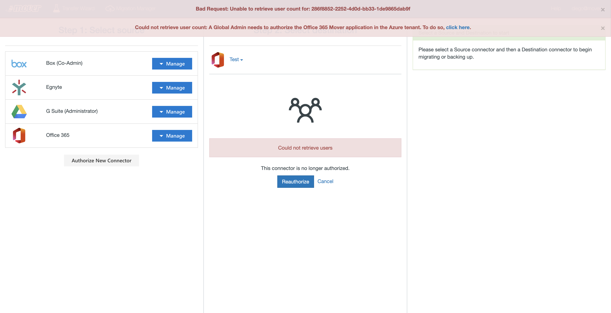

6. **Global Admin**: Log into the Azure Portal via **aka.ms/office365moverauth**. You'll see a list of **Enterprise applications**.

7. **Global Admin**: Find and select the Microsoft 365 Mover app. A page appears that provides an overview of our app.

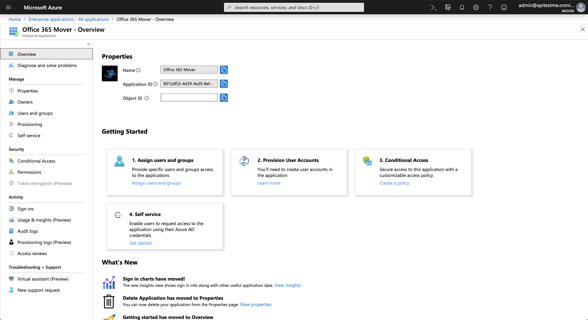

8. **Global Admin**: In the left menu, find and open **Permissions**. Select **Grant admin consent for Mover**.

9. **Global Admin**: A pop-up window appears that guides you through the rest of the permissions process. When complete, it closes automatically, and your **Microsoft 365 Connector** is fully authorized and ready to go.

### Troubleshooting a Microsoft 365 connector

#### App access error

If you encounter an error on authorization, try signing out of any Microsoft accounts, and attempt to authorize the **Connector** in an Incognito Window.

#### Global Admin account provisioning

Your Global Admin user must have a Microsoft 365 account provisioned in order to administer other Microsoft 365 accounts. If you create a service account for our app, ensure you also assigned a Microsoft 365 license, and walked through the Microsoft 365 setup process.

#### User provisioning

Are your Microsoft 365 users provisioned? All Microsoft 365 users must log in to their Microsoft 365, and open Microsoft 365 for us to transfer into their accounts. You can also provision Microsoft 365 accounts via Windows PowerShell using the following commands (replace your URL and email appropriately):

`Connect-SPOService -Url https://example-admin.sharepoint.com -credential user@example.com`

`Request-SPOPersonalSite -UserEmails "neverloggedintest@example.onmicrosoft.com"`

#### Microsoft 365 permission requirements

Our app requires a Global Admin for authorization. The following table lists the scopes we require:

|**Permission**|**(Details) Allows out app to...**|
|:-----|:-----|
|Create, edit, and delete items and lists in all your site collections|Create or delete document libraries and lists in all site collections on your behalf.|
|View your basic profile|See your basic profile (name, picture, user name).|
|Maintain access to data you have given it access to|See and update the data you gave it access to, even when you are not currently using our app. This does not give our app any additional permissions.|

### Connecting your source G Suite Drive account

If you are not already connected after you have authorized your source, select **G Suite Drive**, and load the connector. An icon appears, and shows you how many users you are migrating.

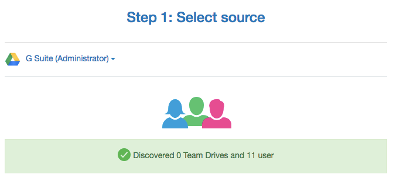

### Connecting your destination Microsoft 365 account

If you are not already connected after you have authorized your destination, select **Microsoft 365**, and load the connector. An icon appears and show you how many users you are migrating.

#### Creating a new migration

Select **Continue Migration Setup**, and our app moves to the **Migration Manager**.

The next step is to create a user list of those transfering.

From your newly created migration in the **Migration Manager**, there are two ways to add users:

- Select **Add Users**.

- Or, select **Migration Actions**, then select **Add to Migration**.

Select one of two options:

1. Auto Discover Users.
  - Select **Automatically Discover and Add Users**, and our app automatically finds your users and attempts to match them up.

2. Upload Migration CSV File.
  - Either drag a file into the designated space, or select **Choose a file to upload**, and add a customized CSV file for your migration.

>[!Note]
>You still get to finalize your migration before any data moves!

#### Creating a new migration from a CSV (optional)

Sometimes you have thousands of users and a complicated directory schema that you want to import. In these cases, it's desirable to plan out your migration in a spreadsheet.

In these cases, we trust the CSV upload option is useful. This allows you to lay out all your users and directories, and then provide it to us in a .csv format for us to create your migration.

##### Users to migrate

Your CSV file must follow this format:

A heading for the source and destination, followed by the paths, and optional tags on each line.

`Source Path,Destination Path,Tags` 
`user1@example.com,user__1@corp.example.com,"Pilot, IT"` 
`user2@example.com,user__2@corp.example.com,"Pilot, Sales"` 
`user3@example.com/src dir,user3@example.com/migrated,"Pilot, IT"` 
`Source Shared Drive,user4@example.com/Team Folder,"Pilot, Sales"` 
`https://TENANT02.sharepoint.com/sites/SiteName/Shared%20Documents,user5@example.com,"Marketing, Sales"` 

>[!Note]
>Ensure your CSV has no spaces after each comma-separated value. Values that require commas must be wrapped in quotation marks.

Download an example CSV:

**Example_CSV_Map.csv**

>[!Note]
>When URL mapping to SharePoint, you must remove everything after /Shared%20Documents; otherwise,the URL fails.

For example, this full URL won't work:
`https://TENANT01.sharepoint.com/sites/SiteName/Shared%20Documents/Forms/AllItems.aspx`

Change it to:
`https://TENANT01.sharepoint.com/sites/SiteName/Shared%20Documents`

#### Creating your CSV in Excel

To use an Excel spreadsheet to create your CSV:

1. Ensure you have two columns, one titled `Source Path`, and one `Destination Path`.
2. List the relative paths, domains, and usernames on the subsequent rows.
3. Export your spreadsheet as a CSV:
  a. Select **File**.
  b. Select **Save As**.
  c. From the **File Format** options, select **CSV**.

#### Reviewing your users

##### Checking paths

Confirm that the users in the G Suite Drive source match the users in the Microsoft 365 destination. Usually the emails/usernames match up, but it depends how you structure and name your users. *Be diligent during this step!*

#### Editing

Be aware that Users can only be edited if they haven't been scanned, or had a transfer run.

To edit a user source entry:

1. To select a User row, on the left side of a row, select the respective checkbox.
2. On the right and directly above the user rows, find **User Actions**, or right-click the user row for which you want to edit the source path.
3. A new side panel opens, enabling you to edit the G Suite Drive source path.
4. To select your parent source path, double-click it, and to complete your edit, select **Save**.

To edit a user destination entry:

1. To select a user row, on the left side of a row, select the respective checkbox.
2. On the right and directly above the user rows, find **User Actions**, or right-click the user row for which you want to edit the destination path.
3. A new side panel opens, enabling you to edit the Microsoft 365 destination path.
4. To select your parent destination path, double-click it. To complete your edit, select **Save**.

You can also choose to edit your user entries via CSV, though this is a fairly in-depth process. *If you are simply looking to make a handful of edits to your paths, we recommend using the previous method.*

To edit or update your current existing user pairings:

1. Near the top right of the **Migration Manager**, select **Migration Actions**.
2. Select **Update Migration**.
3. Upload your .csv file. 

Tips for creating the CSV:
  - The CSV needs to follow this format:
     - `ID, Source Path, Destination Path` 
     - `id12345, /first.last@example.com, /f.last@example.com`

  - The `ID` column is required to specify the existing row in the **Migration Manager**, whereas the source and destination path are optional - as in, you don't need to enter both if you only want to edit the destination path, for example - and leaving both of those columns blank mean no changes are made.
 
    - To get the ID for each row: 
      a. Find and select **Migration Actions**. 
      b. Select **Customize Columns**, and select **ID**. 
        
    You'll now be able to see the ID appearing in each row. If you refresh the page, this info disappears unless you select **Save Column State**.

Download an example CSV:

[example_path_edit.csv](https://github.com/MicrosoftDocs/OfficeDocs-SharePoint/tree/live/migration/downloads/example_path_edit.csv)

4. After you've created your CSV file using these instructions and format, you can drag and drop the file into our app, or select **Choose a file to upload**. Changes to your user pairings are implemented immediately.

#### Adding

If you missed users in your original CSV upload, or simply want to add new user entries to the current migration, add them via CSV. All entries you add in this manner are appended to the current migration, meaning this won't modify existing rows and it is possible to create duplicate entries alongside the ones that already exist.

To add new users:

1. Near the top right of the **Migration Manager**, select the **gear** icon.
2. Select **Add to Migration**.
3. Upload your .csv file. 

Tips for creating the CSV:
  - CSV needs to follow this format: 
    `Source Path, Destination Path` 
    `/first.last@example.com, /flast@example.com`
  - **CSV is created the same way you would if you initially created the migration with a CSV**.
4. After you've created your CSV file using these instructions and format, drag and drop the file into our app, or select **Choose a file to upload**. Changes to your user pairings are implemented immediately.

#### Duplicating

At any time, you may duplicate a user in the **Migration Manager** list. To duplicate a user entry:

1. To choose a user row, on the left side of a row, select the respective checkbox. You may select more than one entry at a time.
2. On the right and directly above the user rows, find **User Actions**, or right-click the user row you want to duplicate.
3. In the context menu, select **Duplicate # User**.
4. Select **OK**. 

A new user entry appears. From here, you can change the directory, schedule, or even the entire user.

#### Scheduling

You can set an hourly, daily, weekly, or monthly schedule for each user, even after they have been run.

To create or edit a schedule:

1. Select the user pairing(s) you want to schedule.
2. Select the **User Actions** dropdown menu.
3. Select **Schedule # Users**.
4. Configure your Hourly, Daily, Weekly, or Monthly setup, including the timing and day of the week (where applicable).
5. Select **Apply Schedules to X Users**.

##### Deleting

Be aware that users can only be deleted if they haven't been scanned, or had a transfer run.

To delete a user entry:

1. To choose a user row, on the left side of a row, select the respective checkbox. You can select more than one entry at a time.
2. On the right and directly above the user rows, select **User Actions**, or right-click the user row you want to delete.
3. In the context menu, select **Delete User**.
>[!Important]
>This is permanent and cannot be undone unless you create a new entry.

### Reviewing your permission map

The permission map is a critical part of your migration.

When a user is migrated, we transfer files and folders and share any required data. We already know who is copying data, but we also need to know who might have content shared with them, even if they don't copy data.

To stay organized, we provide a secondary list of your users, called a permission map. This list includes everyone who could possibly receive sharing permissions to any files or folders that might be migrated. This even includes users who are not migrating data.

Another important consideration is that usernames and emails aren't always consistent across platforms, and the permission map helps us line up everyone.

**Example**:  `jane@example.com` is actually `j.smith@example.com`

We automatically detect users and handle perfect matches. Any inconsistencies must be manually reconciled. The permission map can be continually updated, because with each incremental pass of the migration, permissions are reapplied.

1. To view your permission map, in the top right of the **Migration Manager**, select **Migration Actions**, and then, from the dropdown menu, select **Edit Permission Map**.

You may either auto-discover or upload a permission map file. We automatically pair perfect matches. If a user or group in G Suite Drive does not have a perfect match in Microsoft 365, you can correct it in our interface.

2. Select **Auto-discover Users**.

3. At any time, you may view and edit your permission map.

>[!Note]
>A blank destination entry automatically cancels any permission sharing for that user or group.
>
>[!Note]
>Adding a new line for a specific users - for example, user01@gmail.com to user01@hotmail.com - that perfectly matches auto-discovered permissions by the domain - for example, `@gmail.com` to `@hotmail.com` - is automatically removed. Our app marks these as redundant entries.

#### G Suite Drive caveats

>[!Note]
>The G Suite Drive requires any groups in your permission map to use the group email address, and not the group name.

### Uploading a permission map (optional)

You can upload a permission map in CSV format. This overwrites any existing permission map, so use caution. In an ideal world, all users are matched. If there are a few unmatched users, from the web interface, you can manually add names to the **Destination** field.

Ensure that your permission map follows this strict format:

A heading for the source and destination, followed by domain names, groups, usernames, or emails.

`Source User, Destination User` 
`example.com, example.com` 
`corp.example.com, example.com` 
`user@example.com, differentuser@example.com` 
`group, group` 

Permission maps should have two specific entries:

1. Any domain names that are wildcard matched, (for example, `example.com, example.com` or `contoso.com, corp.contoso.com`). This instructs our app to match any users with those domain names in their source email to their new destination email domain.
2. Imperfect matches. Users that are differently named between the source and destination domains need to be explicitly listed, (for example, `firstname@contoso.com, firstname_lastname@contoso.com`).
3. Groups can also be included for most connectors. These are explicitly required and are not matched with a domain wildcard, (for example, `Sales Team, Global Sales Team`). For G Suite, the group email is used instead of the group name (for example, `salesteam@example.com, globalsalesteam@example.com`).
4. We strip all leading and trailing spaces from each path value, unless it is wrapped in quotation marks.

Download an example CSV:

[example_permission_map.csv](https://github.com/MicrosoftDocs/OfficeDocs-SharePoint/tree/live/migration/downloads/example_permission_map.csv)

### Creating your CSV in Excel

If you are using an Excel spreadsheet to create your CSV:

- Ensure you have two columns, one titled `Source User`, and one `Destination User`. Check the spelling on the domains, usernames, and groups listed.

For example:

`Source User, Destination User` 
`example.com, example.com` 
`eric@example.com, ewarnke@example.com` 
`joshua@example.com, jbadach@example.com` 
`Sales Team,Global Sales Team`

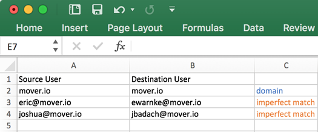

#### Exporting a permission map

You can export a permission map in CSV format.

1. Select **File**.
2. Select **Save As**.
3. From the **File Format** options, select **CSV**.

### Migration Manager overview

The **Migration Manager** is the key part of our app. It is the primary screen for interacting during the data migration process.

#### Migration Manager dashboard

Use the **Migration Manager** dashboard for a summary of your overall migration. This is covered in depth **here**.

#### Main menu bar

Use our app's main navigation bar to switch between the **Migration Manager**, **Transfer Wizard**, and your **Account** details, as well as contact support if you run into any issues during your migration.

#### Migration selection

Use the **Migration Selection** bar to navigate between separate multi-user migrations, as well as individual normal transfers.

Here, you are also able to edit and personalize the names of each multi-user migration.

#### Migration actions

Use the **Migration Actions** menu to access things such as: the migration reports, the columns displayed, and the overall layout of your migration to best suit your personal needs.

#### Filters

Use the **Active Filters** bar to search your migration for specific key terms or custom tags you have applied.

You can also view more in-depth instructions by selecting the info button directly to the right of the **Active Filters** search bar, or by viewing the **Active Filter** list.

#### User display

The user display is the central focus of the **Migration Manager**, and displays all the users in the current migration.

This section of our app provides you with a column-by-column breakdown of each individual user in a migration. Here, you can also duplicate and edit source/destination paths of a user, as well as view the logs of any scanned or completed transfers.

#### User actions and finalization

This area of the screen contains the **User Actions** dropdown menu, the **Scan User** and **Start Migrating Users** buttons.

**User Actions** opens a new dropdown menu enabling you to interact with a selected transfer.

**Scan # Users** performs a scan of the selected users. This helps identify any problematic files, folders, or connectors.

**Start # Migrating Users** opens a side tab enabling you to finalize and begin the migration.

## Running the migration

### Scanning

Scanning your source data is key to running a smooth and stress-free migration. For the full list of key data necessary for a smooth migration, see this **checklist**.

>[!Note]
>Scanned data is marked as *Skipped* as scanning does not transfer data; it simply counts the data that we would normally transfer from the source.
>
>After a transfer is scanned, the source/destination are effectively *locked in.* Be sure to double-check that they are correct, and not left blank.

### Running the scan

You now have a list of users appearing in the migration, complete with destination set up.

To start the scanning source data process:

- Select all user(s). At the top of navigation bar, select the checkbox.

After you select all users, select **Scan X Users**.

After the scan has successfully completed, the users appear in green. The scan time varies depending on the data amount in the source.

After users appear in green, yellow, or red, on the top right side of your screen, select **Migration Actions**, and then select **Scan Report**.

>[!Note]
>If your scan encounters an error or crashes, our app automatically reruns the scan up to three times to attempt to resolve the issue.

The **Scan Report** is covered in-depth in the **Reports** subsection under the **Scan Report** section of this guide.

#### Migrating users

We recommend starting slow. Test one user, then three to five. If it looks good, and you see data being downloaded and uploaded, start queuing everyone and stage the rest of your users.

1. To select a user(s), check their row's respective checkbox.
2. Select **Start Migrating X Users.**
3. Review your migration summary. This informs you which user is being copied, where they are transfering from, and where to, as well as when the transfer will begin.
4. Review and agree to our terms and conditions, and then select **Continue**. Your users are immediately queued for migration.

>[!Note]
>If your transfer encounters an error or crashes, our app automatically reruns the transfer up to three times to attempt to resolve the issue.

#### Canceling users

To cancel a currently running transfer:

1. Find the transfer(s) you want to cancel, and select them. A running transfer is in blue and have a status of **Running** or **Queued**.
2. For multiple users, select the **User Actions** dropdown, or right-click on a single user.
3. Select **Cancel X Transfers**.

This action stops the transfer as soon as possible (usually within a few seconds).

#### Rerunning users

The best way to resolve any issues with a transfer is to rerun it. This action checks over all the files in your destination, compares them to the source, and then transfers over the new or modified files.

All transfers take advantage of our incremental feature and only transfer new or modified data differences between G Suite Drive and Microsoft 365.

As long as a transfer is not running, to restart a transfer, you can re-queue a user.

To rerun or restart your transfer, complete the following steps:

1. Select the or user(s) you want to rerun.
2. To run the users again, at the top right, select **Start Migrating X Users**.

### Transfer status messages

The following table lists additional info about each transfer status message from the **Migration Manager**.

|**Status message**|**Definition**|
|:-----|:-----|
|Running pre-checks|    Our servers checking a few things and sending your transfer to the queue. Almost there!|
|Queued to start, please be patient|    Your transfer will run as soon as possible. You can close your browser, and receive an email on completion. There is no limit to queued users.|
|Success. No files copied    |We have skipped all of your files without error, and have detected no new or modified files.|
|Success. Some unsupported files not transferred|    We have skipped all of your files without error, and have detected no new or modified files. Files unsupported by the source or destination were skipped over.|
|Some upload errors, please retry|    We were able to download everything from the source, or skip files that already existed in the destination, but some files didn't make it into the destination.|
|No files copied. Some upload errors, please retry    |We were able to download everything from the source, or skip files that already existed in the destination, but no files made it into the destination.|
|Some download errors, please retry|    We weren't able to download everything from the source, but some files made it into the destination successfully.|
|No files copied. Some download errors, please retry    |We weren't able to download anything from the source!|
|Some download and upload errors, please retry    |There were errors with both downloading and uploading files, although some incremental files may have been skipped successfully.|
|General failure, please retry|    We don't have a particular reason why your transfer failed - maybe we were having trouble connecting to your source or destination properly, for example.|
|Connector auth failed|    One of your connectors isn't authorized correctly.|
|Crashed, please retry|    We don't have a particular reason why your transfer failed, but generally this is due to server issues on our side or with the source or destination connectors. Contact us if you encounter a crash.|

## Post-migration troubleshooting

### General troubleshooting

Follow these steps if your migration is having issues:

1. Rerun users. Select one or more users and to rerun them, on the top right of the **Migration Manager**, select **Start Migrating**.
2. To view your most recent transfer log, select the user row you want to view. This action opens the **Transfer Logs** sidebar. From here, select the **View Log** button for the most recent transfer.

Alternatively, you can select multiple users, and from the **User Actions** dropdown menu, you can download their most recent collective logs in a zip file that provides them in both HTML and CSV formats.

3. Check if your failed/unsupported files are too large to go into Microsoft 365.
4. Ensure you have enough storage space in Microsoft 365 to accommodate the data you're moving in.
5. Think files are missing? Check out our list of **Unsupported Files per Connector**.

### Incremental feature

Our incrementals are delta operations which compare files in your G Suite Drive to files in Microsoft 365. Using this comparison, we copy anything that is new or has changed. This enables us to keep Microsoft 365 data up to date when the very final cutover of users occurs. These incremental passes are an important part of our process.

**Technical clarification**: We compare what you have in G Suite Drive to what is in Microsoft 365, and we only transfer anything that doesn't already exist, or has a newer timestamp.

### 'Lost files'

During a transition where sharing paradigms change, there are many users who claim, "My files are lost!"

This is common if they are not in clear communication about how the sharing structure changes when they log in to Microsoft 365. This can be mitigated with a clear communication strategy.

### Waiting for Microsoft

After all your files have been uploaded to Microsoft, the status of the transfer changes from *Running* to *Waiting for Microsoft*. We must wait for Microsoft to complete their processing.

It is normal for this process to take a few hours, and ultimately depends on how much data there is to process.

### Document parser error

Large HTML or XML documents (256MB+) fail to transfer if the **Document Parser** is enabled for the destination site during the migration.

The following error appears:

`File too large for Microsoft Doc Parser. Please contact Microsoft support and request the Doc Parser be disabled for this site.`

If this error message appears, you must contact Microsoft support directly to disable the **Document Parser** on the target site for the duration of the migration.

If you require assistance with your communication strategy, ask us for help.

## Transfer logs

### Viewing your logs

Viewing your logs is an excellent way to troubleshoot transfer issues. They inform you about each action we performed on each file and folder. If we run into any problems, you receive an error message next to the file with a description about what happened.

During a migration, a file sometimes fails to download or upload. All failures are fully logged so you may address them.

>[!Note]
>We attempt to copy a file three times before considering it a failure. We only log a failure if we are unable to properly transfer it after three attempts.

You can view a user's transfer logs by doing one of the following:

1. Select the user row. This action opens the **Transfer Logs** sidebar. From here, select **View Log** on any previous transfer log for the selected user.

>[!Note]
>To open a Transfer log in your web browser with built-in sorting and filter features, select **View Log**.

2. To select multiple users, from the **User Actions** dropdown menu or the **Actions** menu in the side tab, select **Download Logs (zip file)**. As the label implies, multiple log files are zipped together for download.

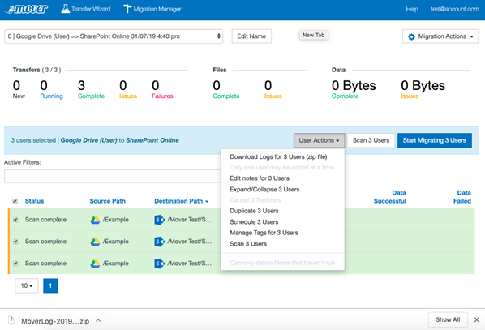

>[!Note]
>The zipped file provides logs in both CSV and HTML formats for only the most recent transfer of each user.

View an example CSV log or in your browser:

[User log for DropboxAdmin to BoxAdmin transfer_ tRanSacTionID.html](https://github.com/MicrosoftDocs/OfficeDocs-SharePoint/tree/live/migration/downloads/User log for DropboxAdmin to BoxAdmin transfer_ tRanSacTionID.html)

### Interpreting a log file

- **Status**: Whether an action was a success or a failure.
- **Size**: File size in bytes, or that it's a folder being created/operated on.
- **Name**: File, folder, or action being acted upon.
- **Additional Info**: More info about the particular action performed. For more info, see the following table.

|**Message**|**Definition**|
|:-----|:-----|
|Failed to download file successfully    |An issue occured with the Source Connector.|
|Failed to upload file successfully    |An issue occured with the Destination Connector.|
|Unknown error of type 400    |A 'bad request' error. It could be a problem with the Source (File Download) or Destination (File Upload). Typically, this means that something has changed client-side or server-side and could be resolved the next time you run the transfer.|
|Unknown error of type 404    |This is a *server not found* error. Typically, this means that the Source (File Download) or Destination (File Upload) server is down or experiencing a temporary outage.|
|Auth failure: attempt to renew authentication successful|    Authorization is failing either on the Source (File Download) or Destination (File Upload) Connector.|
|Backoff used: #|    Generally seen after an action listed as 'throttle.' This means we've made too many requests of that Connector, and must wait before trying whatever action we were trying to complete again.|
|Folder Already Exists|    We attempted to create the folder, but we've already created it in a previous transfer, or it already exists in the destination.|
|Skipping because of incremental    |Not an error by definition; it's just our incremental process at work.|
|Scanned|    Not an error by definition; it's just our scanner counting your data.|

## Reports

### Dashboard overview

The dashboard statistics given at the top of the **Migration Manager** provide a visual summary of your overall migration. This includes the number of users in the current selected migration, the number of files scanned or transfered, and the amount of data scanned or transfered; as well as any issues, errors, or failures that may have occured.

#### Transfers

The **Transfers** section of the **Migration Manager** dashboard provides a brief rundown of all user transfers and scans.

- **New**: Number of individual users that have yet to be scanned or transfered.
- **Running**: Number of users that are currently running either a scan or a transfer.
- **Complete**: Number of users that have successfully completed scans or transfers.
- **Issues**: Number of users that encountered errors during a scan or a transfer.
- **Failures**: Number of users that failed to scan or transfer.

>[!Note]
>The total **Transfers** tally is from all users regardless of status.

#### Files

The **Files** section of the **Migration Manager** dashboard provides a total of all files scanned and transfered across all users in a migration.

- **Complete**: Number of files that have successfully scanned or transfered.
- **Issues**: Number of files that have encountered issues and failed to scan or transfer.

>[!Note]
>The total number of **Files** is from both scanned and transfered users. Be aware that scanned files are marked as *Skipped* as they have yet to be transfered.

#### Data

The **Data** section of the **Migration Manager** dashboard shows the total of all data scanned and transfered across all users in a migration.

- **Complete**: Amount of data that has been successfully scanned and transfered.
- **Issues**: Amount of data that encountered issues and has failed to scan or transfer.

>[!Note]
>The total amount of **Data** is from both scanned and transfered users. Be aware that scanned data is marked as *Skipped* as it has yet to be transfered.

### Active filter list

This provides the list of all current **Filters** that you can apply to the **Active Filter** search bar.

>[!Note]
>Applying the filters changes the statistic shown in the **Migration Manager** dashboard.

|**Filter label**|**Label effect**|
|:-----|:-----|
|Status|    Filters by status [for example, Failed, Success, User Does Not Exist, and so on.]|
|Files|    Filters based on files transfered, failed, and skipped.|
|Data    |Filters based on data that has transfered, failed, or skipped.|
|Success|    Displays all successful Data and Files transfered.|
|Failed    |Displays all Data and Files that have failed to transfer.|
|Skipped    |Displays all data and files that were skipped.|
|Schedule    |Displays all users with scheduled transfers [for example, Hourly, Daily, Weekly, Monthly].|
|Path    |Filters for specific source or destination path [for example, path:username].|
|Destination|    Filters for specific destination path [for exaample, path:@domain<spam><spam>.com].|
|Source|    Filters for specific source path [for example, path:foldername].|
|Destination path    |Functions the same as **Destination**.|
|Source path    |Functions the same as **Source**.|
|Tags     |Lists transfers with previously implemented custom tags.|
|Notes    |Filters by keywords in previously implemented custom notes.|
|Code|    Filters for specific status codes.|
|Destination name|    Displays transfers with a specific destination name.|
|Source name|    Displays transfers with a specific source name.|

### Scan report

For more info about the scanning process, see the **Scanning** section.

After the scan report is downloaded and opened, look for these key items:

- Users with a failed status. We recommend rerunning the scan for these user(s).
- Users with one file or less. **Note**: Sharing permissions are still transfered.
- Users with the most data. Use this info to decide about a data distribution strategy that suits your needs. For more info about data distribution, see **here**.

### Migration report

The **Migration Report** provides an in-depth overview of your entire migration, including (but not limited to) speed and time statistics, totals for files and data transfered, and info relating to the latest run.

To download this as a CSV, at the top right of the **Migration Manager**, select the **gear** icon, and select **Migration Report**.

The CSV report provides the following info for each user pairing:

|**Header/Statistic**|**Definition**|
|:-----|:-----|
|Schedule ID|    Our internal reference unique to the user pairing created.|
|Source|    Source directory path.|
|Destination    |Destination directory path.|
|Tags    |If you have used our tags feature, you'll see them here. Use tags to differentiate operational departments, to flag specific users, and so on.|
|Notes|    If you have added Notes to user pairings in the **Migration Manager**, they'll appear here, for example, *Remind me to check the logs on this user* or *Weird folder problem - ask support*.|
|First Run Start|    When the first transfer for this user pairing began.|
|Files Transfered    |Total files transfered.|
|MB Transfered    |Total data (MB) transfered.|
|Times run|    Total number of times this user pairing has been run.|
|Total Duration    |Total duration of each time this user pairing has been run.|
|Average File Velocity (files/hour)|    Files transfered, divided by the total duration.|
|Average Data Velocity (MB/hour)    |Data (MB) transfered, divided by the total duration.|
|Last Status|    Last status of the user pairing.  This is also reflected by the color of each row in the **Migration Manager**. Examples include *Success*, *Some Problems*, *Failure*.|
|Last Status Code|    Internal reference number refering to the last status of the user pairing.|
|Last Skipped|    Number of skipped files in the last run.|
|Last Files|    Number of files transfered in the last run.|
|Last MB    |Volume of data (MB) transfered in the last run.|
|Last MB Skipped    |Volume of data (MB) skipped in the last run.|
|Last Failed Files    |Number of files that failed to transfer in the last run.|
|Last Folders Listed    |Number of folders that we opened/created in the last run.|
|Last Folders Failed    |Number of folders that we failed to open/create in the last run.|
|Last Run Start    |When the latest transfer on this user pairing began.|
|Last Run End    |When the latest transfer on this user pairing finished.|
|Last Run Duration    |How long the latest transfer for this user pairing took to complete.|
|Last File Velocity (files/hour)    |Files transfered, divided by the total duration for the last run.|
|Last Data Velocity (MB/hour)|    Data (MB) transfered, divided by the total duration for the last run.|

Download an example CSV:

[example_migration_report.csv](https://github.com/MicrosoftDocs/OfficeDocs-SharePoint/tree/live/migration/downloads/example_migration_report.csv)

### Migration table report

The **Migration Table Report** generates an overview of your entire migration based on the custom designated columns you have set.

To edit report columns, in the **Migration Manager**, select **Migration Actions**, and select **Customize Columns**. Here you can set and reorganize which **Columns** you want to display when you download the CSV report.

To download this as a CSV, at the top right of the **Migration Manager**, select the **gear** icon, and select **Migration Table Report**.

Download an example CSV:

[example_migration_table_report.csv](https://github.com/MicrosoftDocs/OfficeDocs-SharePoint/tree/live/migration/downloads/example_migration_table_report.csv)

### Migration error report

The **Migration Error Report** generates a simplified **Migration Report** that focuses on any problematic files, folders, permission errors, or general errors.

To download this as a CSV, at the top right of the **Migration Manager**, select the **gear** icon, and select **Migration Error Report**.

Download an example CSV:

[example_migration_error_report.csv](https://github.com/MicrosoftDocs/OfficeDocs-SharePoint/tree/live/migration/downloads/example_migration_error_report.csv)

## Post-migration tips

We are stewards of your data. Our approach in all things is to see you successfully cross the finish line. We provide full service support and are ready to solve any problem and communicate with you about any issue.

### Communication

Follow up with users after migration to ensure they know where to access their data.
Provide a link to set up their new Microsoft 365 accounts. Be prepared to answer any questions or concerns, as it is common for users to complain about a new system.

### Example email

**Subject**: ATTENTION: Log in to Microsoft 365*

**Message**: Over the weekend, we migrated our team from G Suite Drive to Microsoft 365.

All files and folders were transfered without any issues. To set up your new Microsoft 365 account, follow this link.

Your username remains the same; however, you must create a new password.

From this point forward, log into your Microsoft 365 account.

If you have any questions or concerns, let us know.

## User migration guides

This **User Migration Guide** is intended to be distributed to users via their migration management team. Feel free to customize messaging to best serve users.

Read the following important info regarding your upcoming Microsoft 365 migration.

### Timeline

This migration happens behind the scenes. Your work day should not be interrupted.
Files and folders are migrated. Any root folders or files you own in G Suite Drive are copied.
A final cut-over is planned after all users in your group have been migrated.

### Dos and don'ts

Do continue working in G Suite Drive as usual!

Don't start using Microsoft 365 until you have been notified the final cut-over is complete!

Don't make any major changes to file or folder names! Your files and folders are continually copied from G Suite Drive to Microsoft 365, but changes to filenames or folders can result in duplicated data.

### Filenames

Files and folders are automatically processed to ensure they are compatible with Microsoft 365.

### What happens to external-sharing links?

Our app does not recreate external-sharing links. These have to be set in the destination manually after migration.

### Your migration team

If you need more help with Microsoft 365, shortening paths, or just want to say thanks, e-mail <your end-user support email>.
