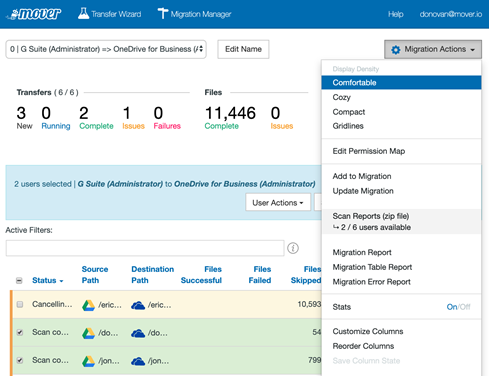
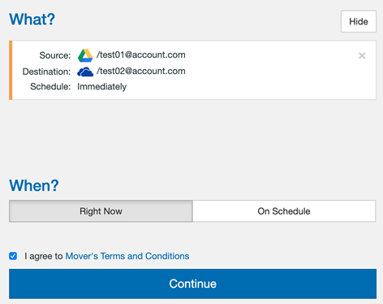

# Running the Mover migration

## Scanning

Scanning your source data is key to running a smooth and stress-free migration. For the full list of key data necessary for a smooth migration, see this **checklist**.

>[!Note]
>Scanned data is marked as *Skipped* as scanning does not transfer data; it simply counts the data that we would normally transfer from the source.
>
>After a transfer is scanned, the source/destination are effectively *locked in.* Be sure to double-check that they are correct, and not left blank.

## Running the scan

You now have a list of users appearing in the migration, complete with destination set up.

To start the scanning source data process:

- Select all user(s). At the top of navigation bar, select the checkbox.

Afrer you select all users, select **Scan X Users**.

After the scan has successfully completed, the users appear in green. The scan time varies depending on the data amount in the source.

After users appear in green, yellow, or red, on the top right side of your screen, select **Migration Actions**, and then select **Scan Report**.

>[!Note]
>If your scan encounters an error or crashes, our app automatically reruns the scan up to three times to attempt to resolve the issue.

For in-depth info about **Scan Report**, see the **Reports** subsection under the **Scan Report** section of this guide.

## Migrating users

We recommend starting slowly. Test one user, then three to five. If all looks good, and you see data being downloaded and uploaded, start queuing everyone, and stage the rest of your users.

1. To select a user(s), check their row's respective checkbox.
2. Select **Start Migrating X Users.**
3. Review your migration summary. This informs you which user is being copied, where they are transfering from, and where to, as well as when the transfer begins.
4. Review and agree to our terms and conditions, and then select **Continue**. Your users are immediately queued for migration.

>[!Note]
>If your transfer encounters an error or crashes, our app automatically reruns the transfer up to three times to attempt to resolve the issue.

### Canceling users

To cancel a currently running transfer:

1. Find the transfer(s) you want to cancel, and select them. A running transfer is in blue and have a status of **Running** or **Queued**.
2. For multiple users, select the **User Actions** dropdown, or right-click on a single user.
3. Select ***Cancel X Transfers**.

This action stops the transfer as soon as possible (usually within a few seconds).

### Rerunning users

The best way to resolve any issues with a transfer is to rerun it. This action checks over all the files in your destination, compares them to the source, and then transfers over the new or modified files.

All transfers take advantage of our incremental feature and only transfers new or modified data differences between your source and Office 365.

As long as a transfer is not running, to restart a transfer, you can re-queue a user.

To rerun or restart your transfer, complete the following steps:

1. Select the or user(s) you want to rerun.
2. To run the users again, at the top right, select **Start Migrating X Users**.

