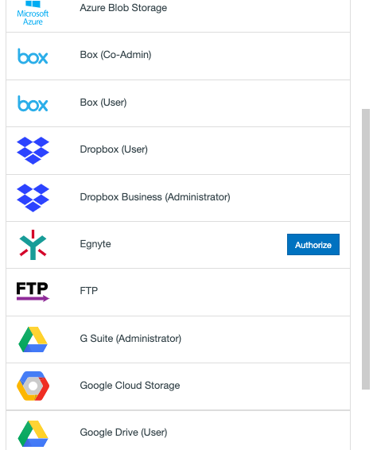
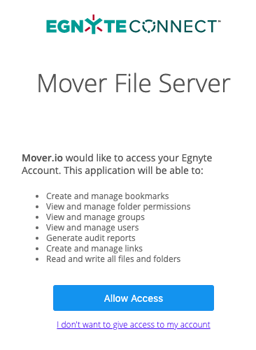
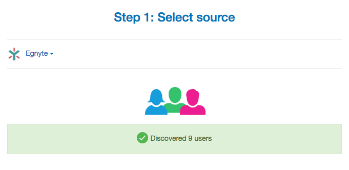
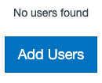
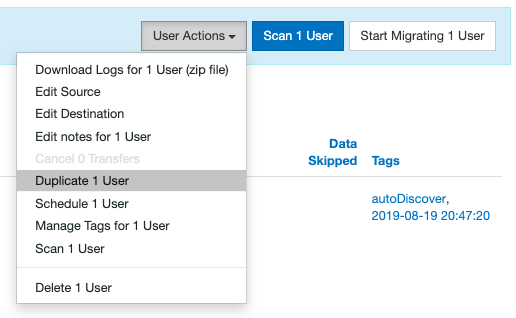

# Setting up your migration from Egnyte using Mover

## Egnyte FAQ

### What is different about Egnyte?

Unlike other cloud storage providers, Egnyte has a `Shared` folder and a `Private` folder. When migrating from Egnyte, our app defaults to the **Private** folders when auto-completing the user to user migration setup.

### How will my paths look when Egnyte is my source?

During the migration setup (described later in this guide), you can edit the path(s) to specify where in Egnyte you want the data to go. From the root level of Egnyte, you can go into `/Private` which lists the individual users and their data, or `/Shared` which is the main shared data repository.

Most cloud storage providers, Egynte, for example, start the listing with a user such as `/user@example.com/marketing data`. Egnyte does not do this, so you would be looking at a path such as `/Shared/marketing data` if it's a Shared folder, or `/Private/example/marketing data` if it's a Private folder.

## Setting up the migration

### Authorizing Egnyte (Multi-User)

Authorizing **Egnyte** as an administrator is straightforward. To authorize or add a Multi-User Egnyte account as a connector, follow these steps.

>[!IMPORTANT]
>You MUST be an Administrator. A non-administrator does not work.

1. In the **Transfer Wizard**, select **Authorize New Connector**. 

2. In the **Connector** list, find **Egnyte**.
3. Select **Authorize**.

4. A new window (tab) opens. Name your Connector <optional>. 

5. Provide the Egnyte domain, for example, if your Egnyte domain is companyname.egnyte.com, enter "companyname".

6. Select **Authorize**.

7. If you are not already logged in, you can use either your Egnyte credentials or an SSO account.

8. To grant our app access to your Egnyte Account, select **Allow Access**.

### Egnyte permission requirements

Our app requires an **Administrator** for authorization. The following table lists the scopes we require:

|**Permission**|**(Details) Allows our app to...**|
|:-----|:-----|
|Create and manage bookmarks    |Access and migrate bookmark data.|
|View and manage folder permissions|Access and create folder permission.|
|View and manage groups|View all groups under in the available Egnyte Directory.|
|View and manage users|View, edit, and manage users under the available Egnyte Directory.|
|Generate audit reports    |Generate and view reports available in the Egnyte Report Center.|
|Create and manage links|Create and manage internal links.|
|Read and write all files and folders|View, edit, copy and paste all data from within the Egnyte-available Directories.|

### Authorizing Microsoft 365

>[!Warning]
>To fully authorize the **Microsoft 365 Connector**, a Global Admin is required to grant permissions to the Microsoft 365 Mover app within the Azure portal.
>
>The Global Admin must grant these permissions *after* the **Microsoft 365 Connector** is authorized within the main Mover app.

To complete the authorization steps in the right order, see the following instructions.

A Global Admin or an SPO Admin can complete some steps in the authorization process. At the beginning of each step, we indicate who can complete it.

1. **Global Admin or SPO Admin**: Via app.mover.io, log into the main Mover app. In the **Transfer Wizard**, select **Authorize New Connector**.

>[!Note]
>Whether the **Microsoft 365 Connector** is your source or destination connector (or both), you must complete this authorization process.

2. **Global Admin or SPO Admin**: In the **Connector** list, find **Microsoft 365**, and select **Authorize**.

3. **Global Admin or SPO Admin**: A window with an **Authorize** button appears. It prompts you to give your Microsoft 365 Connector a display name <optional>. Select **Authorize**.

4. **Global Admin or SPO Admin**: Follow the on-screen instructions. You are redirected to a Microsoft login screen where you can log in with your Microsoft admin privileges, and continue to authorize the connector.

>[!Warning]
>If you are a **Global Admin**, a slightly different login screen will display.  
>
>**DO NOT** select the option **Consent on behalf of your organization**. This option **must** remain unselected.

- 

5. **Global Admin or SPO Admin**: After authorizing the connector, you are redirected to the **Mover Transfer Wizard**, and an error aapears, like the following. This means it is now time for a Global Admin in your tenant to grant permissions to the Microsoft 365 Mover app in the Azure portal.

If you're an **SPO Admin**: To grant permissions and finish the authorization process (Steps 6 – 9), point your Global Admin to **aka.ms/office365moverauth**.

If you're a **Global Admin**: Continue with Steps 6–9.

6. **Global Admin**: Log into the Azure Portal via **aka.ms/office365moverauth**. A list of **Enterprise applications** appears.

7. **Global Admin**: Find and select the **Microsoft 365 Mover** app. A page appears that provides an overview of our app.

8. **Global Admin**: In the left menu, find and open **Permissions**. Select **Grant admin consent for Mover**.

9. **Global Admin**: A pop-up window appears that guides you through the rest of the permissions process. When complete, it closes automatically, and your **Microsoft 365 Connector** is fully authorized and ready to go.

### Troubleshooting a Microsoft 365 connector

#### App access error

If you encounter an error on authorization, try signing out of any Microsoft accounts, and attempt to authorize the **Connector** in an Incognito Window.

#### Global Admin account provisioning

Your Global Admin user must have a Microsoft 365 account provisioned to administer other Microsoft 365 accounts. If you create a service account for our app, ensure you also assigned a Microsoft 365 license, and walked through the Microsoft 365 setup process.

#### User provisioning

Are your Microsoft 365 users provisioned? All Microsoft 365 users must log in to their Microsoft 365, and open Microsoft 365 for us to transfer into their accounts. You can also provision Microsoft 365 accounts via Windows PowerShell using the following commands (replace your URL and email appropriately)::

`Connect-SPOService -Url https://example-admin.sharepoint.com -credential user@example.com`

`Request-SPOPersonalSite -UserEmails "neverloggedintest@example.onmicrosoft.com"`

#### Microsoft 365 permission requirements

Our app requires a Global Admin for authorization. The following table lists the scopes we require.

|**Permission**|**(Details) Allows our app to...**|
|:-----|:-----|
|Create, edit, and delete items and lists in all your site collections|Create or delete document libraries and lists in all site collections on your behalf.|
|View your basic profile|See your basic profile (name, picture, user name).|
|Maintain access to data you have given it access to|See and update the data you gave it access to, even when you are not currently using our app. This does not give our app any additional permissions.|

### Connecting your source Egnyte account

If you are not already connected after you have authorized your source, select **Egnyte**, and load the connector. An icon appears, and show you how many users you are migrating.

### Connecting your destination Microsoft 365 account

If you are not already connected after you have authorized your destination, select **Microsoft 365**, and load the connector. An icon appears and show you how many users you are migrating.

#### Creating a new migration

Select **Continue Migration Setup**, and our app moves to the **Migration Manager**.

The next step is to create a user list of who is transfering.

From your newly created migration in the **Migration Manager**, there are two ways to add users:

- Select **Add Users**.

- Or, select **Migration Actions**, then select **Add to Migration**.

Select one of two options:

1. Auto Discover Users.
  - For our app to automatically find your users and attempt to match them up, select **Automatically Discover and Add Users**.

2. Upload Migration CSV File.
  - To add a customized CSV file for your migration, either drag a file into the designated space, or select **Choose a file to upload**.

>[!Note]
>You still get to finalize your migration before any data moves!

#### Creating a new migration from a CSV (optional)

Occasionally, you have thousands of users and a complicated directory schema that you want to import. In these cases, it's desirable to plan out your migration in a spreadsheet.

In these cases, we trust the CSV upload option is useful. This allows you to lay out all your users and directories, and then provide it to us in a .csv format for us to create your migration.

##### Users to migrate

Your CSV file must follow this format:

A heading for the source and destination, followed by the paths, and optional tags on each line.

`Source Path,Destination Path,Tags`
`user1@example.com,user__1@corp.example.com,"Pilot, IT"` 
`user2@example.com,user__2@corp.example.com,"Pilot, Sales"` 
`user3@example.com/src dir,user3@example.com/migrated,"Pilot, IT"` 
`Source Shared Drive,user4@example.com/Team Folder,"Pilot, Sales"` 
`https://TENANT02.sharepoint.com/sites/SiteName/Shared%20Documents,user5@example.com,"Marketing, Sales"` 

>[!Note]
>Ensure your CSV has no spaces after each comma-separated value. Values that require commas must be wrapped in quotation marks.

Download an example CSV:

**Example_CSV_Map.csv**

>[!Note]
>When URL mapping to SharePoint Online, you must remove everything after /Shared%20Documents; otherwise,the URL fails.

For example, this full URL won't work:
`https://TENANT01.sharepoint.com/sites/SiteName/Shared%20Documents/Forms/AllItems.aspx`

It should be changed to:
`https://TENANT01.sharepoint.com/sites/SiteName/Shared%20Documents`

#### Creating your CSV in Excel

To use an Excel spreadsheet to create your CSV:

1. Ensure you have two columns, one titled `Source Path`, and one `Destination Path`.
2. List the relative paths, domains, and usernames on the subsequent rows.
3. Export your spreadsheet as a CSV:
  a. Select **File**.
  b. Select **Save As**.
  c. From the **File Format** options, select **CSV**.

#### Reviewing your users

##### Checking paths

Confirm that the users in the Egnyte source match the users in the Microsoft 365 destination. Usually the emails/usernames match up, but it depends how you structure and name your users. *Be diligent during this step!*

#### Editing

Be aware that Users can only be edited if they haven't been scanned, or had a transfer run.

To edit a user source entry:

1. To select a User row, on the left side of a row, select the respective checkbox.
2. On the right and directly above the user rows, find **User Actions**, or right-click the user row for which you want to edit the source path.
3. A new side panel opens, enabling you to edit the Egnyte source path.
4. To select your parent source path, double-click it, and to complete your edit, select **Save**.

To edit a user destination entry:

1. To select a user row, on the left side of a row, select the respective checkbox.
2. On the right and directly above the user rows, find **User Actions**, or right-click the user row for which you want to edit the destination path.
3. A new side panel opens, enabling you to edit the Microsoft 365 destination path.
4. To select your parent destination path, double-click it. To complete your edit, select **Save**.

You can also choose to edit your user entries via CSV, though this is a fairly in-depth process. *If you are simply looking to make a handful of edits to your paths, we recommend using the previous method.*

To edit or update your current existing user pairings:

1. Near the top right of the **Migration Manager**, select **Migration Actions**.
2. Select **Update Migration**.
3. Upload your .csv file. 

Tips for creating the CSV:
  - The CSV needs to follow this format:
     - `ID, Source Path, Destination Path` 
     - `id12345, /first.last@example.com, /f.last@example.com`

  - The `ID` column is required to specify the existing row in the **Migration Manager**, whereas the source and destination path are optional - as in, you don't need to enter both if you only want to edit the destination path, for example - and leaving both of those columns blank mean no changes are made.
 
    - To get the ID for each row: 
      a. Find and select **Migration Actions**. 
      b. Select **Customize Columns**, and select **ID**. 
        
    You'll now be able to see the ID appearing in each row. If you refresh the page, this info disappears unless you select **Save Column State**.

Download an example CSV:

[example_path_edit.csv](https://github.com/MicrosoftDocs/OfficeDocs-SharePoint/tree/live/migration/downloads/example_path_edit.csv)

4. After you've created your CSV file using these instructions and format, you can drag and drop the file into our app, or select **Choose a file to upload**. Changes to your user pairings are implemented immediately.

#### Adding

If you missed users in your original CSV upload, or simply want to add new user entries to the current migration, add them via CSV. All entries you add in this manner are appended to the current migration, meaning this won't modify existing rows and it is possible to create duplicate entries alongside the ones that already exist.

To add new users:

1. Near the top right of the **Migration Manager**, select the **gear** icon.
2. Select **Add to Migration**.
3. Upload your .csv file. 

Tips for creating the CSV:
  - CSV needs to follow this format: 
    `Source Path, Destination Path` 
    `/first.last@example.com, /flast@example.com`
  - **CSV is created the same way you would if you initially created the migration with a CSV**.
4. After you've created your CSV file using these instructions and format, drag and drop the file into our app, or select **Choose a file to upload**. Changes to your user pairings are implemented immediately.

#### Duplicating

At any time, you may duplicate a user in the **Migration Manager** list. To duplicate a user entry:

1. To choose a user row, on the left side of a row, select the respective checkbox. You may select more than one entry at a time.
2. On the right and directly above the user rows, find **User Actions**, or right-click the user row you want to duplicate.
3. In the context menu, select **Duplicate # User**.
4. Select **OK**. 

A new user entry appears. From here, you can change the directory, schedule, or even the entire user.

#### Scheduling

You can set an hourly, daily, weekly, or monthly schedule for each user, even after they have been run.

To create or edit a schedule:

1. Select the user pairing(s) you want to schedule.
2. Select the **User Actions** dropdown menu.
3. Select **Schedule # Users**.
4. Configure your Hourly, Daily, Weekly, or Monthly setup, including the timing and day of the week (where applicable).
5. Select **Apply Schedules to X Users**.

##### Deleting

Be aware that users can only be deleted if they haven't been scanned, or had a transfer run.

To delete a user entry:

1. To choose a user row, on the left side of a row, select the respective checkbox. You can select more than one entry at a time.
2. On the right and directly above the user rows, select **User Actions**, or right-click the user row you want to delete.
3. In the context menu, select **Delete User**.

>[!Important]
>This is permanent and cannot be undone unless you create a new entry.

### Reviewing your permission map

The permission map is a critical part of your migration.

When a user is migrated, we transfer files and folders and share any required data. We already know who is copying data, but we also need to know who might have content shared with them, even if they don't copy data.

To stay organized, we provide a secondary list of your users, called a permission map. This list includes everyone who could possibly receive sharing permissions to any files or folders that might be migrated. This even includes users who are not migrating data.

Another important consideration is that usernames and emails aren't always consistent across platforms, and the permission map helps us line up everyone.

**Example**:  `jane@example.com` is actually `j.smith@example.com`

We automatically detect users and handle perfect matches. Any inconsistencies must be manually reconciled. The permission map can be continually updated, because with each incremental pass of the migration, permissions are reapplied.

1. To view your permission map, in the top right of the **Migration Manager**, select **Migration Actions**, and then, from the dropdown menu, select **Edit Permission Map**.

You may either auto-discover or upload a permission map file. We automatically pair perfect matches. If a user or group in Egnyte does not have a perfect match in Microsoft 365, you can correct it in our interface.

2. Select **Auto-discover Users**.

3. At any time, you may view and edit your permission map.

>[!Note]
>A blank destination entry automatically cancels any permission sharing for that user or group.
>
>[!Note]
>Adding a new line for a specific users - for example, user01@gmail.com to user01@hotmail.com - that perfectly matches auto-discovered permissions by the domain - for example, `@gmail.com` to `@hotmail.com` - is automatically removed. Our app marks these as redundant entries.

### Uploading a permission map (optional)

You can upload a permission map in CSV format. This overwrites any existing permission map, so use caution. In an ideal world, all users are matched. If there are a few unmatched users, from the web interface, you can manually add names to the **Destination** field.

Ensure that your permission map follows this strict format:

A heading for the source and destination, followed by domain names, groups, usernames, or emails.

`Source User, Destination User` 
`example.com, example.com` 
`corp.example.com, example.com` 
`user@example.com, differentuser@example.com` 
`group, group` 

Permission maps should have two specific entries:

1. Any domain names that are wildcard matched, (for example, `example.com, example.com` or `contoso.com, corp.contoso.com`). This instructs our app to match any users with those domain names in their source email to their new destination email domain.
2. Imperfect matches. Users that are differently named between the source and destination domains need to be explicitly listed, (for example, `firstname@contoso.com, firstname_lastname@contoso.com`).
3. Groups can also be included for most connectors. These are explicitly required and are not matched with a domain wildcard, (for example, `Sales Team, Global Sales Team`).
4. We strip all leading and trailing spaces from each path value, unless it is wrapped in quotation marks.

Download an example CSV:

[example_permission_map.csv](https://github.com/MicrosoftDocs/OfficeDocs-SharePoint/tree/live/migration/downloads/example_permission_map.csv)

### Creating your CSV in Excel

If you are using an Excel spreadsheet to create your CSV:

- Ensure you have two columns, one titled `Source User`, and one `Destination User`. Check the spelling on the domains, usernames, and groups listed.

For example:

`Source User, Destination User` 
`example.com, example.com` 
`eric@example.com, ewarnke@example.com` 
`joshua@example.com, jbadach@example.com` 
`Sales Team,Global Sales Team`

#### Exporting a permission map

You can export a permission map in CSV format.

1. Select **File**.
2. Select **Save As**.
3. From the **File Format** options, select **CSV**.

### Migration Manager overview

The **Migration Manager** is the key part of our app. It is the primary screen for interacting during the data migration process.

#### Migration Manager dashboard

Use the **Migration Manager** dashboard for a summary of your overall migration. This is covered in depth **here**.

#### Main menu bar

Use our app's main navigation bar to switch between the **Migration Manager**, **Transfer Wizard**, and your **Account** details, as well as contact support if you run into any issues during your migration.

#### Migration selection

Use the **Migration Selection** bar to navigate between separate multi-user migrations, as well as individual normal transfers.

Here, you are also able to edit and personalize the names of each multi-user migration.

#### Migration actions

Use the **Migration Actions** menu to access things such as: the migration reports, the columns displayed, and the overall layout of your migration to best suit your personal needs.

#### Filters

Use the **Active Filters** bar to search your migration for specific key terms or custom tags you have applied.

You can also view more in-depth instructions by selecting the info button directly to the right of the **Active Filters** search bar, or by viewing the **Active Filter** list.

#### User display

The user display is the central focus of the **Migration Manager**, and displays all the users in the current migration.

This section of our app provides you with a column-by-column breakdown of each individual user in a migration. Here, you can also duplicate and edit source/destination paths of a user, as well as view the logs of any scanned or completed transfers.

#### User actions and finalization

This area of the screen contains the **User Actions** dropdown menu, the **Scan User** and **Start Migrating Users** buttons.

**User Actions** opens a new dropdown menu enabling you to interact with a selected transfer.

**Scan # Users** performs a scan of the selected users. This helps identify any problematic files, folders, or connectors.

**Start # Migrating Users** opens a side tab enabling you to finalize and begin the migration.

